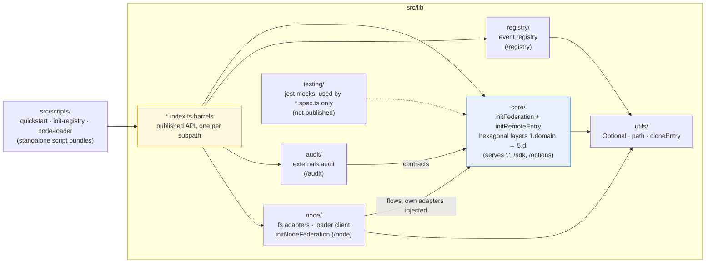

# Contributing

Thanks for being interested in contributing! We welcome all meaningful contributions that help improve the library.

## Getting Started

We love seeing fresh ideas and improvements! Before diving into major architectural changes or large refactors, it's usually helpful to chat with us first in an issue - we're always happy to discuss the best approach and can save you time.

For the smoothest experience, we find that contributions focusing on functionality, bug fixes, and meaningful improvements tend to have the quickest path to merge. Style tweaks are great, but if that's the main focus, consider bundling them with a feature or fix to maximize impact.

To find your way around the codebase, see [Source Code Organization](./docs/architecture.md#source-code-organization) - in short: one folder per published subpath under `src/lib/` (`core/`, `registry/`, `audit/`, `node/`), with the `*.index.ts` barrels at the root of `src/lib/` defining each subpath's public API.

Every arrow below means "may import" - this direction is enforced by ESLint, so a PR that crosses a flow boundary (or imports a `*.index.ts` barrel from internal code) will fail the lint step:



Notably absent arrows: `core` never imports a flow folder, and `registry`, `audit` and `node` never import each other.

## Quick Start

1. Fork and clone the repo
2. Install dependencies: `npm install`
3. Build the library: `npm run build`
4. Create a branch: `git checkout -b my-feature`
5. Make your changes
6. Lint your code: `npm run lint`
7. Test your code: `npm run test`
8. Push your branch and open a PR

## Pull Request Guidelines

- Include tests for any new features
- Update documentation if needed
- Follow our coding style (eslint)
- Keep PRs focused - one feature or bug fix per PR

## Commit Messages

Please use clear commit messages:

```
feat: add new feature
fix: resolve issue
docs: update readme
```

## Need Help?

Open an issue if you:
- Find a bug
- Want to suggest a feature
- Have questions about the code

Thanks for contributing! 🎉