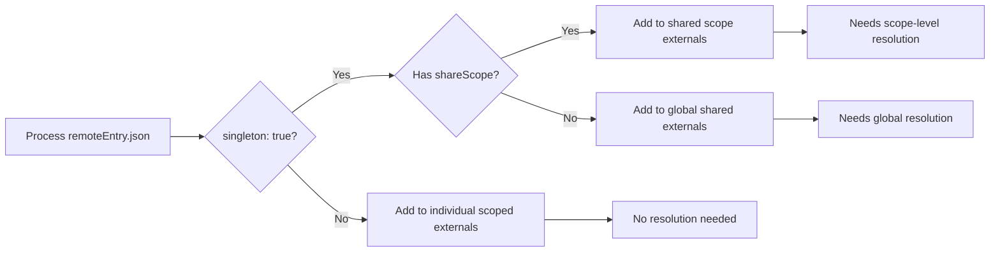
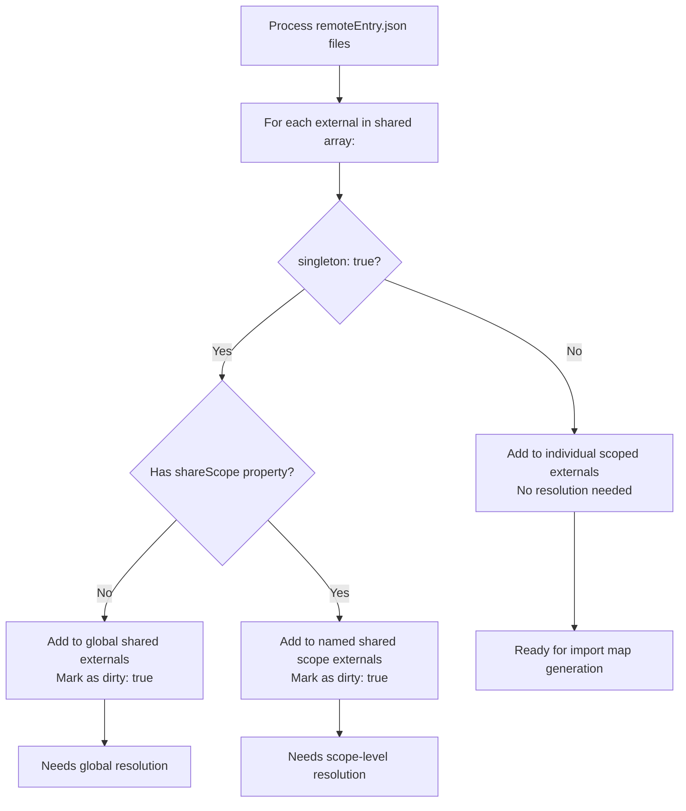
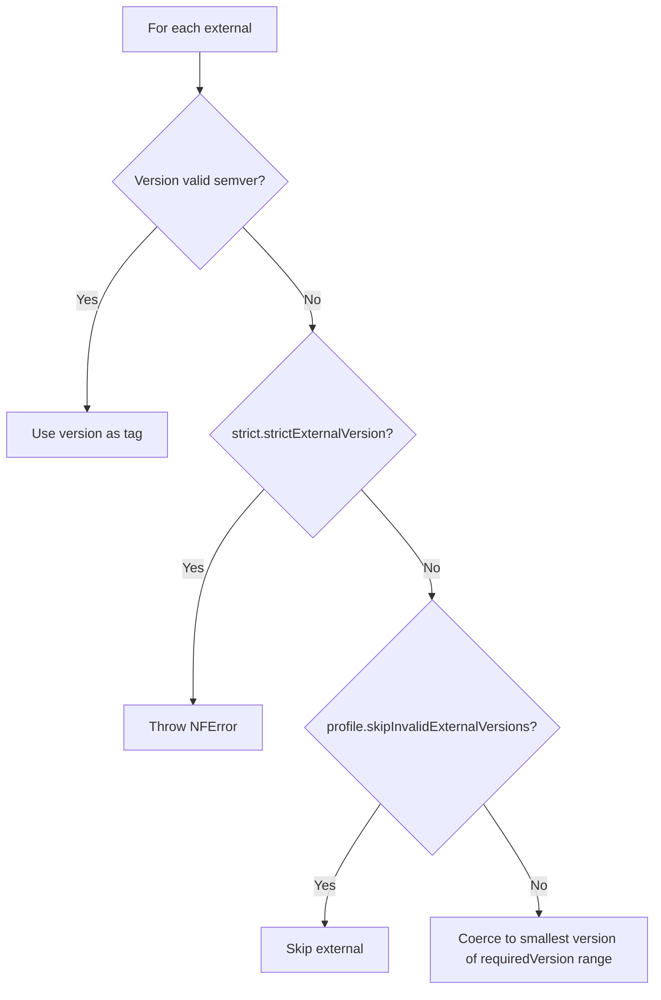
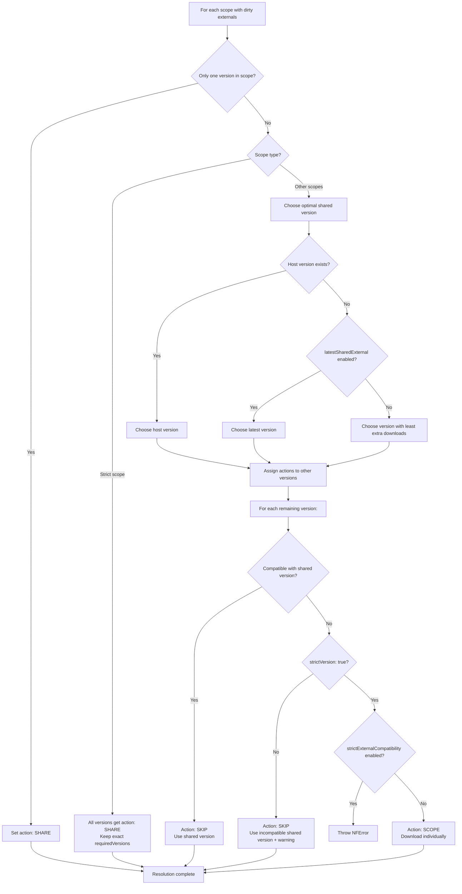
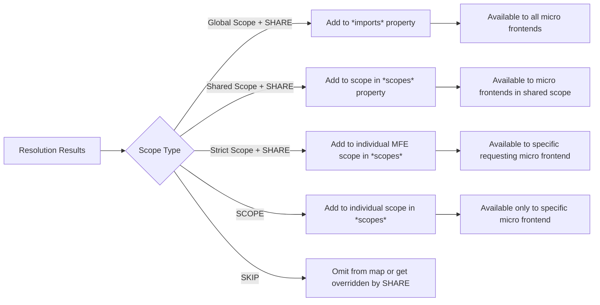
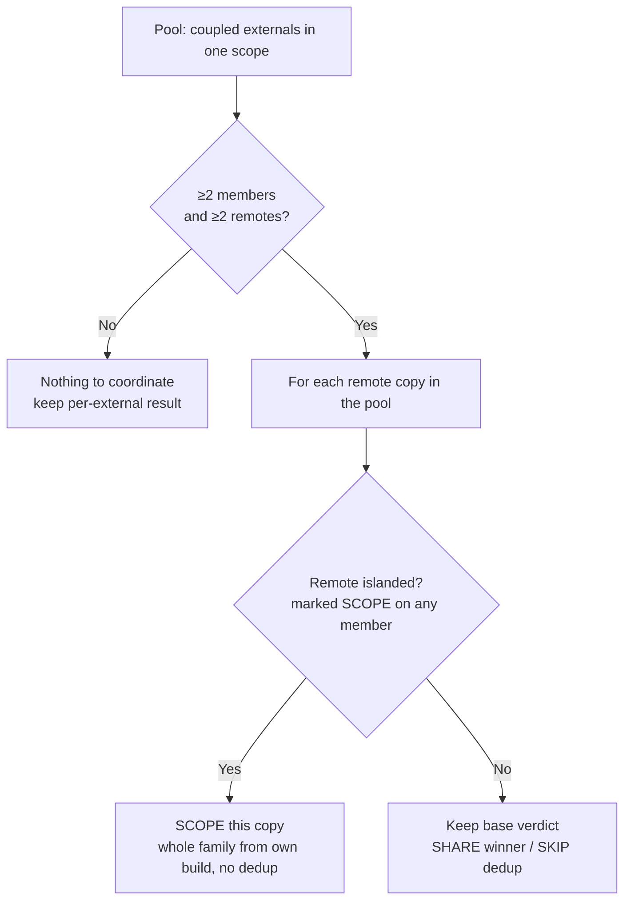
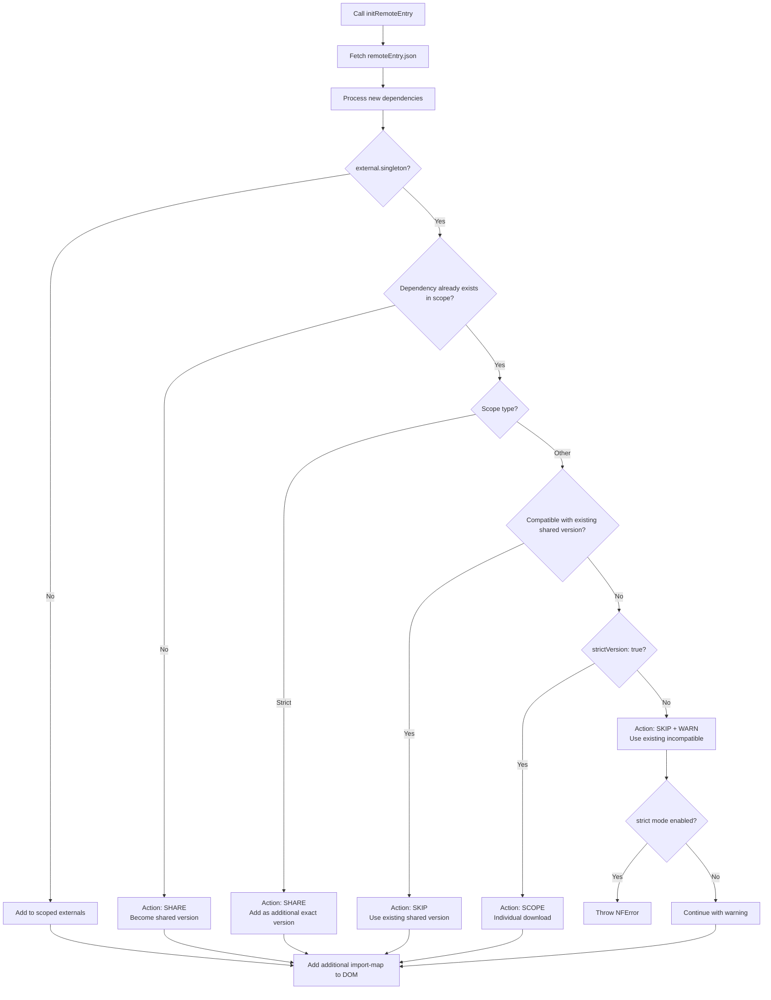
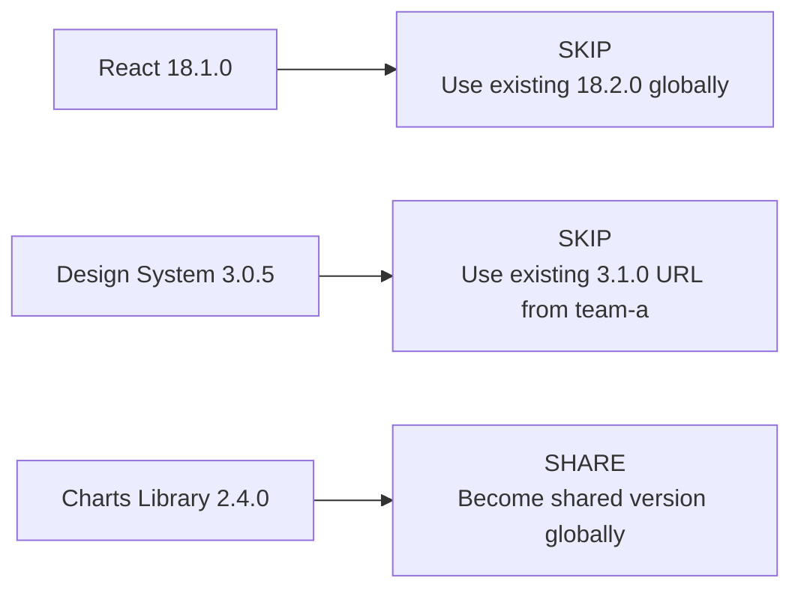
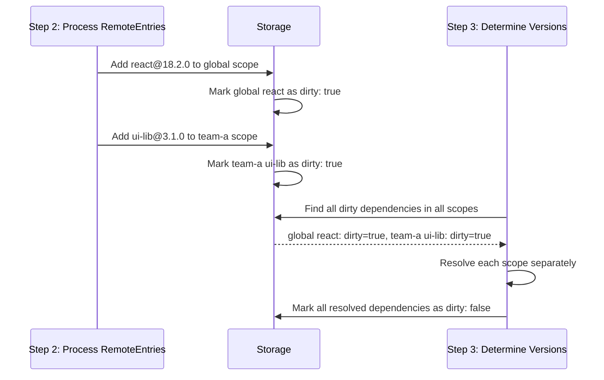
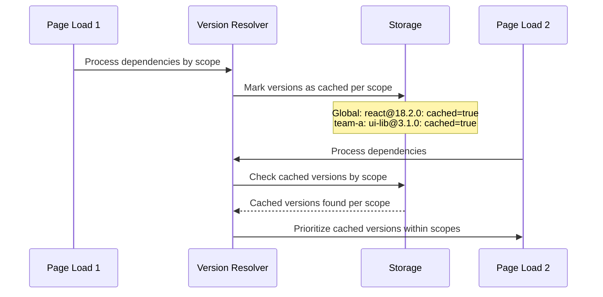

[< back](./../README.md)

# Version Resolver

The version resolver determines how to share externals (dependencies) across multiple remotes (micro frontends). It decides which external versions to share globally, share within specific scopes, or scope to individual remotes (micro frontends).

## How are the remotes bundled:

Native-federation provides a `federation.config.js` in its remotes. This configuration file allows the user to finetune which externals should be shared with other remotes and which should only be used by that specific remote. This process of choosing a specific (sub)set of remotes that can use a particular shared externals is called "scoping".

Whenever a remote is bundled, Native-federation includes a metadata file called the `remoteEntry.json`. When transpiled and bundled, a remote file structure looks like this:

```
📁 dist/
└── 📁 mfe1/
    ├── 📄 remoteEntry.json
    ├── 📄 button.js
    ├── 📄 dependency-a.js
    ├── 📄 dependency-b.js
    └── 📄 chunk-ABCD1234.js
```

The `remoteEntry.json` contains a translation of the `federation.config.js` and serves as metadata file to explain to the orchestrator which remotes can be shared and which have to be scoped:

```json
{
  "name": "team/mfe1",
  "exposes": [
    {
      "key": "./Button",
      "outFileName": "button.js"
    }
  ],
  "shared": [
    {
      "packageName": "dep-a",
      "outFileName": "dependency-a.js",
      "requiredVersion": "~2.1.0",
      "singleton": false,
      "strictVersion": true,
      "version": "2.1.1"
    },
    {
      "packageName": "dep-b",
      "outFileName": "dependency-b.js",
      "requiredVersion": "~2.1.0",
      "singleton": true,
      "strictVersion": true,
      "version": "2.1.2",
      "bundle": "browser-dep-b"
    }
  ],
  "chunks": {
    "browser-dep-b": ["chunk-ABCD1234.js"],
    "mapping-or-exposed": []
  }
}
```

These properties are very important for the orchestrator, here is what they mean:

- **requiredVersion:** The acceptable range of versions that this remote is compatible with.
- **singleton:** Should the orchestrator share this external with other remotes or use it only for this remote?
- **strictVersion:** Does the remote accept versions of this external that are outside of the accepted range (requiredVersion).
- **version:** The version of the external.
- **bundle:** (Optional) name of the internal chunk bundle this external belongs to, resolved via the `chunks` map on the same remoteEntry. See [Shared Chunks](./architecture.md#shared-chunks) for details.

## Understanding Import Maps

The orchestrator creates an import map from the provided remote metadata files (`remoteEntry.json`). Externals can be shared globally, shared within specific groups (shared scopes), or scoped to individual micro frontends.

### What is an Import Map?

An [import map](https://developer.mozilla.org/en-US/docs/Web/HTML/Reference/Elements/script/type/importmap) is a JSON structure that tells the browser where to find JavaScript ES module imports:

```javascript
{
  "imports": {
    "react": "https://cdn.example.com/react@18.2.0.js",
    "lodash": "https://cdn.example.com/lodash@4.17.21.js"
  },
  "scopes": {
    "https://legacy-mfe.example.com/": {
      "react": "https://legacy-mfe.example.com/react@17.0.2.js"
    }
  }
}
```

When your code does `import React from 'react'`, the browser uses this map to fetch the actual file.

### Only one shared version per scope

A major drawback of import-maps is that they can only specify **one version** of each dependency per scope:

```javascript
// ❌ This is NOT possible in import maps
{
  "imports": {
    "react": "https://cdn.example.com/react@18.2.0.js",
    "react": "https://cdn.example.com/react@17.0.2.js"  // Duplicate key!
  }
}
```

This limitation necessitates version resolution. When multiple micro frontends require different versions of the same dependency within a scope, only one can be shared "globally".

### The Solution: Multiple Scope Levels

Import maps provide **scopes** as solutions for dependency management:

```javascript
{
  "imports": {
    // Global scope - most micro frontends use this
    "react": "https://cdn.example.com/react@18.2.0.js",
    "ui-library": "https://cdn.example.com/ui-lib@2.1.0.js"
  },
  "scopes": {
    // Individual micro frontend scope
    "https://legacy-mfe.example.com/": {
      "react": "https://legacy-mfe.example.com/react@17.0.2.js"
    },

    // Linking multiple scopes to the same external can create a more fine-grained sharing of externals between a specific selection of remotes.
    "mfe1.example.com/": {
      "ui-library": "mfe1.example.com/ui-lib@3.0.0.js"
    },
    "mfe2.example.com/": {
      "ui-library": "mfe1.example.com/ui-lib@3.0.0.js"
    }
  }
}
```

**How it works**:

- **Global sharing**: Most micro frontends use React 18.2.0 and UI Library 2.1.0
- **Individual scoping**: Legacy MFE gets its own React 17.0.2
- **shareScope grouping**: Design system MFEs share UI Library 3.0.0.

**Specificity**:

The order of precedence is based on the specificity of the scope, with the global import having the lowest precedence.

> **Note:** With the "shareScope" grouping (3rd example), the import map is being tricked in loading the same file for 2 different scopes. This is handled by the orchestrator internally and provides a way to share an external over a select set of scopes. More on this later.

## Shared vs Scoped Dependencies

In the remote's metadata file (remoteEntry.json), dependencies are marked as "externals". Every external contains configuration that determines how it should be shared.

### Shared externals (singleton: true)

Dependencies marked as `singleton: true` are candidates for sharing:

```json
// In remoteEntry.json
{
  "shared": [
    {
      "packageName": "react",
      "singleton": true,
      "version": "18.2.0",
      "requiredVersion": "^18.0.0"
    }
  ]
}
```

**Result**: This dependency is a candidate to be placed in the imports object (in the importmap).

### Scoped externals (singleton: false)

Dependencies with `singleton: false` are always scoped to their individual remote:

```json
// In remoteEntry.json
{
  "shared": [
    {
      "packageName": "lodash-utils",
      "singleton": false,
      "version": "1.0.0"
    }
  ]
}
```

**Result**: This external is placed in the scope of its remote. And therefore only available to that specific remote.

### Secondary entrypoints (the `entries` map)

A package can expose more than one import specifier — a primary entrypoint (`@angular/core`) and one or
more secondary entrypoints (`@angular/core/testing`, `@angular/core/rxjs-interop`, …). Core v4.3.0 groups
these under a single `DenseSharedInfo`, replacing the flat `outFileName` with an `entries` map from each
specifier to its output file:

```json
// In remoteEntry.json
{
  "shared": [
    {
      "packageName": "@angular/core",
      "singleton": true,
      "version": "20.0.0",
      "requiredVersion": "^20.0.0",
      "entries": {
        "@angular/core": "core.js",
        "@angular/core/testing": "core-testing.js"
      }
    }
  ]
}
```

The resolver treats the whole `entries` map as one shared external: version negotiation happens once per
package, and every specifier in `entries` follows the winning version's placement — scoped, shareScope,
global, or the skip/override redirect. When a shared version wins, the winning remote's `entries` are the
**source** served to every consumer of that version, so each secondary entrypoint resolves to the same
provider as its primary. (Older/flat remote builds emit one `SharedInfo` per specifier; set
[`feature.convertFlatSharedInfo`](./config.md#modeConfig) to group them at runtime.)

#### Entrypoint coverage and tearing

The source's `entries` are not guaranteed to list every specifier a consumer needs. A `skip` version
redirected to the winner, or a sibling remote of the same shared version, can declare a secondary
entrypoint the source's build does not contain — for example the winner ships `@angular/core` while a
compatible, deduped remote also imports `@angular/core/testing`:

```
@angular/core  20.0.0  share  mfe-a  entries { @angular/core }
@angular/core  20.1.0  skip   mfe-b  entries { @angular/core, @angular/core/testing }
```

The default behaviour is **self-fill**: any specifier a remote declares that the source cannot provide is
served from that remote's **own** build. Above, `mfe-b` gets `@angular/core` from `mfe-a` (deduped) and
`@angular/core/testing` from its own scope. Nothing is dropped. The trade-off is a **tear** — one
package's specifiers resolve to two different builds. That is harmless for most libraries but can break
packages whose secondary entrypoints share module-singleton state with the primary.

To forbid tearing, enable [`strict.strictEntryPointCoverage`](./config.md#modeConfig) (opt-in, default
`false`). In this mode a version whose specifiers the shared winner cannot fully cover is **promoted to
`scope`** during resolution — its whole `entries` bunch is served coherently from its own build instead
of being redirected. The additive dynamic-init path applies the same promotion to a runtime remote. As a
last-resort net, if an uncovered specifier still reaches import-map generation it is refused rather than
torn: a warning, or an error under [`strict.strictImportMap`](./config.md#modeConfig).

To minimise tears (and, under strict coverage, scope promotions) the resolver also uses coverage as a
**tiebreaker** when choosing the shared version: among candidates that tie on the extra-downloads
heuristic, it prefers the one whose `entries` leave the fewest specifiers uncovered across the versions it
would skip. A decisive extra-downloads winner is never overridden, and an exact tie still keeps the
highest version.

### Shared scopes

By default, externals with the `singleton: true` property are shared globally between all remotes. The `shareScope` property can be used for externals that should only be shared over a select group of remotes. The `shareScope` property creates a logical group for dependency resolution. Externals with the same shared scope are resolved together in isolation from other share scopes.

This can be useful e.g. if some legacy remotes are still dependent on a previous major of a framework:

> Internally, shared "scope groups" don't exist in import maps, therefore it is only possible through overriding the specific scopes with 'the same url'.

```json
// Team A micro frontends - share UI components v3.x
{
  "shared": [{
    "packageName": "ui-components",
    "singleton": true,
    "shareScope": "team-a",
    "version": "3.1.0",
    "requiredVersion": "^3.0.0"
  }]
}

// Team B micro frontends - share UI components v2.x
{
  "shared": [{
    "packageName": "ui-components",
    "singleton": true,
    "shareScope": "team-b",
    "version": "2.5.0",
    "requiredVersion": "^2.0.0"
  }]
}

// Global shared dependency
{
  "shared": [{
    "packageName": "react",
    "singleton": true,
    "version": "18.2.0",
    "requiredVersion": "^18.0.0"
  }]
}
```

**How shared scopes work:**

1. **Resolution**: Dependencies with the same `shareScope` are grouped and resolved together
2. **Sharing**: The version within a logical group that is deemed to be most optimal for sharing is shared among all micro frontends in that logical group
3. **Import Map**: Each micro frontend within the logical group gets the shared version added to its individual scope in the final import map

### The "strict" shareScope

The special `shareScope: "strict"` shareScope enables exact version matching instead of semantic version range compatibility. This is useful when you need precise version control and want to share multiple specific versions of the same dependency.

```json
// Strict sharing - only exact versions are matched
{
  "shared": [
    {
      "packageName": "ui-library",
      "singleton": true,
      "shareScope": "strict",
      "version": "2.1.1",
      "requiredVersion": "^2.1.0" // Will be replaced with exact version 2.1.1
    }
  ]
}
```

**Differences compared to regular "share scopes":**

While a regular shareScope (including "global") shares only the most compatible version and scopes the rest of the provided incompatible versions. The "strict" shareScope will share _all_ provided versions. The shared versions will be stripped of their requiredVersion range and exposed as exact versions. This way, remotes can still share dependencies while receiving their own exact provided version. This is good for externals that have many breaking updates or incompatibilities between (patch) versions.

**Example: Multiple exact versions sharing**

```json
// Team A - Framework 15.2.1
{
  "shared": [{
    "packageName": "@framework/core",
    "singleton": true,
    "shareScope": "strict",
    "version": "15.2.1",
    "requiredVersion": "15.2.1"  // Exact version required
  }]
}

// Team B - Framework 15.2.3
{
  "shared": [{
    "packageName": "@framework/core",
    "singleton": true,
    "shareScope": "strict",
    "version": "15.2.3",
    "requiredVersion": "15.2.3"  // Different patch, potential incompatibility
  }]
}

// Result: Both teams get their exact framework version
// No runtime compatibility issues from mismatched compiled code
```

This prevents the runtime errors that occur when framework's interdependent modules (e.g. @angular/common -> @angular/core) expects specific internal APIs that may have changed between patch versions.

**When to use strict shareScope:**

- **Compiled Frameworks**: `@framework/*` related packages, where patch versions can break compatibility due to ahead-of-time (AOT) compilation
- **Breaking Changes**: When minor/patch versions introduce breaking changes despite semantic versioning
- **API Contracts**: When exact version matching is required for API compatibility

**Limitations:**

- No automatic version resolution - each remote gets exactly what it specifies
- Potential for more downloads compared to compatible version ranges
- Requires careful coordination between teams, especially when using monorepo-style dependencies subdivided into multiple packages. This feature does not fix an incompatibility between remotes.

## Resolution Process

The resolver creates an import map based on the provided metadata (remoteEntry.json) files, processing dependencies at multiple scope levels.

### Step 1: Categorize Dependencies by Scope



### Step 2: Resolve Dependencies by Scope

Dependencies are resolved separately for each scope:

```
// Input: Multiple scopes with different versions

Global scope:
  react@18.2.0 (requires "^18.0.0", singleton: true)
  react@18.1.0 (requires "^18.0.0", singleton: true)

"team-a" scope:
  ui-lib@3.1.0 (requires "^3.0.0", singleton: true, shareScope: "team-a")
  ui-lib@3.0.5 (requires "^3.0.0", singleton: true, shareScope: "team-a")

"team-b" scope:
  ui-lib@2.5.0 (requires "^2.0.0", singleton: true, shareScope: "team-b")

"strict" scope:
  design-tokens@2.1.0 (requires "2.1.0", singleton: true, shareScope: "strict")
  design-tokens@2.2.0 (requires "2.2.0", singleton: true, shareScope: "strict")

Individual scopes:
  lodash@4.17.21 (singleton: false)
```

### Step 3: Resolution Algorithm

For each scope (global, shared scopes, strict, individual), the resolver determines one or more versions to share. The first step is to check wether the external should be shared or not:



#### Version Validation

An external's `version` is optional and may be missing or non-semver. Before it is stored, an invalid version is handled in precedence order: throw, skip, or coerce (default). The result is always valid semver.



#### Determine Shared Versions

When the shared externals have been discovered, it is time for the resolver to determine which version to share of each shared external. This processs is partially based on the provided config of the user. There are multiple scopes, 1 global and 1 for each shareScope, the resolver loops through the scopes as follows:



> The "least extra downloads" choice (F5) is tie-broken by entrypoint coverage, and with
> [`strict.strictEntryPointCoverage`](./config.md#modeConfig) a `SKIP` version whose specifiers the
> winner cannot cover is promoted to `SCOPE`. See
> [Entrypoint coverage and tearing](#entrypoint-coverage-and-tearing).

### Step 4: Generate Import Map

The resolver creates different import map sections based on scope and actions:



## Dependency Pooling

The resolver above resolves every shared external **independently**: each one picks its own shared
version, sourced from whichever remote contributed that winning tag. Packages that must move together
can therefore split — `@framework/core` and `@framework/common` resolved against different versions,
or served from different remotes, even when one coherent version exists.

The sharper hazard is **transitive coupling** through a shared intermediary. Suppose a design system
`@design-system/ui` is built against `@framework/core`, shared from mfe-A (framework 15), and mfe-B
(framework 16) consumes that shared design system. mfe-B now loads two framework runtimes — its own
`core@16` plus the `core@15` the design system drags in — and breaks (e.g. two DI containers that
cannot see each other). The coupled group must resolve to one mutually-compatible version _together_,
and that has to hold transitively through intermediaries like the design system.

**Pooling** groups such externals and reconciles the whole group onto a single source. It is a
re-resolution layered on top of normal resolution: it rewrites the resolver's output but emits no new
versions.

### Enabling pooling

Pooling is opt-in and inert by default. An external joins a pool in one of two ways:

- **Auto (by npm scope).** Set `useAutoExternalPooling: true` in the mode `feature` block. Scoped packages
  are grouped by their scope — `@framework/core`, `@framework/common` → pool `framework`. Unscoped
  packages (`utils`, `tslib`) are never auto-pooled. The scope is derived from the package name, so
  this grouping is global and cannot drift.
- **Remote-declared tag.** A remote adds an optional `pool` field to a shared external in its
  `remoteEntry.json` (mirrors `shareScope`). A tag is **remote-local**: it groups only the externals
  that _one_ remote tags together. This is how a transitive coupling is expressed — auto-pooling groups
  by scope and can never connect `@design-system/ui` to `@framework/core`, so the remote co-tags both
  (see below).

```ts
initFederation(manifest, {
  feature: { useAutoExternalPooling: true },
});
```

**Membership is by shared members, not by name.** Pool identity is not a string that remotes must
agree on — it is the **connected component** of a graph. Each external is a node, joined by an edge to
its npm scope (auto-pooling, global) and to each `(remote, tag)` that declares it (remote-local). Two
remotes' groups merge only when they **share a member**, never because they chose the same tag string.
Drift is therefore harmless: mfe-A calling a group `"angular"` and mfe-B calling it `"design-system"`
still pool together when they overlap on one external, while two unrelated groups that happen to reuse
a label stay separate.

Because a tag is remote-local, it does **not** merge with a same-named auto scope by string. To pull a
cross-scope sibling into a family, co-tag a **bridge member**: tagging both `@design-system/ui` and
`@framework/core` with the same label connects the tag group to `@framework/core`'s auto scope through
the shared `@framework/core` node. (A coupling that no single remote witnesses — where no remote ships
both members — cannot be expressed; this is rare and by design.) A member that carries an explicit tag
yet pools with nothing is almost always a typo or a missing sibling, so it is logged; auto-scope
singletons are normal and stay silent. Each pool is named by its smallest member, for stable,
reload-safe logging.

### How pooling resolves

Pooling never re-runs the compatibility search. The resolver has already, per member, elected a
winning version (`share`) and marked every other version `skip` (compatible) or `scope`
(strict-incompatible). Pooling reads those verdicts and reconciles the family; it makes no
`isCompatible` calls of its own.

The rule is **island-or-defer**. A remote that the resolver marked `scope` on _any_ member of the pool
is **islanded**: its **entire** family is served from its own build, with **no** dedup — even on a
member where its version matches the shared one. This is the whole point of pooling and the one thing
the per-external resolver cannot do: deduping that matching sibling is exactly what would leak a
foreign build in through a shared intermediary (the `@design-system/ui`-against-`core@15` hazard). One
incompatibility anywhere in the family islands the remote everywhere.

Every _other_ remote keeps the resolver's per-member verdict untouched — the winner stays `share`, its
compatible dedups stay `skip`. Pooling adds nothing here; a fully compatible pool is a near no-op. It
does **not** re-point members onto a single "anchor" remote: coherence is a property of _versions_
(guaranteed by islanding), not of a common source, so different members may legitimately share from
different remotes.



**Scoped-only members.** If the winner's providers were all islanded away, the member has no shared
build left: its remaining copies fall to `scope` (self-serve) and the member is scope-only. Pooling
does **not** re-elect a surviving lower version — the pool exists to keep an _incompatible_ remote's
family coherent, not to recover a dedup for bystanders. When a scoped-only member has more than one
consumer (sharing was genuinely possible and lost) pooling logs
`'<member>' is scoped-only — no coherent shared build provides it; N remotes download their own copy`;
a single-consumer member is one download either way, so it is silent.

Under `strictExternalCompatibility` any island throws (defensively — the per-external resolver already
throws on a real incompatibility before pooling runs).

> **Compatible portfolios are unaffected.** Because pooling defers to the resolver everywhere except a
> real incompatibility, coherent and lockstep families — the overwhelmingly common case — pass through
> exactly as the per-external resolver left them. Pooling earns its keep only in the ragged,
> incompatible case, which is exactly where islanding fires.

### Scope and dynamic init

Pooling applies to the **global scope and named shareScopes**; the `strict` scope is never pooled. It
runs in both the initial pipeline and dynamic init (`initRemoteEntry`).

Because the import map is immutable once committed, the dynamic pass is **additive** — it adjusts only
the newly loaded remote and never retro-corrects committed remotes. It coordinates each shareScope
independently and applies the same rule: if any member is `scope` the whole family scopes with no
dedup; otherwise the remote keeps the resolver's verdict (a `share`+`skip` mix is a coverage gap, not a
conflict, so it is not forced to scope).

## Dynamic Init

> **Important!:** This feature currently only works with the `use-import-shim` import-map type.

Dynamic init is a runtime feature that allows loading additional micro frontends after the initial federation setup is complete. This is useful for lazy-loading micro frontends on demand or adding micro frontends based on user interactions or application state.

### Key Characteristics/limitations

**Additive Only**: Dynamic init can only **add** new dependencies to existing scopes - it cannot replace, modify, or remove dependencies that were resolved during the initial setup.

**Non-Disruptive**: The dynamic init process preserves all existing dependency resolutions and import map entries. Cached dependencies from the initial setup remain unchanged.

**Scope Aware**: Dynamic init respects the same scoping rules as the initial resolution process, adding new dependencies to their appropriate global, shared, or individual scopes.

This is in line with the ideology behind import maps. [source](https://github.com/WICG/import-maps/blob/abc4c6b24e0cc9a764091be916c5057e83c30c23/README.md) | [Shopify article](https://shopify.engineering/resilient-import-maps#)

### How Dynamic Init Works

When you call `initRemoteEntry()` to dynamically load a micro frontend, the system follows these steps:



### Dynamic Init Actions

Each new dependency gets one of these actions during dynamic init:

| Action    | Description                                                                                                                                                                                          |
| --------- | ---------------------------------------------------------------------------------------------------------------------------------------------------------------------------------------------------- |
| **SKIP**  | Version already exists or use existing shared version. In a shareScope context this action is used for overriding by skipping the provided external and loading a compatible cached version instead. |
| **SHARE** | No compatible version exists (yet), become the shared version for this scope                                                                                                                         |
| **SCOPE** | Incompatible version with strictVersion: true, or (under `strictEntryPointCoverage`) a version whose entrypoints the shared winner cannot cover — served coherently from its own build.               |

### Example: Dynamic Loading Scenario

```javascript
// Initial setup
const { initRemoteEntry } = await initFederation({
  'team/header': 'http://localhost:3000/remoteEntry.json',
  'team/sidebar': 'http://localhost:4000/remoteEntry.json',
});

// Later, dynamically load a new micro frontend
await initRemoteEntry('http://localhost:5000/remoteEntry.json', 'team/dashboard');

// The dashboard MFE becomes available
const DashboardComponent = await loadRemoteModule('team/dashboard', './Dashboard');
```

### Initial Setup Dependencies

```json
// team/header - React 18.2.0 (global scope)
{
  "shared": [{
    "packageName": "react",
    "version": "18.2.0",
    "singleton": true
  }]
}

// team/sidebar - Design System 3.1.0 (team-a scope)
{
  "shared": [{
    "packageName": "design-system",
    "version": "3.1.0",
    "singleton": true,
    "shareScope": "team-a"
  }]
}
```

### Dynamic Init - New Dashboard MFE

```json
// team/dashboard - added dynamically
{
  "shared": [
    {
      "packageName": "react",
      "version": "18.1.0",
      "requiredVersion": "^18.0.0",
      "singleton": true
    },
    {
      "packageName": "design-system",
      "version": "3.0.5",
      "requiredVersion": "^3.0.0",
      "singleton": true,
      "shareScope": "team-a"
    },
    {
      "packageName": "charts-library",
      "version": "2.4.0",
      "singleton": true
    }
  ]
}
```

### Resolution Results



### Resulting Import Map Changes

**Before Dynamic Init:**

```javascript
{
  "imports": {
    "react": "http://localhost:3000/react@18.2.0.js"
  },
  "scopes": {
    "http://localhost:4000/": {
      "design-system": "http://localhost:4000/design-system@3.1.0.js"
    }
  }
}
```

**ImportMap that will be appended to the DOM:**

```javascript

{
  "imports": {
    "charts-library": "http://localhost:5000/charts-library@2.4.0.js"
  },
  "scopes": {
    "http://localhost:5000/": {
      "design-system": "http://localhost:4000/design-system@3.1.0.js"
    }
  }
}
```

### Dynamic Init Constraints

#### Cannot Replace Existing Dependencies

If a dependency is already shared globally during the initial setup, dynamic init cannot replace it with a different version. For example, if React 18.2.0 is shared globally, dynamically loading React 17.0.0 with `strictVersion: false` will still use React 18.2.0 and show a warning. If `strictVersion: true` is used, the micro frontend will get its own scoped copy of React 17.0.0.

#### Cannot Modify Scope Assignments

Dynamic init cannot change the scope of a shared dependency. If a dependency like design-system@3.1.0 is shared in the "team-a" scope, it cannot be moved to the global scope or another shared scope during dynamic loading.

#### Dirty Flag Always False

Dynamic init sets `dirty: false` for all dependencies because it never modifies existing resolutions:

```typescript
// Dynamic init behavior
ports.sharedExternalsRepo.addOrUpdate(packageName, {
  dirty: false, // Always false - no re-resolution needed
  versions: [...existingVersions, newVersion],
});
```

### Best Practices for Dynamic Init

#### 1. Design for Additive Loading

Structure your application so dynamic MFEs complement rather than conflict with initial setup:

```javascript
// ✅ Good: Progressive enhancement
Initial: Core navigation + basic React
Dynamic: Dashboard with charts, analytics widgets

// ❌ Problematic: Conflicting versions
Initial: React 18.x + Modern UI library
Dynamic: Legacy MFE requiring React 17.x + Old UI library
```

#### 2. Use Shared Scopes Strategically

Group related MFEs in shared scopes to maximize reuse during dynamic loading:

```javascript
// ✅ Good: Team-based scopes
"team-dashboard": { "ui-components": "3.x" }
"team-reports": { "ui-components": "3.x" }

// Later dynamic loading within same team reuses components
```

#### 3. Handle Loading Failures Gracefully

```javascript
try {
  await initRemoteEntry('http://dashboard-team.com/remoteEntry.json', 'dashboard');
  // Dashboard is now available
} catch (error) {
  console.warn('Dashboard MFE failed to load:', error);
  // Application continues without dashboard features
}
```

#### 4. Monitor Compatibility Warnings

Dynamic init may produce warnings for version mismatches:

```javascript
// Enable logging to catch compatibility issues
await initFederation(manifest, {
  logLevel: 'warn',
  logger: consoleLogger,
});

// Watch for warnings like:
// "WARN: dashboard.react@18.1.0 using existing shared version 18.2.0"
```

### Use Cases for Dynamic Init

#### Route-Based Loading

```javascript
// Load MFEs based on navigation
router.on('/dashboard', async () => {
  await initRemoteEntry('http://dashboard.com/remoteEntry.json', 'dashboard');
  const Dashboard = await loadRemoteModule('dashboard', './Dashboard');
});
```

#### Feature Flags

```javascript
// Load additional features based on user permissions
if (user.hasFeature('advanced-analytics')) {
  await initRemoteEntry('http://analytics.com/remoteEntry.json', 'analytics');
}
```

#### A/B Testing

```javascript
// Load different versions for testing
const variant = getABTestVariant();
await initRemoteEntry(`http://variant-${variant}.com/remoteEntry.json`, 'test-mfe');
```

## Understanding Scope Levels

### Global Scope (`__GLOBAL__`)

- **Purpose**: Dependencies shared across all micro frontends
- **Use case**: Core libraries like React, common utilities
- **Configuration**: `singleton: true` without `shareScope`
- **Import map**: Added to the `imports` property

### Shared Scopes (custom names)

- **Purpose**: Logical groupings for dependency resolution among specific micro frontends
- **Use case**: Team-specific libraries, design systems, domain-specific tools
- **Configuration**: `singleton: true` with `shareScope: "scope-name"`
- **Import map**: Resolved version URL is added to each MFE's individual scope

### Strict Scope (`"strict"`)

- **Purpose**: Exact version matching without semantic version compatibility checking
- **Use case**: Multiple exact versions of the same dependency, legacy support, breaking changes
- **Configuration**: `singleton: true` with `shareScope: "strict"`
- **Import map**: Each exact version URL is added to requesting MFE's individual scope
- **Unique behavior**: Multiple versions can have the "share" action simultaneously

### Individual Scopes (per micro frontend)

- **Purpose**: Dependencies used only by one micro frontend
- **Use case**: Incompatible versions, micro frontend-specific libraries
- **Configuration**: `singleton: false` or incompatible shared dependencies
- **Import map**: Added to the specific MFE's scope with its own URL

## Understanding "dirty" Flag

When processing remoteEntry.json files, shared dependencies are marked as "dirty" when new versions are added or their version list changes. This signals that the dependency needs resolution within its scope.



**Why this matters**: The dirty flag prevents unnecessary re-resolution of dependencies that haven't changed within their scope, improving performance when the same micro frontends are loaded repeatedly.

## Understanding "strictVersion"

The `strictVersion` flag applies to shared dependencies (`singleton: true`) and determines how incompatible versions are handled within each scope:

### strictVersion: false (default)

The user will be notified about the incompatible version, but the resolver will skip this version since another version was already shared in the scope.

```json
// MFE needs ui-lib ~4.16.0, but team-a scope shares 4.17.0
{
  "packageName": "ui-lib",
  "version": "4.16.5",
  "requiredVersion": "~4.16.0",
  "singleton": true,
  "shareScope": "team-a",
  "strictVersion": false
}

// Result: SKIP + WARNING
// The MFE will use the shared 4.17.0 version URL from team-a scope
// May cause runtime compatibility issues
```

### strictVersion: true

```json
// MFE needs ui-lib ~4.16.0, but team-a scope shares 4.17.0
{
  "packageName": "ui-lib",
  "version": "4.16.5",
  "requiredVersion": "~4.16.0",
  "singleton": true,
  "shareScope": "team-a",
  "strictVersion": true
}

// Result: SCOPE (individual)
// The MFE gets its own ui-lib@4.16.5 download
// Guaranteed compatibility, but extra download
```

**Note**: `strictVersion` is ignored for scoped dependencies (`singleton: false`) since they always get their own copy.

## Priority Rules Explained

### 1. Host Version Override

Host remoteEntry.json has the highest precedence within each scope. When an external version exists in the host remoteEntry.json for a specific scope, it is guaranteed chosen as the shared version for that scope.

```javascript
await initFederation(manifest, {
  hostRemoteEntry: { url: './host-remoteEntry.json' },
});

// If host specifies react@18.0.5 globally, it wins over:
// - MFE1's react@18.2.0 (global)
// - MFE2's react@18.1.0 (global)

// If host specifies ui-lib@3.0.0 for team-a scope, it wins over:
// - Team A MFE1's ui-lib@3.1.0 (team-a scope)
// - Team A MFE2's ui-lib@3.0.5 (team-a scope)
```

### 2. Latest Version Strategy

Can be activated with the `profile.latestSharedExternal` hyperparameter. This changes the strategy within each scope from "most optimal" to "latest available" version.

```javascript
await initFederation(manifest, {
  profile: { latestSharedExternal: true },
});

// Available versions in global scope: [18.1.0, 18.2.0, 18.0.5]
// Chosen: 18.2.0 (latest in global scope)

// Available versions in team-a scope: [3.0.5, 3.1.0, 3.0.8]
// Chosen: 3.1.0 (latest in team-a scope)
```

### 3. Optimal Version Strategy (default)

**Why this is default**: Minimizes bundle size and download time by choosing the version that requires the fewest additional scoped downloads within each scope.

The resolver calculates which version minimizes extra downloads per scope by examining how many versions would need to be individually scoped due to incompatibility:

```
// The resolver calculates which version minimizes extra downloads per scope:

Global scope - if 18.2.0 is chosen:
  18.1.0: compatible (SKIP) → 0 extra downloads
  17.0.2: incompatible + strict (SCOPE) → 1 extra download
  Total cost: 1 extra download

Team-a scope - if 3.1.0 is chosen:
  3.0.5: compatible (SKIP) → 0 extra downloads
  Total cost: 0 extra downloads

Result: Choose 18.2.0 globally, 3.1.0 for team-a scope
```

### 4. Caching Strategy

The resolver optimizes for applications with page reloads. When storage like sessionStorage is chosen, shared dependencies are cached across page loads within their respective scopes:



## Remote Cache Override Behavior

When a remote is already present in the cache, the orchestrator will skip the requested remote or override the existing cached remote based on the provided `profile` options.

### Override Flag Detection

The orchestrator checks when a remote should be overridden or skipped by comparing the provided remoteName with the cached remoteName. If they match, the requested `remoteEntry.json` URL will be compared with the cached `remoteEntry.json` URL. By default, on initialization, the remote will be skipped if the URLs match and overridden if the URLs differ. Except for the dynamic init which will always skip by default.

### Skip Cached Remotes Configuration

The `overrideCachedRemotes` setting controls whether to fetch remotes that already exist in cache. The default setting is "init-only" since it is generally not recommended to update the existing import-map after initialization:

```javascript
await initFederation(manifest, {
  profile: {
    overrideCachedRemotes: 'never', // Do not override cached remotes
    overrideCachedRemotes: 'init-only', // Override only during the first initialization (default)
    overrideCachedRemotes: 'always', // Override all cached remotes
  },
});
```

### URL Matching Behavior

The `overrideCachedRemotesIfURLMatches` setting provides additional control. Normally, it makes sense to only override the cached remote if the URL changed, like from `https://my.cdn/mfe1/0.0.1/remoteEntry.json` to `https://my.cdn/mfe1/0.0.2/remoteEntry.json`. However, it might be necessary to always override, even if the URL matches the previously cached url:

```javascript
await initFederation(manifest, {
  profile: {
    overrideCachedRemotes: 'always',
    overrideCachedRemotesIfURLMatches: true,
  },
});
```

> **Note:** the `overrideCachedRemotes` is generally meant as "override only if urls differ".

### Override Processing Steps

When a remote is marked for override by the orchestrator (`override: true`), the system performs complete cache cleanup by purging all cached meta data like exposed modules and externals:

```mermaid
flowchart TD
    A[Remote marked as override] --> B[Remove from RemoteInfo cache]
    B --> C[Remove from ScopedExternals cache]
    C --> D[Remove from SharedExternals cache (all scopes)]
    D --> E[Add new RemoteInfo to cache]
    E --> F[Process new externals normally]

    F --> G{External Type}
    G -->|singleton: true| H[Add to SharedExternals]
    G -->|singleton: false| I[Add to ScopedExternals]
```

## Configuration

### Host Remote Entry

Specify a host `remoteEntry.json` to control critical dependencies across all scopes:

```javascript
await initFederation(manifest, {
  hostRemoteEntry: {
    url: './host-remoteEntry.json',
  },
});
```

Host dependencies can specify `shareScope` to control specific logical shared scopes, or omit it to control global sharing. Host versions always take precedence within their respective scope.

### Resolution Strategy

Hyperparameters to tweak the behavior of the version resolver across all scopes:

```javascript
await initFederation(manifest, {
  // Use latest available versions in each scope
  profile: {
    latestSharedExternal: true,
  },

  // Skip cached remotes for performance
  profile: {
    overrideCachedRemotes: 'never',
  },

  // Drop externals with a missing/invalid version instead of coercing them
  profile: {
    skipInvalidExternalVersions: true,
  },

  // Fail on version conflicts in any scope
  strict: true,
});
```

### Storage Options

Choosing different storage allows the library to reuse cached externals across page loads, maintaining scope-specific optimizations:

```javascript
// In-memory only (default) - fastest, lost on page reload
storage: globalThisStorageEntry,

// Single session only - survives page reloads, cleared when browser closes
storage: sessionStorageEntry,

// Persist across browser sessions - survives browser restarts
storage: localStorageEntry
```

**When to use each**:

- **globalThis**: Development or single-page visits where speed matters most
- **sessionStorage**: Multi-page applications where users navigate between pages
- **localStorage**: Frequently visited applications where long-term caching provides value

**Scope impact**: All storage options maintain the logical shared scope groupings and resolved version URLs for optimal performance.

## Troubleshooting

### Version Conflicts

```
// Error in strict mode for global scope
NFError: [team/mfe1] dep-a@1.2.3 is not compatible with existing dep-a@2.0.0 requiredRange '^1.0.0'

// Error in strict mode for shared scope
NFError: [custom-scope.dep-a] ShareScope external has multiple shared versions.

// Solutions:
// 1. Loosen the version constraints in the remoteEntry.json
// 2. Use host override for the dependency in the specific scope
// 3. Disable strict mode
// 4. Move conflicting dependencies to different shared scopes
// 5. Use strict shareScope for exact version control
```

### Shared Scope Issues

```
// Warning for shared scope with no shared versions
Warning: [team-a][dep-a] shareScope has no override version.

// All versions in the shared scope will be individually scoped
// Consider reviewing version compatibility or shared scope assignments
```

**Common causes**:

- All versions in the logical shared scope are incompatible with each other and have `strictVersion: true`
- Misconfigured shared scope names leading to single-version groups
- Version ranges that don't overlap within the logical group

### Strict Scope Considerations

```
// Multiple exact versions in strict scope
Info: Strict scope external design-tokens has multiple shared versions: 2.1.0, 2.2.0

// This is expected behavior - each exact version gets its own download
// Consider if version consolidation is possible to reduce bundle size
```

**Best practices for strict scopes**:

- Use sparingly to avoid version sprawl
- Consider if regular shareScopes with looser version ranges could work
- Document exact version requirements clearly for your team
- Monitor bundle size impact of multiple exact versions

**Common scenarios requiring strict scopes**:

- **Angular applications**: Patch versions can break compatibility due to AOT compilation
- **Compiled frameworks**: Any framework with compilation steps that create version-specific artifacts
- **Binary dependencies**: Native modules or WebAssembly that require exact version matching
- **Legacy migrations**: Gradually migrating from old to new versions without compatibility risks

## Semver Compatibility

The resolver uses [standard semantic versioning rules](https://www.npmjs.com/package/semver) within each scope:

| Range     | Matches               | Examples                  |
| --------- | --------------------- | ------------------------- |
| `^1.2.3`  | Compatible changes    | `1.2.4`, `1.3.0`, `1.9.9` |
| `~1.2.3`  | Patch-level changes   | `1.2.4`, `1.2.9`          |
| `>=1.2.3` | Greater than or equal | `1.2.3`, `2.0.0`          |
| `1.2.3`   | Exact version         | `1.2.3` only              |

Pre-release versions are only compatible with the same pre-release range within the same scope.
