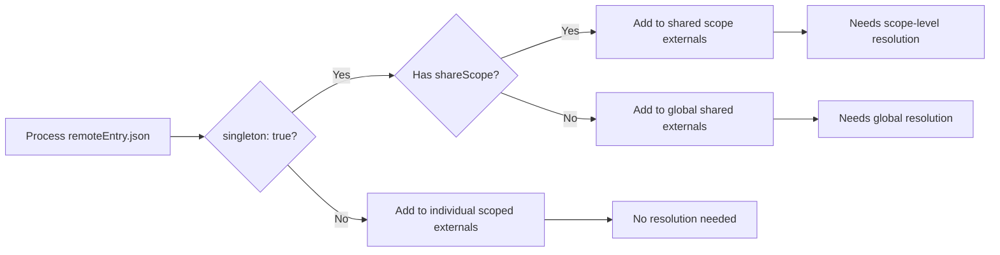
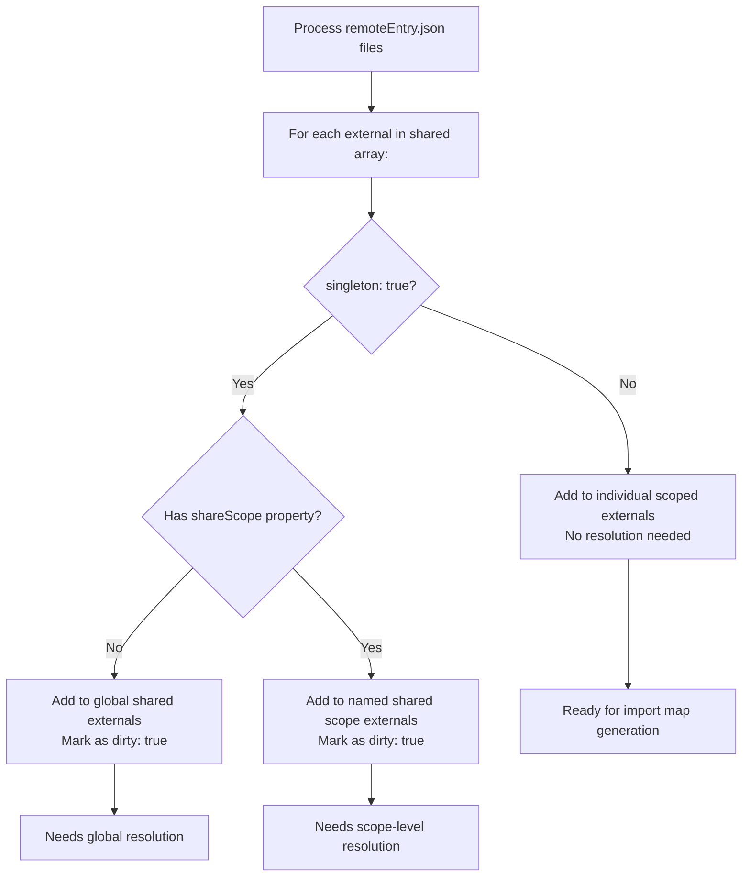
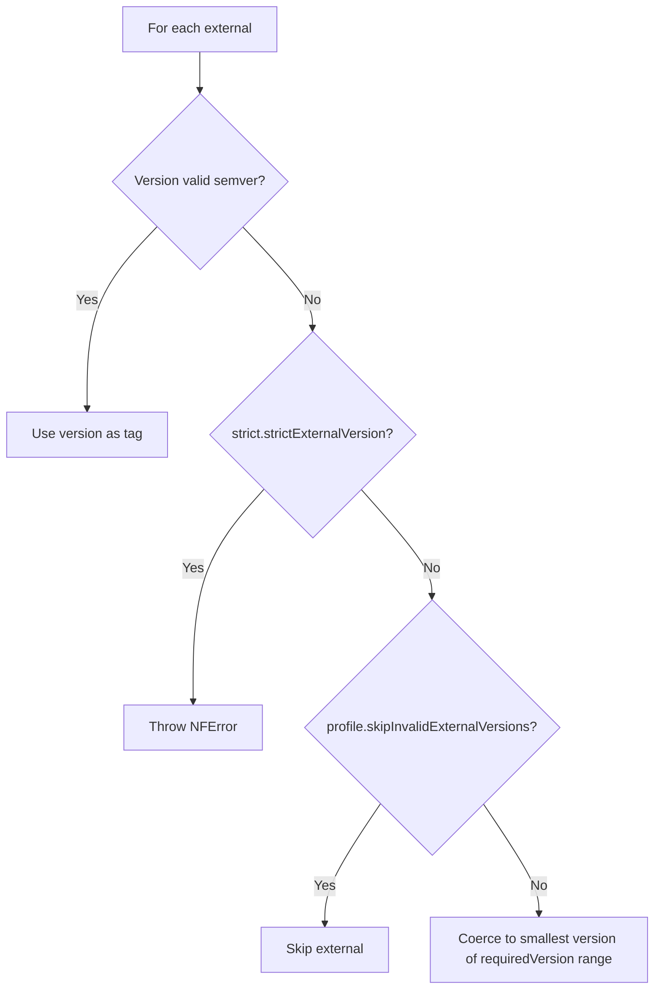
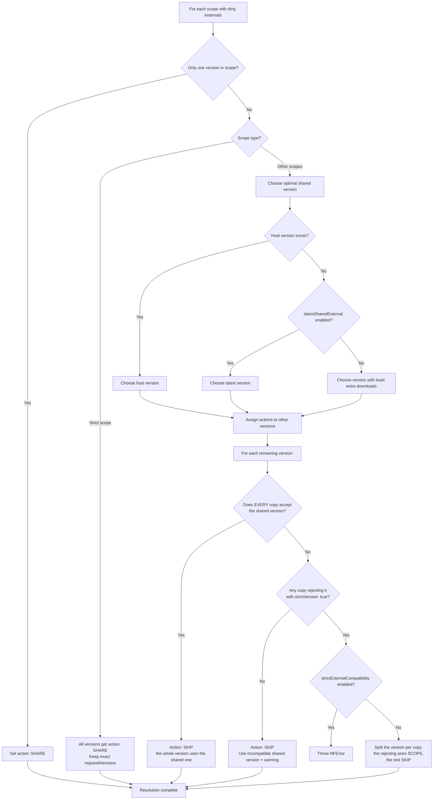
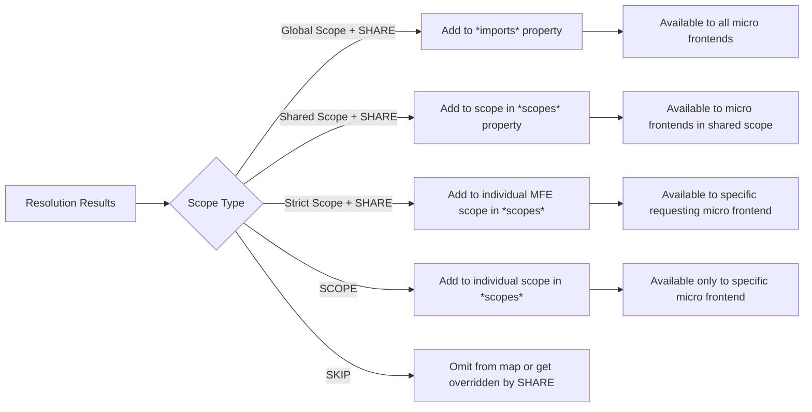
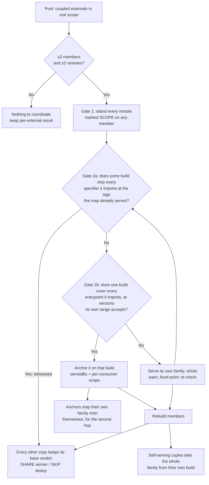
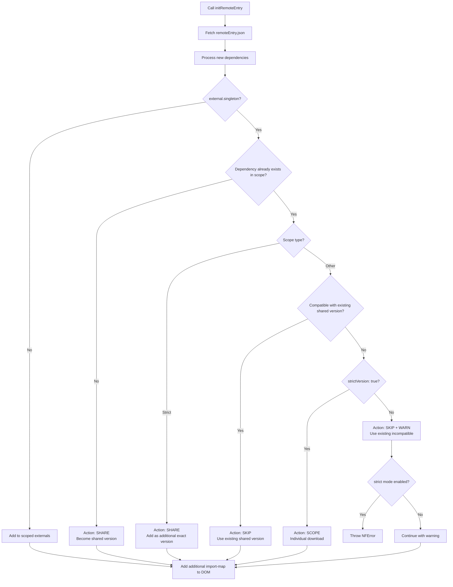
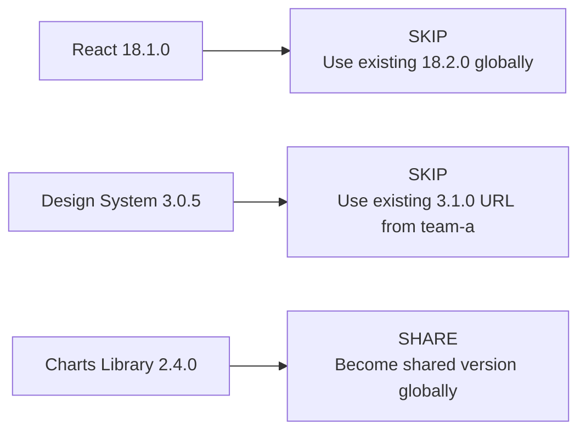
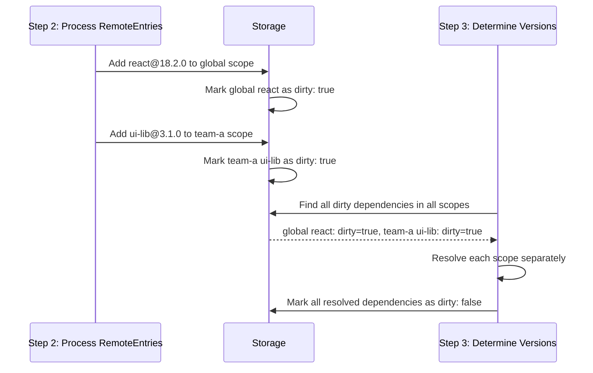
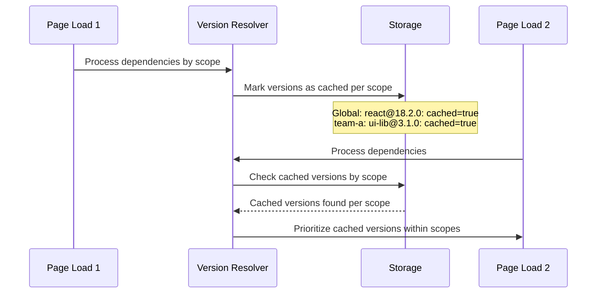

[< back](./../README.md)

# Version Resolver

The version resolver determines how to share externals (dependencies) across multiple remotes (micro frontends). It decides which external versions to share globally, share within specific scopes, or scope to individual remotes (micro frontends).

## How are the remotes bundled:

Native-federation provides a `federation.config.js` in its remotes. This configuration file allows the user to finetune which externals should be shared with other remotes and which should only be used by that specific remote. This process of choosing a specific (sub)set of remotes that can use a particular shared externals is called "scoping".

Whenever a remote is bundled, Native-federation includes a metadata file called the `remoteEntry.json`. When transpiled and bundled, a remote file structure looks like this:

```
📁 dist/
└── 📁 mfe1/
    ├── 📄 remoteEntry.json
    ├── 📄 button.js
    ├── 📄 dependency-a.js
    ├── 📄 dependency-b.js
    └── 📄 chunk-ABCD1234.js
```

The `remoteEntry.json` contains a translation of the `federation.config.js` and serves as metadata file to explain to the orchestrator which remotes can be shared and which have to be scoped:

```json
{
  "name": "team/mfe1",
  "exposes": [
    {
      "key": "./Button",
      "outFileName": "button.js"
    }
  ],
  "shared": [
    {
      "packageName": "dep-a",
      "outFileName": "dependency-a.js",
      "requiredVersion": "~2.1.0",
      "singleton": false,
      "strictVersion": true,
      "version": "2.1.1"
    },
    {
      "packageName": "dep-b",
      "outFileName": "dependency-b.js",
      "requiredVersion": "~2.1.0",
      "singleton": true,
      "strictVersion": true,
      "version": "2.1.2",
      "bundle": "browser-dep-b"
    }
  ],
  "chunks": {
    "browser-dep-b": ["chunk-ABCD1234.js"],
    "mapping-or-exposed": []
  }
}
```

These properties are very important for the orchestrator, here is what they mean:

- **requiredVersion:** The acceptable range of versions that this remote is compatible with.
- **singleton:** Should the orchestrator share this external with other remotes or use it only for this remote?
- **strictVersion:** Does the remote accept versions of this external that are outside of the accepted range (requiredVersion).
- **version:** The version of the external.
- **bundle:** (Optional) name of the internal chunk bundle this external belongs to, resolved via the `chunks` map on the same remoteEntry. See [Shared Chunks](./architecture.md#shared-chunks) for details.

## Understanding Import Maps

The orchestrator creates an import map from the provided remote metadata files (`remoteEntry.json`). Externals can be shared globally, shared within specific groups (shared scopes), or scoped to individual micro frontends.

### What is an Import Map?

An [import map](https://developer.mozilla.org/en-US/docs/Web/HTML/Reference/Elements/script/type/importmap) is a JSON structure that tells the browser where to find JavaScript ES module imports:

```javascript
{
  "imports": {
    "react": "https://cdn.example.com/react@18.2.0.js",
    "lodash": "https://cdn.example.com/lodash@4.17.21.js"
  },
  "scopes": {
    "https://legacy-mfe.example.com/": {
      "react": "https://legacy-mfe.example.com/react@17.0.2.js"
    }
  }
}
```

When your code does `import React from 'react'`, the browser uses this map to fetch the actual file.

### Only one shared version per scope

A major drawback of import-maps is that they can only specify **one version** of each dependency per scope:

```javascript
// ❌ This is NOT possible in import maps
{
  "imports": {
    "react": "https://cdn.example.com/react@18.2.0.js",
    "react": "https://cdn.example.com/react@17.0.2.js"  // Duplicate key!
  }
}
```

This limitation necessitates version resolution. When multiple micro frontends require different versions of the same dependency within a scope, only one can be shared "globally".

### The Solution: Multiple Scope Levels

Import maps provide **scopes** as solutions for dependency management:

```javascript
{
  "imports": {
    // Global scope - most micro frontends use this
    "react": "https://cdn.example.com/react@18.2.0.js",
    "ui-library": "https://cdn.example.com/ui-lib@2.1.0.js"
  },
  "scopes": {
    // Individual micro frontend scope
    "https://legacy-mfe.example.com/": {
      "react": "https://legacy-mfe.example.com/react@17.0.2.js"
    },

    // Linking multiple scopes to the same external can create a more fine-grained sharing of externals between a specific selection of remotes.
    "mfe1.example.com/": {
      "ui-library": "mfe1.example.com/ui-lib@3.0.0.js"
    },
    "mfe2.example.com/": {
      "ui-library": "mfe1.example.com/ui-lib@3.0.0.js"
    }
  }
}
```

**How it works**:

- **Global sharing**: Most micro frontends use React 18.2.0 and UI Library 2.1.0
- **Individual scoping**: Legacy MFE gets its own React 17.0.2
- **shareScope grouping**: Design system MFEs share UI Library 3.0.0.

**Specificity**:

The order of precedence is based on the specificity of the scope, with the global import having the lowest precedence.

> **Note:** With the "shareScope" grouping (3rd example), the import map is being tricked in loading the same file for 2 different scopes. This is handled by the orchestrator internally and provides a way to share an external over a select set of scopes. More on this later.

## Shared vs Scoped Dependencies

In the remote's metadata file (remoteEntry.json), dependencies are marked as "externals". Every external contains configuration that determines how it should be shared.

### Shared externals (singleton: true)

Dependencies marked as `singleton: true` are candidates for sharing:

```json
// In remoteEntry.json
{
  "shared": [
    {
      "packageName": "react",
      "singleton": true,
      "version": "18.2.0",
      "requiredVersion": "^18.0.0"
    }
  ]
}
```

**Result**: This dependency is a candidate to be placed in the imports object (in the importmap).

### Scoped externals (singleton: false)

Dependencies with `singleton: false` are always scoped to their individual remote:

```json
// In remoteEntry.json
{
  "shared": [
    {
      "packageName": "lodash-utils",
      "singleton": false,
      "version": "1.0.0"
    }
  ]
}
```

**Result**: This external is placed in the scope of its remote. And therefore only available to that specific remote.

### Secondary entrypoints (the `entries` map)

A package can expose more than one import specifier — a primary entrypoint (`@angular/core`) and one or
more secondary entrypoints (`@angular/core/testing`, `@angular/core/rxjs-interop`, …). Core v4.3.0 groups
these under a single `DenseSharedInfo`, replacing the flat `outFileName` with an `entries` map from each
specifier to its output file:

```json
// In remoteEntry.json
{
  "shared": [
    {
      "packageName": "@angular/core",
      "singleton": true,
      "version": "20.0.0",
      "requiredVersion": "^20.0.0",
      "entries": {
        "@angular/core": "core.js",
        "@angular/core/testing": "core-testing.js"
      }
    }
  ]
}
```

The resolver treats the whole `entries` map as one shared external: version negotiation happens once per
package, and every specifier in `entries` follows the winning version's placement — scoped, shareScope,
global, or the skip/override redirect. When a shared version wins, the **basis** remote's `entries` are the
source served to every consumer of that version, so each secondary entrypoint resolves to the same
provider as its primary. (Older/flat remote builds emit one `SharedInfo` per specifier; set
[`feature.convertFlatSharedInfo`](./config.md#modeConfig) to group them at runtime.)

#### The basis of a version

Several remotes can report the same version of a package, and they all land in one `SharedVersion` as its
`remotes` list. They build the same tag, but each bundles only the entrypoints it actually imports, so the
lists can differ. `remotes[0]` is the version's **basis** — the copy whose `entries` every consumer
resolves to — and the cache keeps it sorted on insert by this precedence:

1. **host** — the shell's build is already loaded in the browser and cannot be repointed.
2. **cached** — an already-served copy; repointing it would invalidate a committed import map and force a
   redundant download.
3. **widest coverage** — the copy declaring the most entrypoints, so siblings need no self-fill.
4. **arrival order** — ties keep the incumbent, so generated import maps stay byte-stable.

Rule 3 is what makes a superset copy win: given `{table}`, `{table}` and `{sort, table}` of one version,
the third becomes the basis and serves both specifiers from a single build. Rules 1 and 2 deliberately
outrank it — stability beats optimality — so a host or already-served basis can still leave gaps, which
fall through to the coverage policy below.

#### Entrypoint coverage and tearing

The basis's `entries` are not guaranteed to list every specifier a consumer needs. A `skip` version
redirected to the winner, or a sibling remote of the same shared version, can declare a secondary
entrypoint the basis's build does not contain — for example the basis ships `@angular/core` while a
compatible, deduped remote also imports `@angular/core/testing`:

```
@angular/core  20.0.0  share  mfe-a  entries { @angular/core }
@angular/core  20.1.0  skip   mfe-b  entries { @angular/core, @angular/core/testing }
```

Serving those two specifiers from two different builds is a **tear**. It is harmless for most libraries but
can break packages whose secondary entrypoints share module-singleton state with the primary. Three
behaviours are available, in precedence order:

| Setting | Behaviour on an uncovered entrypoint |
| --- | --- |
| [`strict.strictEntryPointCoverage`](./config.md#modeConfig) | **Throws.** Resolution refuses to share a package it cannot serve coherently. |
| [`profile.scopeUncoveredEntrypoints`](./config.md#modeConfig) | **Scopes.** The uncovered copy is split out into a `scope` version of its own tag and serves its whole `entries` bunch from its own build. Sharing continues for the copies the basis does cover. |
| neither (default) | **Self-fills.** The specifier is served from the declaring remote's own build and a warning is logged. Nothing is dropped; the package tears. |

**Inside a pool the tear cannot happen at all**, whichever of the three is configured: pooling tests
coverage itself, per specifier, and a remote no build covers takes its whole family from its own build (see
"How pooling resolves"). Both settings above are `false` in every shipped profile, so a *pooled* family
relies on the pooling rule rather than on them, and an unpooled package still self-fills as described.

Scoping is per remote copy, not per version: given a basis `{table, sort}`, a covered `{table}` and an
uncovered `{table, paginator}`, only the third is split out — the first two keep sharing. The additive
dynamic-init path applies the same policy to a runtime remote, and the import-map builders keep a
last-resort net for stale storage: an uncovered specifier reaching them is refused under
`strictEntryPointCoverage` or [`strict.strictImportMap`](./config.md#modeConfig), and warned about
otherwise.

To minimise tears (and scope promotions) the resolver also uses coverage as a **tiebreaker** when choosing
the shared version: among candidates that tie on the extra-downloads heuristic, it prefers the one whose
`entries` leave the fewest specifiers uncovered across the versions it would skip. A decisive
extra-downloads winner is never overridden, and an exact tie still keeps the highest version.

### Shared scopes

By default, externals with the `singleton: true` property are shared globally between all remotes. The `shareScope` property can be used for externals that should only be shared over a select group of remotes. The `shareScope` property creates a logical group for dependency resolution. Externals with the same shared scope are resolved together in isolation from other share scopes.

This can be useful e.g. if some legacy remotes are still dependent on a previous major of a framework:

> Internally, shared "scope groups" don't exist in import maps, therefore it is only possible through overriding the specific scopes with 'the same url'.

```json
// Team A micro frontends - share UI components v3.x
{
  "shared": [{
    "packageName": "ui-components",
    "singleton": true,
    "shareScope": "team-a",
    "version": "3.1.0",
    "requiredVersion": "^3.0.0"
  }]
}

// Team B micro frontends - share UI components v2.x
{
  "shared": [{
    "packageName": "ui-components",
    "singleton": true,
    "shareScope": "team-b",
    "version": "2.5.0",
    "requiredVersion": "^2.0.0"
  }]
}

// Global shared dependency
{
  "shared": [{
    "packageName": "react",
    "singleton": true,
    "version": "18.2.0",
    "requiredVersion": "^18.0.0"
  }]
}
```

**How shared scopes work:**

1. **Resolution**: Dependencies with the same `shareScope` are grouped and resolved together
2. **Sharing**: The version within a logical group that is deemed to be most optimal for sharing is shared among all micro frontends in that logical group
3. **Import Map**: Each micro frontend within the logical group gets the shared version added to its individual scope in the final import map

### The "strict" shareScope

The special `shareScope: "strict"` shareScope enables exact version matching instead of semantic version range compatibility. This is useful when you need precise version control and want to share multiple specific versions of the same dependency.

```json
// Strict sharing - only exact versions are matched
{
  "shared": [
    {
      "packageName": "ui-library",
      "singleton": true,
      "shareScope": "strict",
      "version": "2.1.1",
      "requiredVersion": "^2.1.0" // Will be replaced with exact version 2.1.1
    }
  ]
}
```

**Differences compared to regular "share scopes":**

While a regular shareScope (including "global") shares only the most compatible version and scopes the rest of the provided incompatible versions. The "strict" shareScope will share _all_ provided versions. The shared versions will be stripped of their requiredVersion range and exposed as exact versions. This way, remotes can still share dependencies while receiving their own exact provided version. This is good for externals that have many breaking updates or incompatibilities between (patch) versions.

**Example: Multiple exact versions sharing**

```json
// Team A - Framework 15.2.1
{
  "shared": [{
    "packageName": "@framework/core",
    "singleton": true,
    "shareScope": "strict",
    "version": "15.2.1",
    "requiredVersion": "15.2.1"  // Exact version required
  }]
}

// Team B - Framework 15.2.3
{
  "shared": [{
    "packageName": "@framework/core",
    "singleton": true,
    "shareScope": "strict",
    "version": "15.2.3",
    "requiredVersion": "15.2.3"  // Different patch, potential incompatibility
  }]
}

// Result: Both teams get their exact framework version
// No runtime compatibility issues from mismatched compiled code
```

This prevents the runtime errors that occur when framework's interdependent modules (e.g. @angular/common -> @angular/core) expects specific internal APIs that may have changed between patch versions.

**When to use strict shareScope:**

- **Compiled Frameworks**: `@framework/*` related packages, where patch versions can break compatibility due to ahead-of-time (AOT) compilation
- **Breaking Changes**: When minor/patch versions introduce breaking changes despite semantic versioning
- **API Contracts**: When exact version matching is required for API compatibility

**Limitations:**

- No automatic version resolution - each remote gets exactly what it specifies
- Potential for more downloads compared to compatible version ranges
- Requires careful coordination between teams, especially when using monorepo-style dependencies subdivided into multiple packages. This feature does not fix an incompatibility between remotes.

## Resolution Process

The resolver creates an import map based on the provided metadata (remoteEntry.json) files, processing dependencies at multiple scope levels.

### Step 1: Categorize Dependencies by Scope


```mermaid
flowchart LR
    A[Process remoteEntry.json] --> B{singleton: true?}
    B -->|Yes| C{Has shareScope?}
    B -->|No| D[Add to individual scoped externals]
    C -->|Yes| E[Add to shared scope externals]
    C -->|No| F[Add to global shared externals]
    E --> G[Needs scope-level resolution]
    F --> H[Needs global resolution]
    D --> I[No resolution needed]
```

### Step 2: Resolve Dependencies by Scope

Dependencies are resolved separately for each scope:

```
// Input: Multiple scopes with different versions

Global scope:
  react@18.2.0 (requires "^18.0.0", singleton: true)
  react@18.1.0 (requires "^18.0.0", singleton: true)

"team-a" scope:
  ui-lib@3.1.0 (requires "^3.0.0", singleton: true, shareScope: "team-a")
  ui-lib@3.0.5 (requires "^3.0.0", singleton: true, shareScope: "team-a")

"team-b" scope:
  ui-lib@2.5.0 (requires "^2.0.0", singleton: true, shareScope: "team-b")

"strict" scope:
  design-tokens@2.1.0 (requires "2.1.0", singleton: true, shareScope: "strict")
  design-tokens@2.2.0 (requires "2.2.0", singleton: true, shareScope: "strict")

Individual scopes:
  lodash@4.17.21 (singleton: false)
```

### Step 3: Resolution Algorithm

For each scope (global, shared scopes, strict, individual), the resolver determines one or more versions to share. The first step is to check wether the external should be shared or not:


```mermaid
flowchart TD
    A[Process remoteEntry.json files] --> B[For each external in shared array:]
    B --> C{singleton: true?}
    C -->|No| D[Add to individual scoped externals<br/>No resolution needed]
    C -->|Yes| E{Has shareScope property?}
    E -->|No| F[Add to global shared externals<br/>Mark as dirty: true]
    E -->|Yes| G[Add to named shared scope externals<br/>Mark as dirty: true]

    F --> H[Needs global resolution]
    G --> I[Needs scope-level resolution]
    D --> J[Ready for import map generation]
```

#### Version Validation

An external's `version` is optional and may be missing or non-semver. Before it is stored, an invalid version is handled in precedence order: throw, skip, or coerce (default). The result is always valid semver.


```mermaid
flowchart TD
    A[For each external] --> B{Version valid semver?}
    B -->|Yes| C[Use version as tag]
    B -->|No| D{strict.strictExternalVersion?}
    D -->|Yes| E[Throw NFError]
    D -->|No| F{profile.skipInvalidExternalVersions?}
    F -->|Yes| G[Skip external]
    F -->|No| H[Coerce to smallest version of requiredVersion range]
```

#### Determine Shared Versions

When the shared externals have been discovered, it is time for the resolver to determine which version to share of each shared external. This processs is partially based on the provided config of the user. There are multiple scopes, 1 global and 1 for each shareScope, the resolver loops through the scopes as follows:


```mermaid
flowchart TD
    A[For each scope with dirty externals] --> B{Only one version in scope?}
    B -->|Yes| C[Set action: SHARE]
    B -->|No| D{Scope type?}
    D -->|Strict scope| E[All versions get action: SHARE<br/>Keep exact requiredVersions]
    D -->|Other scopes| F[Choose optimal shared version]

    F --> F1{Host version exists?}
    F1 -->|Yes| F2[Choose host version]
    F1 -->|No| F3{latestSharedExternal enabled?}
    F3 -->|Yes| F4[Choose latest version]
    F3 -->|No| F5[Choose version with least extra downloads]

    F2 --> G[Assign actions to other versions]
    F4 --> G
    F5 --> G

    G --> G1[For each remaining version:]
    G1 --> G2{Does EVERY copy accept<br/>the shared version?}
    G2 -->|Yes| G3[Action: SKIP<br/>the whole version uses the shared one]
    G2 -->|No| G4{Any copy rejecting it<br/>with strictVersion: true?}
    G4 -->|No| G6[Action: SKIP<br/>Use incompatible shared version + warning]
    G4 -->|Yes| G5{strictExternalCompatibility enabled?}
    G5 -->|Yes| G7[Throw NFError]
    G5 -->|No| G8[Split the version per copy:<br/>the rejecting ones SCOPE,<br/>the rest SKIP]

    C --> H[Resolution complete]
    E --> H
    G3 --> H
    G6 --> H
    G8 --> H
```

> The "least extra downloads" choice (F5) is tie-broken by entrypoint coverage, and with
> [`strict.strictEntryPointCoverage`](./config.md#modeConfig) a `SKIP` version whose specifiers the
> winner cannot cover is promoted to `SCOPE`. See
> [Entrypoint coverage and tearing](#entrypoint-coverage-and-tearing).

#### A verdict belongs to the copy, not the version

Note where the two questions are asked, because they are asked at different granularities. **Whether a
version may be redirected** (G2) is asked of the version as a whole: it is one file served from one basis,
so redirecting it has to satisfy every remote it would redirect — see `versionDemands`. **Whose build must
change** (G8) is per copy: `requiredVersion` and `strictVersion` are per-build settings, so two remotes
that happen to ship the same tag can disagree about the winner, and only the ones that reject it keep their
own build.

So a version that fails G2 is **split**: the rejecting copies become a `scope` version at that tag, the
rest stay `skip` and dedup. A tag can therefore hold two versions in the record, one `skip` and one
`scope` — at most one of each, and both sorted where that tag belongs. Three consequences worth knowing:

- **The winner is never split.** Its copies are never really asked to accept its own tag, and host
  precedence makes the host's version the winner, so a host copy never lands in a `scope` version.
- **A copy declaring `strictVersion: false` dedups** even where its own range rejects the shared version —
  that is what the flag asks for — rather than being carried into a strict sibling's `scope`.
- **The objective prices the split**, not the version: see
  [Optimal Version Strategy](#3-optimal-version-strategy-default).

Before this, the verdict was written onto the version, so one strict pin scoped every remote that happened
to ship its tag — and with pooling on, gate 1 read that as an incompatibility and islanded those remotes
across their whole family. `determine-shared-externals.split.spec.ts` locks the mechanics;
`pooling/per-copy-verdicts.regression.spec.ts` locks the two portfolios it was measured on.

### Step 4: Generate Import Map

The resolver creates different import map sections based on scope and actions:


```mermaid
flowchart LR
    A[Resolution Results] --> B{Scope Type}
    B -->|Global Scope + SHARE| C[Add to *imports* property]
    B -->|Shared Scope + SHARE| D[Add to scope in *scopes* property]
    B -->|Strict Scope + SHARE| E[Add to individual MFE scope in *scopes*]
    B -->|SCOPE| F[Add to individual scope in *scopes*]
    B -->|SKIP| G[Omit from map or get overridden by SHARE]

    C --> H[Available to all micro frontends]
    D --> I[Available to micro frontends in shared scope]
    E --> J[Available to specific requesting micro frontend]
    F --> K[Available only to specific micro frontend]
```

## Dependency Pooling

The resolver above resolves every shared external **independently**: each one picks its own shared
version, sourced from whichever remote contributed that winning tag. Packages that must move together
can therefore split — `@framework/core` and `@framework/common` resolved against different versions,
or served from different remotes, even when one coherent version exists.

The sharper hazard is **transitive coupling** through a shared intermediary. Suppose a design system
`@design-system/ui` is built against `@framework/core`, shared from mfe-A (framework 15), and mfe-B
(framework 16) consumes that shared design system. mfe-B now loads two framework runtimes — its own
`core@16` plus the `core@15` the design system drags in — and breaks (e.g. two DI containers that
cannot see each other). The coupled group must resolve to one mutually-compatible version _together_,
and that has to hold transitively through intermediaries like the design system.

**Pooling** groups such externals and makes each remote take the whole group from a build that shipped them
together — its own included. It is a re-resolution layered on top of normal resolution: it rewrites the
resolver's output but emits no new versions and elects no tag of its own.

### Enabling pooling

Pooling is opt-in and inert by default. An external joins a pool in one of two ways:

- **Auto (by npm scope).** Set `useAutoExternalPooling: true` in the mode `feature` block. Scoped packages
  are grouped by their scope — `@framework/core`, `@framework/common` → pool `framework`. Unscoped
  packages (`utils`, `tslib`) are never auto-pooled. An auto-pool is **per remote**: the scope edge is
  contributed by each remote that declares the external, so a pool forms only once some remote declares
  members from both sides. Two remotes that share no member do not pool, and need not — neither is in a
  position to run an incoherent pair. A remote that has **tagged** any member of a scope contributes no
  auto edge for that scope at all, so one tag on a design-system package does not drag every unrelated
  package of the same scope in behind it; the suppression is per `(remote, scope)`, so tagging inside
  `@acme` leaves that remote's `@framework` auto-pool alone.
- **Remote-declared tag.** A remote adds an optional `pool` field to a shared external in its
  `remoteEntry.json` (mirrors `shareScope`). A tag is **remote-local**: it groups only the externals
  that _one_ remote tags together. This is how a transitive coupling is expressed — auto-pooling groups
  by scope and can never connect `@design-system/ui` to `@framework/core`, so the remote co-tags both
  (see below).

```ts
initFederation(manifest, {
  feature: { useAutoExternalPooling: true },
});
```

**Membership is by shared members, not by name.** Pool identity is not a string that remotes must
agree on — it is the **connected component** of a graph. Each external is a node, joined by an edge to
each `(remote, scope)` that declares it (auto-pooling) and to each `(remote, tag)` that declares it
(explicit tags). **Every edge is remote-local**, so two remotes' groups merge only when they **share a
member**, never because they chose the same tag string or happen to publish under one npm scope. Drift
is therefore harmless: mfe-A calling a group `"angular"` and mfe-B calling it `"design-system"` still
pool together when they overlap on one external, while two unrelated groups that happen to reuse a
label stay separate.

One edge is **not** remote-local: a secondary entrypoint is always joined to its package
(`@framework/core/testing` → `@framework/core`), whoever declares either. A package and its entrypoints
are one artefact, so they must not be separable — and they genuinely tear when they are, with one
remote's `@framework/forms` served beside another's `@framework/forms/signals`. This edge is not itself
a reason to pool: with pooling inert, a package and its entrypoints form no pool.

Because a tag is remote-local, it does **not** merge with a same-named auto scope by string. To pull a
cross-scope sibling into a family, co-tag a **bridge member**: tagging both `@design-system/ui` and
`@framework/core` with the same label joins them through the shared `@framework/core` node. Note that
tagging suppresses that remote's auto edges for both scopes, so the rest of `@framework/*` comes along
only through a remote that declares two of its members untagged. (A coupling that no single remote
witnesses — where no remote ships both members — cannot be expressed; this is rare and by design.) A
member that carries an explicit tag yet pools with nothing is almost always a typo or a missing sibling,
so it is logged; auto-scope singletons are normal and stay silent. Each pool is named by its smallest
member, for stable, reload-safe logging.

### How pooling resolves

**The promise pooling enforces: within a pool, every member a remote runs comes from a build that shipped
them together.** A remote may `skip` onto a shared build only when that build serves a **superset** of what
the remote consumes, at versions the remote's own `requiredVersion` accepts. Otherwise it serves its own
family, which is one build by definition.

The unit it reasons about is a **build**: one remote's whole set of `(member → tag)`. A build is
internally consistent by construction — those files were compiled and tested together — so a remote that
takes everything from one build is safe whatever the version metadata says. Nothing in the rule reads tag
*distance*: it reads coverage and `versionCheck.isCompatible(tag, requiredVersion)`, and compares tags only
for **identity**. Why provenance rather than version arithmetic, and what it cost, are recorded under
"The provenance promise" below.

Pooling never re-runs the compatibility search. The resolver has already, per member, elected a winning
version (`share`) and marked every other version `skip` (compatible) or `scope` (strict-incompatible).
Host precedence and `requiredVersion` acceptance are therefore settled before pooling runs, and pooling
grants no dedup the resolver did not already grant — it only decides, per remote, whether that remote may
**take** the dedups it was granted. It does **not** promise to leave the elected winner in front of
everybody: a remote the rule moves onto another build resolves that build's files, so a pool can end up
running an older tag that every declared range accepts. The `share` *tag* is never re-elected, though; what
moves is which file a given consumer resolves.

**Gate 1 — strict incompatibility (island-or-defer).** A remote that the resolver marked `scope` on
_any_ member of the pool is **islanded**: its **entire** family is served from its own build, with **no**
dedup — even on a member where its version matches the shared one. This is the whole point of pooling and
the one thing the per-external resolver cannot do: deduping that matching sibling is exactly what would
leak a foreign build in through a shared intermediary (the `@design-system/ui`-against-`core@15` hazard).
One incompatibility anywhere in the family islands the remote everywhere.

What gate 1 reads is therefore only as good as the verdict it reads. Because `determine` marks the copies
that objected rather than the versions they sit in (see
[A verdict belongs to the copy](#a-verdict-belongs-to-the-copy-not-the-version)), a remote that merely
happens to ship a pinner's tag is not islanded with it — it never objected, so there is nothing for pooling
to defer.

Gate 1 reads the `scope` verdicts out of storage, and an island is *also* persisted as `scope` — so the
two are indistinguishable in the record. What keeps the reading honest is that a pool is re-elected as a
**unit**: `mark-pools-for-reelection` marks every member of a pool dirty as soon as any one of them is, so the
resolver re-elects the whole pool and pooling runs on a pool exactly when every member of it was
re-elected. Every `scope` gate 1 sees therefore comes from this init's election and describes the current
portfolio. Without that, a joiner shipping only part of a pool leaves the untouched members carrying the
previous run's island, gate 1 reads it back as a fresh incompatibility, and the island never expires.
That also fixes the cost: a partially re-elected pool resolved differently — and more expensively — than
the same portfolio assembled in one go.

**Gate 2 — provenance.** For every remote gate 1 left alone, three questions in this order. The order is
not cosmetic: asking coverage first pins remotes that already sit at the shared tags onto one build for no
gain in provenance, which is most of why an early prototype measured 24% dearer than the rule actually is.

1. **The witness — may it keep resolving through the global `imports` exactly as they stand?** It may when
   **some** live build in the pool ships every specifier the remote consumes at exactly the tags the map
   serves them at. The remote's own build is the common case, and the general form matters: a remote sitting
   one patch below the shared set on everything it declares is witnessed by whichever sibling build ships
   that combination, and pays nothing. A witnessed remote is left completely alone.
2. **One covering build.** Otherwise the remote may dedup onto a single build that offers **every**
   entrypoint it consumes, at versions its own `requiredVersion` accepts. Coverage is a subset test over
   **specifiers** (see below), and the accepted-version half reuses the resolver's memoized `isCompatible`.
3. **Otherwise it serves its own family**, whole, from its own build — and says so in a `warn`, since this
   is the rule's main cost and nothing else would make it visible.

**All-or-nothing per remote.** A remote that cannot take every member it consumes from one build serves its
**whole** family itself. No partial mixing: one member at the remote's own tag beside another from a foreign
build at a different tag is exactly the combination nothing compiled, so the witness too is all-or-nothing
across the family rather than a per-member test.

**The guarantee, enforced rather than implied.** Before writing a pool's verdicts, the step checks them: for
every remote, the `(member → tag)` combination the record will make it resolve must be one that **some
single build shipped**. A violation islands that remote — self-serving a whole family is always coherent —
and the assignment is redone, since taking a build away can move everyone who was deduping onto it. Two
things this is careful about:

- **Tags, never origins.** Two builds shipping one tag of a member are interchangeable providers, so a
  remote drawing `core@22.0.6` from one remote and `router@22.0.6` from another is *not* torn as long as
  some build shipped that pair of tags. Only the combination is constrained.
- **A host is never judged.** It cannot be repointed onto another build — its map is committed and it wins
  every external it ships — so there is nothing to enforce and no safe fallback to enforce it with.

The gates above already leave this true: an islanded remote self-serves, an anchored one takes every member
from a build the coverage rule vetted, and an unassigned one was witnessed. No portfolio is known to reach
the fallback. It is checked anyway because a torn family is not a cost defect but a page that crashes, and
the argument closing it spans three separate rules. `findTornRemotes` is the check;
`find-torn-remotes.spec.ts` pins its contract, and `family-coherence.regression.spec.ts` and
`pooling.integration.spec.ts` assert the guarantee over every fixture they run.

**Why the witness is sound: at equal versions, provider identity is irrelevant.** `@framework/core@22.0.5`
from one remote and from another are the same published artefact, so *which* copy is elected as the shared
one cannot change what anybody runs — which is what licences a remote to keep deduping when the tags on
offer are ones some build compiled together, however many origins the individual files arrive from. The
host is exempt from the witness: it is never reassigned, and without the exemption the witness rewrites the
host's own copy to another remote's build of the same tag.

**A range-accepted `skip` does not survive the gate.** The resolver marks a remote `skip` whenever its
declared range accepts the shared version, and this gate decides whether it may *take* that dedup. Where no
build shipped the resulting combination it may not — declared ranges under-state real coupling (Angular
publishes `^22.0.0` while `router@22.1.0` needs `core@22.1.0`), so "the range accepts it" is precisely the
signal pooling exists to compensate for.

**Assignment is per consumer, so one pool may run several builds.** One build rarely covers a whole
portfolio, and forcing a single anchor per pool costs more *and* scopes members nothing required to be
scoped — two remotes sharing no member already satisfy the promise. Which build serves which remote is
therefore recorded per remote, on `SharedVersionMeta` (`servedBy`), not per version: two consumers of the
same tag can legitimately take different anchors. The assignment is greedy and deterministic, never a
search, with tiebreaks in order: host → most consumers fully covered → fewer anchors → arrival order →
name. When a single build already serves every member the whole gate short-circuits before building
anything — the healthy-portfolio path stays free.

**Coverage is per entrypoint, and keyed by specifier rather than by external name.** `generate-import-map`
serves an entrypoint the shared source lacks from the consumer's own build — a second build — so
package-granularity coverage would break the promise silently; see "Entrypoint coverage and tearing".
Keying on the external *name* is worse than imprecise: a flat remote declares
`@framework/core/primitives/di` as its own external while a dense one carries the same specifier as an
*entry* of `@framework/core`, and comparing names makes the two shapes mutually uncoverable for a
build-tool reason with no provenance content. The witness and the emission are specifier-keyed for the same
reason.

**What the map has to say for it.** Three emission rules, all correctness rather than tidiness:

- A deduping copy whose serving build is not the one the global `imports` publishes gets a **per-consumer
  scope entry** pointing at that build's files. The global path previously emitted nothing for a deduping
  copy — it skipped `skip` versions and let them inherit the one global mapping — so without this the
  remote resolves through the global set and runs a combination nothing compiled, silently.
- **Every anchor maps its own family onto itself.** A consumer's scope governs only the consumer's *own*
  imports; the anchor's files resolve their peers in the **anchor's** scope and fall through to `imports`.
  So an anchor needs a scope entry for every member it does not win globally, or a consumer gets the
  anchor's `router` bound to the global winner's `core` one hop in — coherent in the consumer's own
  resolution and torn one hop deeper. Measured in Chromium with handcrafted maps before it was built, and
  locked end to end by the peer-edge fixtures in `e2e/pooling/provenance.e2e.spec.ts`.
- A scope entry that merely repeats the global mapping is **not** emitted, and each URL keeps the hash of
  the remote that owns the file.

**A basis must run its own file.** `remotes[0]` of a `share` version is the copy the global `imports`
publishes, so a remote anchored onto a *foreign* build may not be it — the record would otherwise serve the
member from that remote's file while telling the remote itself to take it from somebody else's. The basis is
the first copy of the winning version that still runs its own build, in the precedence order `commit()`
established, and an anchor contributes to the shared set only if it wins **every** member it ships. A member
where no such copy is left keeps no global mapping at all.

Gate 2 is **monotone** — moving a remote onto its own build removes it as a serving build, which can leave a
member unserved and push another remote onto its own build — so it iterates to a fixed point, re-entered
only after a round that moved someone. A remote only ever moves from deduping to self-serving, so it
terminates in at most one round per remote.

Every _other_ remote keeps the resolver's per-member verdict untouched — the winner stays `share`, its
compatible dedups stay `skip`. A pool where nobody islands and nobody is reassigned is a true no-op:
pooling writes nothing at all. When it does rebuild a member, it re-emits the versions in descending tag
order, the order `commit()` guarantees and the resolver reads as "the latest" — grouping them by action
instead would silently change what a later re-election elects. Different members may still legitimately be
served from different remotes; what the promise forbids is one *remote* drawing a combination no build
shipped. Coherence is therefore **not** a property of versions alone: a split family contains no
incompatibility, so islanding never fires on it — which is precisely why gate 2 exists alongside gate 1.


```mermaid
flowchart TD
    A[Pool: coupled externals in one scope] --> B{≥2 members<br/>and ≥2 remotes?}
    B -->|No| Z[Nothing to coordinate<br/>keep per-external result]
    B -->|Yes| C[Gate 1: island every remote<br/>marked SCOPE on any member]
    C --> W{Gate 2a: does some build ship every<br/>specifier it imports at the tags<br/>the map already serves?}
    W -->|Yes: witnessed| H
    W -->|No| D{Gate 2b: does one build cover every<br/>entrypoint it imports, at versions<br/>its own range accepts?}
    D -->|Yes| S[Anchor it on that build<br/>servedBy + per-consumer scope]
    D -->|No| E[Serve its own family, whole<br/>warn; fixed point: re-check]
    E --> W
    S --> F[Rebuild members]
    E --> F
    F --> G[Self-serving copies take the whole<br/>family from their own build]
    F --> H[Every other copy keeps its base verdict<br/>SHARE winner / SKIP dedup]
    S --> I[Anchors map their own family onto<br/>themselves, for the second hop]
```

**Scoped-only members.** If the winner's providers were all islanded away, the member has no shared
build left: its remaining copies fall to `scope` (self-serve) and the member is scope-only. Pooling
does **not** re-elect a surviving lower version — the pool exists to keep an _incompatible_ remote's
family coherent, not to recover a dedup for bystanders.

That sweep is narrower than it looks, and deliberately so: it takes only the copies that were resolving
through the global mapping. A copy carrying a `servedBy` is mapped explicitly at another build's files, so
it keeps its dedup and is left alone — otherwise a member whose elected copy merely moved elsewhere would
drag every remote at its version off the shared set, and N providers of one tag would download N copies
where one would do.

An islanded remote contributes **no** build to the pool — not even for a member it is the sole provider
of. That is deliberate and load-bearing: otherwise a previous-major remote, correctly islanded on
`@framework/core`, would keep its `@framework/animations@21.2.18` globally shared beside
`core@22.0.8`, and any remote consuming both would load a mismatched pair. Dropping the whole build is
what makes the shared set itself coherent, at the cost of that member no longer being shared at all. When a scoped-only member has more than one
consumer (sharing was genuinely possible and lost) pooling logs
`'<member>' is scoped-only — no coherent shared build provides it; N remotes download their own copy`;
a single-consumer member is one download either way, so it is silent.

Under `strictExternalCompatibility` a gate-1 island throws (defensively — the per-external resolver already
throws on a real incompatibility before pooling runs). A gate-2 self-serve does **not** throw: nothing about
its versions is wrong, so a coverage gap must not turn a strict portfolio into a failure.

> **Compatible portfolios are unaffected.** Because pooling defers to the resolver everywhere except a real
> incompatibility or a family no build shipped together, coherent and lockstep families — the overwhelmingly
> common case — pass through exactly as the per-external resolver left them, without a single storage write.
> Measured on the seven-remote production capture, the promise changes nothing at all: same downloads, same
> chunks, same shared tags, byte-identical import map.

> **Pooling buys coherence, not downloads.** On every portfolio measured, pooling left the download count
> unchanged or **increased** it; it never reduced it. What it removes is the incoherence: a shared set
> spanning majors `{21, 22}` collapses to `{22}`, packages split across two tags (`@angular/forms` shared at
> both `21.2.18` and `22.0.8`) disappear, and no remote is handed a family assembled from builds that never
> shipped it. A remote no build can cover downloads that whole family — that is the trade, deliberately
> taken, and it is +23.6% on the eleven-remote portfolio where one remote ships the widest set of anyone.
> The escape hatch is to not pool the family (auto-pooling off, no `pool` tag), not a per-portfolio knob.

#### Declare the coupling you actually have

Pooling compensates for information the remote entry does not carry: a monorepo's members are coupled
far more tightly than their published ranges admit (Angular emits `^22.0.0` while `router@22.1.0` truly
needs `core@22.1.0`). Where your real coupling is tighter than your declared range, **say so** —
`~22.0.6` rather than `^22.0.0`.

Note where that lands, because it changed with the provenance rule. Gate 2 now enforces coupling at **every**
granularity, patch included: `22.0.6` beside `22.0.8` from two builds is a combination nothing compiled, so
the remote serves its own family whether or not you declared a tighter range. Declaring the tighter range
is still worth doing, and it does something different — it routes through the *resolver*, which marks the
version `scope`, and **gate 1** then islands the remote before any coverage question is asked. The
difference is which verdict the portfolio owner sees, and how early: a range violation is a version problem
with a name, while a coverage self-serve is a statement about what nobody built.

**A tag is all-or-nothing per npm scope: tag the whole family, or none of it.** Tagging any member of a
scope switches that remote's auto-pooling off for the *whole* scope (see "Enabling pooling"), while the
tag itself only groups what you actually tagged — plus each tagged member's own package, since
entrypoints follow their package. Tag one member of `@framework/*` and the rest of your `@framework`
externals therefore contribute nothing to the graph from your remote: they pool only if some *other*
remote declares two of them untagged and holds the scope open. Partial tagging can consequently make
coverage **worse** than not tagging at all, which is the opposite of what a tag is usually reached for.

The failure is quiet, because the members that fall out are still shared — just no longer coordinated
with the family. Two habits avoid it:

- If you tag, tag **every** member of that scope you declare, secondary entrypoints included. A build
  that emits flat entries makes this easy to get wrong: `@framework/core` and
  `@framework/core/primitives/di` are two externals, and tagging only the first leaves the second
  relying on the package edge rather than on your tag.
- Reach for a tag to express a coupling auto-pooling **cannot see** — a cross-scope sibling, or an
  unscoped lockstep pair. For a coupling inside one npm scope, auto-pooling already has it, and a tag can
  only narrow what it covers.

#### Unscoped lockstep families (react/react-dom)

Auto-pooling groups by npm scope, so it only ever matches `@scope/…` names. A lockstep pair with no
scope — `react` + `react-dom`, `vue` + `vue-router` — is never auto-pooled, and the coupling cannot be
inferred: a remote entry carries no `peerDependencies`. Declare it with a tag:

```json
// In remoteEntry.json
{
  "shared": [
    {
      "packageName": "react",
      "singleton": true,
      "version": "18.3.1",
      "requiredVersion": "^18.0.0",
      "pool": "react"
    },
    {
      "packageName": "react-dom",
      "singleton": true,
      "version": "18.3.1",
      "requiredVersion": "^18.0.0",
      "pool": "react"
    }
  ]
}
```

**One remote declaring this is enough for the whole portfolio.** The tag is remote-local for
_membership_ — it decides which externals form the pool — but the pool then operates on the whole
`SharedExternal` for each member: every version, every remote. So remotes that never declared a `pool`
tag are still subject to the family's coherence rules for those two packages. That is deliberate (one
remote can fix a portfolio it does not own), but worth knowing before adding a tag.

#### What pooling logs

| level | line | what to do |
| --- | --- | --- |
| `warn` | `'<remote>' is islanded: the resolver scoped its '<member>@<tag>', so all N members it imports are scoped for it.` | Gate 1. That remote re-downloads the whole family. Align its version, or accept the cost. N counts what that remote imports, not the pool: in a ragged pool the two differ, and only its own copies can scope. The sentence says what pooling *knows* — that `determine` scoped this copy — rather than asserting an incompatibility of its own: the copy is scoped because its own range rejected the shared version, but that is the resolver's finding, not one pooling can verify from the record. |
| `warn` | `'<remote>' serves its own family: the mapping would have handed it <member>@<tag>, …, which no build shipped together, so all N members it imports are scoped for it.` | The no-tear guarantee caught a combination nothing built and fell back to self-serving. No portfolio is known to reach this; if you see it, the record disagrees with the gates and it is worth reporting with the line. |
| `warn` | `'<remote>' serves its own family: no shared build offers every entrypoint it imports at a version it accepts — '<gap>' is the gap, closest is '<build>'. All N members it imports are scoped for it.` | Gate 2, and **the promise's main cost**. Nothing shipped the combination the shared set would have handed it, so it downloads its own family. `<gap>` is the one thing the closest build fell short on: an entrypoint it does not carry, or `<member>@<tag>` where the version is outside this remote's range. Closing that gap in either build recovers the dedup. When no other build serves any of it the clause reads `no other build in the pool serves any of it` instead. |
| `warn` | `'<member>' is scoped-only — no coherent shared build provides it; N remotes download their own copy.` | Sharing was possible and was lost. Counts only the copies that really self-serve: a copy pooling anchored elsewhere still dedups. Suppressed when an island in the same pass took the member's last provider — that island's own warning already named the cause. |
| `debug` | `[pool:<name>] N members across M remotes, incompatible={…}` | Pool formation, for confirming membership came out as intended. The set is gate 1's, listed before the coverage gate runs — a remote that ends up serving its own family for lack of coverage appears in its own `warn`, not here. |
| `warn` | `'<remote>' serves its own family: no committed build offers every entrypoint it imports at a version it accepts — '<gap>' is the gap, closest is '<build>'. All N members it imports are scoped for it.` | Dynamic init only (step 8), and the same sentence as the init line above read off the committed record: the remote just loaded would have bridged builds that shipped none of each other's members, so it serves its family itself. |

### Scope and dynamic init

Pooling applies to the **global scope and named shareScopes**; the `strict` scope is never pooled. It
runs in both the initial pipeline and dynamic init (`initRemoteEntry`).

Because the import map is immutable once committed, the dynamic pass is **additive** — it adjusts only
the newly loaded remote and never retro-corrects committed remotes, and it coordinates each shareScope
independently. Both gates are mirrored on the loaded remote: if any member of its family is `scope` the
whole family scopes with no dedup, and otherwise the same question the init gate asks is asked of the
committed record. A `share`+`skip` mix is a coverage gap, not a conflict, so it alone does not force a
scope.

The gate reads the record *after* `update-cache` stored the loaded remote's own copies, which is what lets
both paths share one implementation. In order:

1. **The witness.** May the remote resolve through the committed `imports` as they stand — did some build
   ship every specifier it imports at exactly the tags the map serves them at? Its own build counts, and so
   does a committed island's. Witnessed ⇒ nothing changes and the delta stays empty.
2. **One committed build, whole.** Otherwise the remote may take a single committed build that covers every
   entrypoint it imports at versions it accepts, mapped per consumer through the override below.
3. **Otherwise it serves its own family**, and says so.

The candidate in (2) has to **already serve its own whole family**: either it wins every member it ships,
so the map already names its own files for all of them, or every copy it holds is scoped, so it is an
island and runs its own build by construction. Anything in between resolved part of its family through the
global winner — its modules are already bound to that copy, a consumer deduping onto it inherits the tear
one hop in, and no additive map can repair it. A copy carrying a `servedBy` is deduping onto somebody else
and is disqualified outright.

Two consequences of "committed" not meaning "being decided". A `scope` copy is a **stable island** here,
not a remote about to self-serve, so its files — already in the map under its own scope — can serve a
remote loaded later; the init path excludes a `scope` copy from what a build may offer, and this path must
not. And the per-consumer **override** that a shareScope `skip` has always carried is now available on the
global path too: a committed island's files live nowhere but its own scope, so a global dedup onto one has
to be spelled out per consumer. Pooling writes an override only for the specifiers the committed map does
not already serve from the chosen build, so a dedup onto the global provider still adds nothing — which is
also why `update-cache` still computes the default override for a named shareScope only: on the global path
that default would name the very files `imports` already carries.

This gate is not redundant even though init enforced its own. Init guarantees no _remote_ runs a
combination nothing shipped, but the committed shared set can still hold members from builds that ship
none of each other's — `@framework/forms@22.0.8` beside `@framework/forms/signals@21.2.18` in the
production capture. A remote loaded later is exactly the consumer that would bridge them.

Finally, pooling is gated on the resolver having actually re-elected something: it skips any pool no
member of which was touched this pass, so a warm init that adds no remotes does no pooling work at all.

### The provenance promise — the record (decided 2026-07-31, shipped 2026-08-03)

The rule itself is stated as shipped behaviour under "How pooling resolves" above. This section is the
record behind it: what it replaced and why that was unsound, what each part of it bought in measured
downloads, the decisions taken along the way that are not obvious from the code, and the conditions the
change was held to. It is kept because a rule whose rationale lives only in a working note becomes
un-revisable as soon as the note rots — and because two of the alternatives here look cheaper and are not.

**What it replaced, and why version arithmetic could not deliver it.** Until this change gate 2 asked
whether the builds a remote drew on **agreed at minor granularity**: two builds agreed when every member
both shipped sat on the same minor line, `22.0.6` beside `22.0.8` fine, `22.0.5` beside `22.1.0` not.
Pooling's own safety argument was always provenance — "those files were compiled and tested together" — but
that test is version arithmetic over a convention each vendor chooses for itself. The two coincide often
enough to look equivalent, and came apart in three measured ways:

- Builds shipping **disjoint** members agreed *vacuously*, since they had nothing to disagree about — so a
  consumer of both was served a pair no build ever shipped, with no island and no log. The comparison was
  pairwise between the *serving* builds, and the build that related the two tags was the consumer's own,
  which was never in it.
- A pool whose members version **independently** — the bridge-tag pattern this chapter recommends — has no
  minor line to compare at all, so a declared coupling constrained nothing.
- The same arithmetic islanded remotes that were perfectly fine, whenever two unrelated packages happened
  to share a minor line, which a non-lockstep npm scope does routinely.

`minorLine` and `findDisagreement` are gone from the codebase; nothing on either the init or the dynamic
path reads tag distance now.

**The witness generalised past the consumer's own build, and had to.** The criterion as first written
compared the shared tags against *the consumer's own* build. That is one case of the wider rule now
implemented — some live build ships every specifier at the tags the map serves — and the difference is
almost the whole cost of the promise. With the own-build form only, the production capture paid **+5
downloads**: one remote sits a patch below the shared set on all eleven Angular specifiers it declares, so
it was unwitnessed, and the greedy pass anchored it on a build that covers it but whose files are not the
ones `imports` already publishes, so it downloaded a second copy of everything. Every other remote in that
capture covers it, including the basis, and no tiebreak fixes that — no single build is the basis of *all*
its members. Under the general form it is witnessed by a sibling build and costs nothing.

Two subtleties in that rule are load-bearing, both learned by getting them wrong first. The tags being
witnessed are the ones the **map** serves, which for a package's secondary entrypoints is routinely a
sibling copy of the same tag rather than the basis (`selfFillUncovered`) — a rule about what a consumer
lands on that reads less than the map writes understates the shared set and islands remotes that were never
at risk. And two copies of one version can still carry different **entrypoint** subsets; that is handled
where it arises, since basis precedence ranks candidates by how many entrypoints they carry and the witness
never *moves* a basis, it only declines to force one.

**What changed to deliver it.**

- **Election picks a build, not a version per member.** The load-bearing change. Enforcing the promise on
  top of the per-member election alone cost **+128% downloads** on the seven-remote capture, so the
  substrate moved with the rule.
- **Consumers are assignable to different anchors**, recorded on `SharedVersionMeta` rather than on
  `SharedVersion`, because two consumers of the *same tag* can legitimately take different builds. On the
  map side the named shareScopes were already close, since a `skip` version there gets a per-consumer scope
  entry pointing at its override provider; the **global** path emitted nothing for a deduping copy and
  needed the cross-build emission described above. The shape was never the obstacle: measured in Chromium
  before any of it was built, a scope entry pointing at another origin's build beats the global `imports`
  for importers under that prefix, and three consumer groups can run three builds of one specifier with no
  change to `ImportMap`.
- **Coverage keyed by _specifier_ rather than by external name** was worth **112 → 96 downloads** at eleven
  remotes on its own, and it is also required for correctness — see the rule above and "Entrypoint coverage
  and tearing". The emission had to follow, or a consumer anchored via a specifier its anchor provides as an
  *entry* gets no mapping at all and the page dies on an unresolved module specifier. The same argument
  applies to the witness: comparing a member's share version cannot fire on a flat member that has none.
- **Host precedence needed no reconciliation** — resolved 2026-07-31. The worry was that an anchor chosen by
  coverage may not be the host. It cannot arise: consumption is derived from **declarations**
  (`consumedMembers`, `pool-views.ts`), so a remote consumes exactly the members it declares as shared,
  and the host declares only what it ships. Its family is therefore its own build by construction —
  trivially compliant, never assigned an anchor, and never the remote that self-serves for lack of coverage.
  The two rules also answer different questions: host precedence decides which **version** wins, anchoring
  decides which **build** a consumer draws from, and the host's own draw is never in question. The host
  stays a candidate anchor for everybody else. (A bare specifier the host imports without declaring it
  shared is outside pooling entirely — nothing maps it, then or now.) One consequence to keep true:
  `pool-shared-externals.ts` drops the `host` bit when grouping `scope` versions, on the grounds that the
  host is never islanded. That still holds under the promise, for the new reason that coverage cannot move
  the host — so the comment there stays accurate rather than becoming accidentally true. What it does
  need is an **explicit exemption in the same-tag witness**: measured, the witness happily rewrites the
  host's own `@framework/core` to another remote's build of the same tag. Version-safe, but the host is
  never reassigned, so the witness has to skip it.

  **The consumer gives way, never the host** — confirmed as a hard rule 2026-08-03. Host precedence is
  absolute on the *version*: the host ships `core@22.0.5`, so the shared `core` is `22.0.5`, and no
  coverage question can move it. It does **not** follow that a remote shipping `core@22.1.0` beside
  `router@22.1.0` must accept that copy. It may not: taking the host's `22.0.5` beside its own
  `router@22.1.0` is a combination no build shipped, and `router@22.1.0` is precisely the package whose
  real requirement is `core@22.1.0`. Such a remote **islands** — it serves its own family and pays the
  extra download, while the host keeps its pin untouched. So absolute host priority and family coherence
  are not in tension: coherence costs the mixing remote a dedup, never the host its version. This is the
  shape of the "host half-serves the family" case among the reproductions, and it was a defect precisely
  because the gate this replaced let the consumer tear instead of islanding it.
- **Auto-pooling is per remote, and a `pool` tag replaces it rather than adding to it** — decided and
  **landed** 2026-08-03; described as shipped under "Enabling pooling" above. The auto-scope edge used to
  be a single global node per npm scope, so `@framework/*` pooled by name alone whether or not any remote
  shipped two of its members, while a tag edge was already per `(remote, label)`. That asymmetry is gone,
  which makes "two disjoint builds of one pool agree vacuously" true by construction rather than by an
  argument the promise has just shown to be unsound. Consequences accepted deliberately: two remotes in
  one npm scope that **share no member no longer pool at all**, and a tag suppresses its remote's auto
  edges for that scope — which is what stops one tag on `@acme/design-system` dragging `@acme/shell/*`,
  coupled to nothing, into the framework pool. Entrypoints follow their package so that suppression
  cannot strand `@framework/core/primitives/*` or `@framework/common/http` outside pooling; measured
  without it, a remote ran a torn `@framework/core` and the capture only looked cheaper because the
  guarantee had shrunk. Measured effect on the hand-tagged production capture: no package is published at
  two tags any more, where two were before.
- **A basis must run its own file** — implemented 2026-08-03, and the piece whose absence stopped the first
  attempt. `remotes[0]` of a `share` version is the copy the global `imports` publishes, so a remote that
  pooling has anchored on a *foreign* build may not be it: the record would then serve the member from that
  remote's file while telling the remote itself to take it from somebody else's — measured, `util` served
  from `b`'s file while `b` was assigned to `d`. Nothing crashes; it is simply not a coherent record. The
  basis is therefore the first copy of the winning version that still runs its own build, in the precedence
  order `commit()` established, and a member where no such copy is left keeps no global mapping at all.
- **The `share` tag itself does not move, and that leaves something on the table.** Election picks a build
  in the sense that matters — every remote ends up running one — but it does so through `servedBy` and
  scope entries rather than by promoting another version to `share`. Where the elected copy is the one that
  dedups away, the member loses its global mapping and *both* its consumers name the anchor's file
  explicitly, which is two scope entries and a dead elected tag where re-electing onto the build the pool
  actually runs would be one global entry and no scopes. Runtime and download count are the same either
  way, so this is map size, not correctness; the case is locked as
  `never islands a clean subset consumer of an asymmetric family`.
- **A member no anchor wins must stay shared with the remotes that are at its version.** Electing a build
  brings a second way to lose a winner, unrelated to the first: an anchor may contribute to the shared set
  only if it wins *every* member it ships, so a provider disqualified there takes its member out of the
  shared set even though its build is perfectly coherent. `rebuildMember` already sweeps orphaned `skip`
  copies into `scope` when no `share` version survives, which is right for the *original* cause — an
  islanded build is one pooling has judged incoherent, and deduping onto it is the leak pooling exists to
  stop — and wrong for the new one. Narrowed accordingly (decided 2026-08-03): the sweep stands when the
  winner was lost to **islanding**, and relaxes when it was lost to **anchor-disqualification**, where the
  member stays mapped globally at the tag the resolver elected before pooling ran and only copies at a
  *different* tag are scoped. Without this, a member every provider loses leaves the global set for
  everyone and N providers of one tag download N copies where one would do. It requires retaining the
  pre-pooling elected tag per member, and it has to land together with the anchor self-scope above: a
  consumer taking a member from an anchor-disqualified provider resolves that member's own peers in the
  provider's scope, so the second hop is only coherent once the provider maps its family onto itself.

  **As implemented** (2026-08-03) the distinction the sweep reads is not *why* the winner was lost but
  whether the copy in front of it still has somewhere to resolve: a copy carrying a `servedBy` is mapped
  explicitly, keeps its dedup, and must not be swept; a copy that was resolving through the global mapping
  has nothing left and self-serves. That is the same outcome for both causes the bullet distinguishes, and
  it needs no retained tag — the copies that would have re-published the elected tag are exactly the ones
  that keep deduping onto the build the pool runs. What it does not do is republish a member whose every
  surviving copy dedups elsewhere; nobody resolves such a member globally, so nothing reads the entry.
- **The expectations that encoded the old promise were rewritten deliberately**, not deleted — patch drift
  across builds and ragged coverage used to be *tolerated by design*, so each such test recorded a portfolio
  whose cost changes, and each rewrite states the old invariant, the new one and its download delta. Fourteen
  of them, in `asymmetric`, `vendor-shapes`, `capture`, `symmetric` and `provenance`. One came out
  **cheaper**: two remotes against a host pinned a minor behind used to island both, and now the second
  dedups onto the first's build, 4 downloads → 2.
- **Two earlier statements stopped being true and were restated, not quietly dropped.** Pooling "never moves
  a winner" became **never re-runs the compatibility search**: a remote the rule moves onto another build
  resolves that build's files, so a pool can end up running an older tag that every range accepts, and the
  newest compatible tag is then not what anybody loads. Host precedence and `requiredVersion` acceptance are
  still settled before pooling runs, which is the part that mattered. And "builds that ship disjoint members
  agree vacuously" survives only as a description of what the per-remote auto-pool makes true by
  construction, never again as a safety argument.

**What it costs — accepted 2026-08-03.** Every figure below is a Chromium measurement over the recorded
portfolios in `e2e/fixtures`, reproducible from `e2e/pooling/capture.e2e.spec.ts`. Seven remotes is the
production capture; eleven is that capture plus four synthetic siblings. Each row adds one lever to the
row above it, and in every row `splitPackages` is empty and no remote runs a torn family.

| | 7 remotes | 11 remotes |
| --- | --- | --- |
| shipped, promise violated | 46 | 72 |
| multi-anchor election, coverage keyed by external name | 57 (+23.9%) | 112 (+55.6%) |
| + coverage and emission keyed by entrypoint specifier | 57 | 96 (+33.3%) |
| + the same-tag witness | 52 (+13.0%) | 96 |
| + per-remote auto-pooling, tag replaces auto-pool | 52 | 95 (+31.9%) |
| + the same-tag witness keyed by specifier too | 46 (+0%) | 95 (+31.9%) |
| **as built, witness generalised past the consumer's own build** | **46 (+0%)** | **89 (+23.6%)** |

**The shipped figures, measured against the tree that preceded them.** The last row is the gate as built,
not a prototype. It was re-measured by running the same portfolios in two worktrees on one machine — the
shipped branch and `7126b5d`, the last commit before election read coverage — so every column below is a
before-and-after on identical fixtures rather than a comparison between a flag being on and off:

| | 7 remotes | 11 remotes |
| --- | --- | --- |
| downloads | 46 → **46** | 72 → **89** (+23.6%) |
| chunk loads | 10 → 10 | 19 → 22 |
| shared tags | 25 → 25 | 30 → 30 |
| `splitPackages` | `{}` → `{}` | `{}` → `{}` |
| remotes on two Angular minor lines | 0 → 0 | 0 → 0 |
| specifiers present at two or more **versions** | 6 → 6 | 9 → 9 |
| specifiers present at one version from two **origins** | 0 → 0 | 1 → 4 |

The production capture is **identical in every column**, which is a stronger claim than the flag equality
`e2e/pooling/flag.e2e.spec.ts` asserts — and worth stating separately, because on these fixtures the flag
is *not* a no-pooling control: nine of the eleven recorded entries carry `pool` tags, and a tag opts its
pool in whatever the flag says. Turning auto-pooling off leaves tag pools running, which is why the
eleven-remote portfolio reads 89 either way. The honest control is the pre-promise tree, and that is the
table above.

The eleven-remote cost came in **6 downloads below the 95 the gate was accepted on**, and the difference is
the generalised witness, which landed after that measurement: a remote may keep resolving through the
global `imports` when *some* live build shipped every specifier it consumes at exactly the tags the map
serves them at.

**The residue is one remote.** Attributed per remote, by how many `@angular/*` specifiers each one runs
from its own build: `mfe11` goes from **1 own copy to 18**, and every other remote in the portfolio is
unchanged to the copy (`mfe1` 20, `mfe2` 5, `mfe3` 9, `mfe5` 2, `mfe8` 18, `mfe10` 3, the rest 0). 18 − 1
is the whole of the +17. `mfe11` ships the widest Angular set of any remote, entirely from one `22.0.6`
build against a shared `22.0.8`, which makes it precisely the remote no other build can cover — so it
serves its own family, and what it used to take from the shared set it now downloads. `mfe9`, which the
same change moved off the shared set, costs **nothing**: it dedups onto `mfe11`'s build, whose files the
page is already loading. The two gate-1 islands on the previous major do not move at all — 20 and 18
`@angular/*` specifiers from their own builds, before and after.

Two properties make that residue defensible, both re-measured above rather than modelled. The count of
specifiers existing at **two or more versions** is unchanged — 9 at eleven, 6 at seven — so the promise
never splits a package across versions that was not already split; it only decides *which* build serves a
family. And the copies it does add are same-version copies from another remote's build (1 → 4 at eleven):
semantically redundant by the witness's own argument, but distinct files, and dragged in by
all-or-nothing rather than by any version disagreement. That is the price of the guarantee — a remote that
must serve one member itself serves the whole family itself — and it is what makes the witness worth trying
first.

**One slice of that residue is recoverable and was deliberately left.** Those same-version copies could keep
deduping without weakening the promise: if every specifier a remote runs ends at the tag *its own* build
shipped, the set is one its own build compiled, whoever serves each file — the witness's own argument, applied
to a remote that self-serves only the members where it actually differs. The gate does not reach it because
the witness is asked once, of the map as it stands, before any self-serve has moved a member; a remote whose
only mismatch is a member it is about to serve itself anyway is never re-asked. On a synthetic five-remote
lockstep shape (`{core, material}`, `{core, cdk@22.1.0}`, `{material, cdk@22.0.5}` plus two more consumers of
the 22.1.0 cdk) it is one download of five: the third remote must serve its own `cdk`, and all-or-nothing then
makes it download its own `material@22.0.5` beside the shared copy of that same tag. On the eleven-remote
portfolio it is bounded above by the three same-version-two-origin copies in the table, so at most 3 of 89.
Not taken because it adds a second fixed point to a gate whose termination argument is currently one line,
while the residue it addresses is a fraction of one remote that no refinement can cover.

The `mfe11` residue is the one place where a cheaper answer exists and was rejected: a *same-minor* witness
instead of a same-tag one would recover it. That is exactly the version-distance reasoning this section
removes, and the authoring rule above already tells owners that pooling does not enforce coupling inside a
minor line. Holding the line keeps the promise unconditional.

**What it costs at init.** Timed per pipeline step over the same fixtures, in Node with the network ports
served from memory, median of 25 runs (ms):

| | getEntries | process | mark | determine | pool | importMap | commit | total |
| --- | --- | --- | --- | --- | --- | --- | --- | --- |
| 7 remotes, cold | 0.45 | 0.46 | 0.29 | 0.30 | 0.67 | 0.37 | 0.58 | **3.32** |
| 7 remotes, cold, no pooling at all | 0.42 | 0.37 | 0.01 | 0.19 | 0.01 | 0.26 | 0.51 | **1.80** |
| 7 remotes, **warm** | 0.03 | 0.01 | 0.01 | 0.02 | 0.004 | 0.33 | 0.01 | **0.42** |
| 11 remotes, cold | 0.71 | 0.85 | 0.46 | 0.50 | 2.40 | 0.68 | 0.89 | **6.54** |
| 11 remotes, cold, no pooling at all | 0.61 | 0.59 | 0.01 | 0.38 | 0.01 | 0.36 | 0.68 | **2.69** |
| 11 remotes, **warm** | 0.03 | 0.01 | 0.01 | 0.01 | 0.004 | 0.53 | 0.01 | **0.61** |

A **warm init pays nothing for pooling**: step 4 writes nothing and does no work, and its warm total is
the same with pooling on as with no pooling at all — the remaining cost is `generateImportMap`, which
rebuilds the map either way. A cold init pays 1.5 ms at seven remotes and 3.9 ms at eleven, of which the
pooling step itself is 0.67 and 2.40; the rest is the other steps having more scope entries to carry. Both
are set against fetching eleven remote entries over the network, which dominates a cold init by orders of
magnitude.

That warm figure took a fix. `mark-pools-for-reelection` built the pool graph for every scope and *then*
discovered nothing was dirty, which cost 0.41 ms of a 1.03 ms warm init — the entire pooling cost of a
plain reload, and it had grown with the per-remote scope nodes of the auto-pooling rule above. It now
checks the scope for a dirty external before building anything, which is equivalent (a scope with nothing
dirty has no pool with a dirty member) and drops it to 0.006 ms.

A second, smaller one on the same path: `hasPoolTag` used to answer across all share scopes, so with
auto-pooling off a single `pool` tag put *every* non-strict scope through a pool graph — twice, once per
pooling step. It now answers per scope, which is equivalent because a pool never spans share scopes: with
auto-pooling off, an untagged scope contributes no edge that can join anything (the `entrypoint -> package`
edge is not itself a reason to pool), so its graph had no pools in it either way. On four scopes of which
one is tagged this halves the step, 0.57–0.70 ms → 0.28–0.38 ms.

**Import-map size** grows with the scope blocks the promise emits: at eleven remotes 9.4 kB → 12.1 kB
(+29%), 51 → 50 global imports and 77 → 110 scope entries; at seven remotes the map is byte-identical,
because pooling there only *moves* four entries out of `imports` into a scope block that already exists.
No scope entry repeats the global mapping in any measured configuration, as Performance §9 requires.

**What it had to log, and does.** A remote that downloads its whole family because no build covers it is the
promise's main cost, and under the prototype it was invisible — coverage rather than a verdict moves the
remote, and coverage logged nothing. It now names the member that broke coverage and the build that came
closest, once per (pool, remote), in a sentence worded deliberately apart from an island; see "What pooling
logs". Making that cost visible immediately turned two silently-green capture tests red, which was the
point: one of them asserted that a strictly pinned remote deduped, while it was in fact being handed an
entrypoint no build carried.

**Done when — every condition below is met.** The promise's own criteria — no version-distance logic,
per-specifier coverage, multi-anchor assignment, host precedence — are the bullets above. These were the
conditions for calling the defect they exist for closed:

- Every portfolio in `e2e/pooling/provenance.e2e.spec.ts` ends with the consumer running **one build, or
  every member at its own declared tag**, in whichever order the manifest lists them, on both the init and
  the dynamic path. Two of those portfolios discriminate between rules: the bridge-tag one is out of reach
  of anything that compares tags, since its members version independently, and the lockstep-pair one is out
  of reach of anything that compares the serving builds with each other however tightly — they already
  agree exactly, on every member they share.
- **A member no anchor wins is still shared with the remotes that are at its version**, and still mapped in
  the global `imports`.
- Whatever closes them **says so**, per "What it has to log" above.
- That is asserted against fixtures whose members **import their peers**. With leaf externals the criterion
  is satisfiable while the promise is violated: a consumer's top-level resolution stays coherent even when
  the build serving it binds a foreign copy of a sibling. Done — `dep(..., { peers })` and `nf.bindings()`.
- Those peer edges stay **inside what the remote declares**. A bare specifier survives bundling only
  because it was externalized, and anything externalized is in the remote entry — so a fixture whose build
  imports a specifier it declares nowhere models nothing, and its failures are the harness's rather than the
  rule's. Done — `remote()` throws on such a `peers` entry, and the one fixture that relied on it now
  declares the core its router imports. Doing so made the case *stronger*: the consumer is anchored on the
  provider's build and its router binds that build's own core, so only one copy of the router exists on the
  page and there is no unmodelled edge left to explain away.
- `e2e/pooling/asymmetric.e2e.spec.ts`'s `lets disjoint builds of one pool agree vacuously` stays green.
  Remotes that share no member already satisfy the promise, so nothing may be scoped and the global set must
  not shrink. This is what fails under a single-anchor rule, and what the per-remote auto-pool rule makes
  true by construction.
- The cost is re-measured over the recorded portfolios, with `e2e/pooling/flag.e2e.spec.ts` as the
  regression guard, and any change in downloads or shared members is recorded in this document. Done — the
  two tables above, measured against a worktree at the last commit before election read coverage.

Status: **shipped on both paths, and the list above is satisfied.** The coverage gate, the witness,
multi-anchor assignment, `servedBy` and cross-build scope emission are in `pool-shared-externals.ts` and
`generate-import-map.ts`; the dynamic mirror is in `pool-dynamic-externals.ts`, deciding on the same
primitives over the committed record, with the per-consumer override lifted onto the global path to carry
it. Every reproduction ends with each remote running one build, transitive peer bindings included, on both
paths, and a coverage-driven self-serve says so at `warn`. `minorLine` and `findDisagreement` are deleted.
The expectations that encoded the old promise are rewritten, and the shipped cost is measured and recorded:
**46 downloads at seven remotes, 89 at eleven.**

## Dynamic Init

> **Important!:** This feature currently only works with the `use-import-shim` import-map type.

Dynamic init is a runtime feature that allows loading additional micro frontends after the initial federation setup is complete. This is useful for lazy-loading micro frontends on demand or adding micro frontends based on user interactions or application state.

### Key Characteristics/limitations

**Additive Only**: Dynamic init can only **add** new dependencies to existing scopes - it cannot replace, modify, or remove dependencies that were resolved during the initial setup.

**Non-Disruptive**: The dynamic init process preserves all existing dependency resolutions and import map entries. Cached dependencies from the initial setup remain unchanged.

**Scope Aware**: Dynamic init respects the same scoping rules as the initial resolution process, adding new dependencies to their appropriate global, shared, or individual scopes.

This is in line with the ideology behind import maps. [source](https://github.com/WICG/import-maps/blob/abc4c6b24e0cc9a764091be916c5057e83c30c23/README.md) | [Shopify article](https://shopify.engineering/resilient-import-maps#)

### How Dynamic Init Works

When you call `initRemoteEntry()` to dynamically load a micro frontend, the system follows these steps:


```mermaid
flowchart TD
    A[Call initRemoteEntry] --> B[Fetch remoteEntry.json]
    B --> C[Process new dependencies]
    C --> D{external.singleton?}
    D -->|No| E[Add to scoped externals]
    D -->|Yes| F{Dependency already exists in scope?}
    F -->|No| G[Action: SHARE<br/>Become shared version]
    F -->|Yes| H{Scope type?}
    H -->|Strict| I[Action: SHARE<br/>Add as additional exact version]
    H -->|Other| J{Compatible with existing shared version?}
    J -->|Yes| K[Action: SKIP<br/>Use existing shared version]
    J -->|No| L{strictVersion: true?}
    L -->|Yes| M[Action: SCOPE<br/>Individual download]
    L -->|No| N[Action: SKIP + WARN<br/>Use existing incompatible]

    N --> O{strict mode enabled?}
    O -->|Yes| P[Throw NFError]
    O -->|No| Q[Continue with warning]

    E --> R[Add additional import-map to DOM]
    G --> R
    I --> R
    K --> R
    M --> R
    Q --> R
```

### Dynamic Init Actions

Each new dependency gets one of these actions during dynamic init:

| Action    | Description                                                                                                                                                                                          |
| --------- | ---------------------------------------------------------------------------------------------------------------------------------------------------------------------------------------------------- |
| **SKIP**  | Version already exists or use existing shared version. In a shareScope context this action is used for overriding by skipping the provided external and loading a compatible cached version instead. |
| **SHARE** | No compatible version exists (yet), become the shared version for this scope                                                                                                                         |
| **SCOPE** | A copy whose own range rejects the shared version while `strictVersion: true`, or (under `strictEntryPointCoverage`) one whose entrypoints the shared winner cannot cover — served coherently from its own build. Per copy, not per version: co-tagged copies that accept the shared version keep deduping. |

### Example: Dynamic Loading Scenario

```javascript
// Initial setup
const { initRemoteEntry } = await initFederation({
  'team/header': 'http://localhost:3000/remoteEntry.json',
  'team/sidebar': 'http://localhost:4000/remoteEntry.json',
});

// Later, dynamically load a new micro frontend
await initRemoteEntry('http://localhost:5000/remoteEntry.json', 'team/dashboard');

// The dashboard MFE becomes available
const DashboardComponent = await loadRemoteModule('team/dashboard', './Dashboard');
```

### Initial Setup Dependencies

```json
// team/header - React 18.2.0 (global scope)
{
  "shared": [{
    "packageName": "react",
    "version": "18.2.0",
    "singleton": true
  }]
}

// team/sidebar - Design System 3.1.0 (team-a scope)
{
  "shared": [{
    "packageName": "design-system",
    "version": "3.1.0",
    "singleton": true,
    "shareScope": "team-a"
  }]
}
```

### Dynamic Init - New Dashboard MFE

```json
// team/dashboard - added dynamically
{
  "shared": [
    {
      "packageName": "react",
      "version": "18.1.0",
      "requiredVersion": "^18.0.0",
      "singleton": true
    },
    {
      "packageName": "design-system",
      "version": "3.0.5",
      "requiredVersion": "^3.0.0",
      "singleton": true,
      "shareScope": "team-a"
    },
    {
      "packageName": "charts-library",
      "version": "2.4.0",
      "singleton": true
    }
  ]
}
```

### Resolution Results


```mermaid
flowchart LR
    A[React 18.1.0] --> B[SKIP<br/>Use existing 18.2.0 globally]
    C[Design System 3.0.5] --> D[SKIP<br/>Use existing 3.1.0 URL from team-a]
    E[Charts Library 2.4.0] --> F[SHARE<br/>Become shared version globally]
```

### Resulting Import Map Changes

**Before Dynamic Init:**

```javascript
{
  "imports": {
    "react": "http://localhost:3000/react@18.2.0.js"
  },
  "scopes": {
    "http://localhost:4000/": {
      "design-system": "http://localhost:4000/design-system@3.1.0.js"
    }
  }
}
```

**ImportMap that will be appended to the DOM:**

```javascript

{
  "imports": {
    "charts-library": "http://localhost:5000/charts-library@2.4.0.js"
  },
  "scopes": {
    "http://localhost:5000/": {
      "design-system": "http://localhost:4000/design-system@3.1.0.js"
    }
  }
}
```

### Dynamic Init Constraints

#### Cannot Replace Existing Dependencies

If a dependency is already shared globally during the initial setup, dynamic init cannot replace it with a different version. For example, if React 18.2.0 is shared globally, dynamically loading React 17.0.0 with `strictVersion: false` will still use React 18.2.0 and show a warning. If `strictVersion: true` is used, the micro frontend will get its own scoped copy of React 17.0.0.

#### Cannot Modify Scope Assignments

Dynamic init cannot change the scope of a shared dependency. If a dependency like design-system@3.1.0 is shared in the "team-a" scope, it cannot be moved to the global scope or another shared scope during dynamic loading.

#### Dirty Flag Always False

Dynamic init sets `dirty: false` for all dependencies because it never modifies existing resolutions:

```typescript
// Dynamic init behavior
ports.sharedExternalsRepo.addOrUpdate(packageName, {
  dirty: false, // Always false - no re-resolution needed
  versions: [...existingVersions, newVersion],
});
```

### Best Practices for Dynamic Init

#### 1. Design for Additive Loading

Structure your application so dynamic MFEs complement rather than conflict with initial setup:

```javascript
// ✅ Good: Progressive enhancement
Initial: Core navigation + basic React
Dynamic: Dashboard with charts, analytics widgets

// ❌ Problematic: Conflicting versions
Initial: React 18.x + Modern UI library
Dynamic: Legacy MFE requiring React 17.x + Old UI library
```

#### 2. Use Shared Scopes Strategically

Group related MFEs in shared scopes to maximize reuse during dynamic loading:

```javascript
// ✅ Good: Team-based scopes
"team-dashboard": { "ui-components": "3.x" }
"team-reports": { "ui-components": "3.x" }

// Later dynamic loading within same team reuses components
```

#### 3. Handle Loading Failures Gracefully

```javascript
try {
  await initRemoteEntry('http://dashboard-team.com/remoteEntry.json', 'dashboard');
  // Dashboard is now available
} catch (error) {
  console.warn('Dashboard MFE failed to load:', error);
  // Application continues without dashboard features
}
```

#### 4. Monitor Compatibility Warnings

Dynamic init may produce warnings for version mismatches:

```javascript
// Enable logging to catch compatibility issues
await initFederation(manifest, {
  logLevel: 'warn',
  logger: consoleLogger,
});

// Watch for warnings like:
// "WARN: dashboard.react@18.1.0 using existing shared version 18.2.0"
```

### Use Cases for Dynamic Init

#### Route-Based Loading

```javascript
// Load MFEs based on navigation
router.on('/dashboard', async () => {
  await initRemoteEntry('http://dashboard.com/remoteEntry.json', 'dashboard');
  const Dashboard = await loadRemoteModule('dashboard', './Dashboard');
});
```

#### Feature Flags

```javascript
// Load additional features based on user permissions
if (user.hasFeature('advanced-analytics')) {
  await initRemoteEntry('http://analytics.com/remoteEntry.json', 'analytics');
}
```

#### A/B Testing

```javascript
// Load different versions for testing
const variant = getABTestVariant();
await initRemoteEntry(`http://variant-${variant}.com/remoteEntry.json`, 'test-mfe');
```

## Understanding Scope Levels

### Global Scope (`__GLOBAL__`)

- **Purpose**: Dependencies shared across all micro frontends
- **Use case**: Core libraries like React, common utilities
- **Configuration**: `singleton: true` without `shareScope`
- **Import map**: Added to the `imports` property

### Shared Scopes (custom names)

- **Purpose**: Logical groupings for dependency resolution among specific micro frontends
- **Use case**: Team-specific libraries, design systems, domain-specific tools
- **Configuration**: `singleton: true` with `shareScope: "scope-name"`
- **Import map**: Resolved version URL is added to each MFE's individual scope

### Strict Scope (`"strict"`)

- **Purpose**: Exact version matching without semantic version compatibility checking
- **Use case**: Multiple exact versions of the same dependency, legacy support, breaking changes
- **Configuration**: `singleton: true` with `shareScope: "strict"`
- **Import map**: Each exact version URL is added to requesting MFE's individual scope
- **Unique behavior**: Multiple versions can have the "share" action simultaneously

### Individual Scopes (per micro frontend)

- **Purpose**: Dependencies used only by one micro frontend
- **Use case**: Incompatible versions, micro frontend-specific libraries
- **Configuration**: `singleton: false` or incompatible shared dependencies
- **Import map**: Added to the specific MFE's scope with its own URL

## Understanding "dirty" Flag

When processing remoteEntry.json files, shared dependencies are marked as "dirty" when new versions are added or their version list changes. This signals that the dependency needs resolution within its scope.


```mermaid
sequenceDiagram
    participant Step2 as Step 2: Process RemoteEntries
    participant Storage as Storage
    participant Step3 as Step 3: Determine Versions

    Step2->>Storage: Add react@18.2.0 to global scope
    Storage->>Storage: Mark global react as dirty: true
    Step2->>Storage: Add ui-lib@3.1.0 to team-a scope
    Storage->>Storage: Mark team-a ui-lib as dirty: true
    Step3->>Storage: Find all dirty dependencies in all scopes
    Storage-->>Step3: global react: dirty=true, team-a ui-lib: dirty=true
    Step3->>Step3: Resolve each scope separately
    Step3->>Storage: Mark all resolved dependencies as dirty: false
```

**Why this matters**: The dirty flag prevents unnecessary re-resolution of dependencies that haven't changed within their scope, improving performance when the same micro frontends are loaded repeatedly.

Step 3 clears the flag on everything it resolves, so it hands the set of externals it re-elected on to
step 4 (pooling), which skips any pool none of whose members appear in it. A warm init — every remote
already cached, nothing dirty — therefore costs neither resolution nor pooling.

## Understanding "strictVersion"

The `strictVersion` flag applies to shared dependencies (`singleton: true`) and determines how incompatible versions are handled within each scope:

### strictVersion: false (default)

The user will be notified about the incompatible version, but the resolver will skip this version since another version was already shared in the scope.

```json
// MFE needs ui-lib ~4.16.0, but team-a scope shares 4.17.0
{
  "packageName": "ui-lib",
  "version": "4.16.5",
  "requiredVersion": "~4.16.0",
  "singleton": true,
  "shareScope": "team-a",
  "strictVersion": false
}

// Result: SKIP + WARNING
// The MFE will use the shared 4.17.0 version URL from team-a scope
// May cause runtime compatibility issues
```

### strictVersion: true

```json
// MFE needs ui-lib ~4.16.0, but team-a scope shares 4.17.0
{
  "packageName": "ui-lib",
  "version": "4.16.5",
  "requiredVersion": "~4.16.0",
  "singleton": true,
  "shareScope": "team-a",
  "strictVersion": true
}

// Result: SCOPE (individual)
// The MFE gets its own ui-lib@4.16.5 download
// Guaranteed compatibility, but extra download
```

**Note**: `strictVersion` is ignored for scoped dependencies (`singleton: false`) since they always get their own copy.

## Priority Rules Explained

### 1. Host Version Override

Host remoteEntry.json has the highest precedence within each scope. When an external version exists in the host remoteEntry.json for a specific scope, it is guaranteed chosen as the shared version for that scope.

```javascript
await initFederation(manifest, {
  hostRemoteEntry: { url: './host-remoteEntry.json' },
});

// If host specifies react@18.0.5 globally, it wins over:
// - MFE1's react@18.2.0 (global)
// - MFE2's react@18.1.0 (global)

// If host specifies ui-lib@3.0.0 for team-a scope, it wins over:
// - Team A MFE1's ui-lib@3.1.0 (team-a scope)
// - Team A MFE2's ui-lib@3.0.5 (team-a scope)
```

### 2. Latest Version Strategy

Can be activated with the `profile.latestSharedExternal` hyperparameter. This changes the strategy within each scope from "most optimal" to "latest available" version.

```javascript
await initFederation(manifest, {
  profile: { latestSharedExternal: true },
});

// Available versions in global scope: [18.1.0, 18.2.0, 18.0.5]
// Chosen: 18.2.0 (latest in global scope)

// Available versions in team-a scope: [3.0.5, 3.1.0, 3.0.8]
// Chosen: 3.1.0 (latest in team-a scope)
```

### 3. Optimal Version Strategy (default)

**Why this is default**: Minimizes bundle size and download time by choosing the version that requires the fewest additional scoped downloads within each scope.

The resolver calculates which version minimizes extra downloads per scope by examining which versions would need to be individually scoped due to incompatibility, and how many copies each of those scopes costs.

The unit of cost is a **copy that has to keep its own build**: a rejected version is split, so what a
candidate really costs is the copies that themselves reject it while `strictVersion` is set and that are not
already cached. Not one per version, and not the whole version either — a copy whose own range accepts the
candidate dedups, and so does one declaring `strictVersion: false`:

```
// The resolver calculates which version minimizes extra downloads per scope:

Global scope - if 18.2.0 is chosen:
  18.1.0 (2 remotes, both accept 18.2.0):     compatible (SKIP)  → 0 extra downloads
  17.0.2 (3 remotes, 1 of them pinning ~17):  splits             → 1 extra download
                                              (the pinner SCOPEs, its two
                                               co-tagged neighbours SKIP)
  Total cost: 1 extra download

Team-a scope - if 3.1.0 is chosen:
  3.0.5 (1 remote): compatible (SKIP) → 0 extra downloads
  Total cost: 0 extra downloads

Result: Choose 18.2.0 globally, 3.1.0 for team-a scope
```

Because the shared version itself is one download whichever candidate wins, minimizing this sum is exactly minimizing total downloads for the external — provided the sum counts what will really be downloaded. Two earlier ways of counting both overstated it: per scoped *version* would have priced that `17.0.2` line at 1 whatever its remote count, so a candidate scoping two single-remote versions looked twice as expensive as one scoping a version shipped by ten remotes; per *whole scoped version* would have priced it at 3, charging the two neighbours that dedup for a download they never make, and could prefer a candidate that is dearer once resolved.

> **Consequence.** A large group of remotes sitting on an older tag can win over a smaller group on a
> newer one — that is what "fewest extra downloads" asks for. Ties break toward the newest tag, and they
> are **more common** now that a version costs only its objectors: prices are smaller, so candidates draw
> level more often. Host precedence (`remoteEntry` of the host) and `profile.latestSharedExternal` are
> decided before this objective runs and are unaffected.
>
> One asymmetry falls out of pricing a cached copy at zero, and it is by design rather than a defect: the
> same portfolio can elect different equal-cost winners assembled cold and assembled incrementally, since
> incrementally the copies already downloaded are free to keep. `e2e/pooling/entrypoints.e2e.spec.ts` pins
> both ends of one such portfolio.
>
> **Knowingly approximate in one term.** The sum prices what the *rejected* versions cost and leaves the
> winner's own download out, so two candidates that differ only in whether their copies are already cached
> score the same, where the cached one is really a download cheaper. Adding the term is one expression
> inside the existing loop, but it would decide ties — a cached candidate would start winning ties that
> currently go to the newest tag — so it is left out deliberately rather than overlooked. It matters more
> now that rival prices are exact per copy and therefore smaller, which makes ties more common.

> **Known limitation.** The objective is exact per external, but it is evaluated *per external*. With
> `useAutoExternalPooling` enabled, two members of one pool whose remote-count majorities sit on
> different version lines will elect opposite winners, and pooling amplifies that split into islanded
> families. Making the election pool-aware is the fix and is not implemented; the shape is characterised
> in `pooling/islanding-cascade.regression.spec.ts`, second `describe`, which locks the split as an
> expectation so that repairing it goes red deliberately.

### 4. Caching Strategy

The resolver optimizes for applications with page reloads. When storage like sessionStorage is chosen, shared dependencies are cached across page loads within their respective scopes:


```mermaid
sequenceDiagram
    participant Page1 as Page Load 1
    participant Resolver as Version Resolver
    participant Storage as Storage
    participant Page2 as Page Load 2

    Page1->>Resolver: Process dependencies by scope
    Resolver->>Storage: Mark versions as cached per scope
    Note over Storage: Global: react@18.2.0: cached=true<br/>team-a: ui-lib@3.1.0: cached=true

    Page2->>Resolver: Process dependencies
    Resolver->>Storage: Check cached versions by scope
    Storage-->>Resolver: Cached versions found per scope
    Resolver->>Page2: Prioritize cached versions within scopes
```

## Remote Cache Override Behavior

When a remote is already present in the cache, the orchestrator will skip the requested remote or override the existing cached remote based on the provided `profile` options.

### Override Flag Detection

The orchestrator checks when a remote should be overridden or skipped by comparing the provided remoteName with the cached remoteName. If they match, the requested `remoteEntry.json` URL will be compared with the cached `remoteEntry.json` URL. By default, on initialization, the remote will be skipped if the URLs match and overridden if the URLs differ. Except for the dynamic init which will always skip by default.

### Skip Cached Remotes Configuration

The `overrideCachedRemotes` setting controls whether to fetch remotes that already exist in cache. The default setting is "init-only" since it is generally not recommended to update the existing import-map after initialization:

```javascript
await initFederation(manifest, {
  profile: {
    overrideCachedRemotes: 'never', // Do not override cached remotes
    overrideCachedRemotes: 'init-only', // Override only during the first initialization (default)
    overrideCachedRemotes: 'always', // Override all cached remotes
  },
});
```

### URL Matching Behavior

The `overrideCachedRemotesIfURLMatches` setting provides additional control. Normally, it makes sense to only override the cached remote if the URL changed, like from `https://my.cdn/mfe1/0.0.1/remoteEntry.json` to `https://my.cdn/mfe1/0.0.2/remoteEntry.json`. However, it might be necessary to always override, even if the URL matches the previously cached url:

```javascript
await initFederation(manifest, {
  profile: {
    overrideCachedRemotes: 'always',
    overrideCachedRemotesIfURLMatches: true,
  },
});
```

> **Note:** the `overrideCachedRemotes` is generally meant as "override only if urls differ".

### Override Processing Steps

When a remote is marked for override by the orchestrator (`override: true`), the system performs complete cache cleanup by purging all cached meta data like exposed modules and externals:

```mermaid
flowchart TD
    A[Remote marked as override] --> B[Remove from RemoteInfo cache]
    B --> C[Remove from ScopedExternals cache]
    C --> D[Remove from SharedExternals cache (all scopes)]
    D --> E[Add new RemoteInfo to cache]
    E --> F[Process new externals normally]

    F --> G{External Type}
    G -->|singleton: true| H[Add to SharedExternals]
    G -->|singleton: false| I[Add to ScopedExternals]
```

## Configuration

### Host Remote Entry

Specify a host `remoteEntry.json` to control critical dependencies across all scopes:

```javascript
await initFederation(manifest, {
  hostRemoteEntry: {
    url: './host-remoteEntry.json',
  },
});
```

Host dependencies can specify `shareScope` to control specific logical shared scopes, or omit it to control global sharing. Host versions always take precedence within their respective scope.

### Resolution Strategy

Hyperparameters to tweak the behavior of the version resolver across all scopes:

```javascript
await initFederation(manifest, {
  // Use latest available versions in each scope
  profile: {
    latestSharedExternal: true,
  },

  // Skip cached remotes for performance
  profile: {
    overrideCachedRemotes: 'never',
  },

  // Drop externals with a missing/invalid version instead of coercing them
  profile: {
    skipInvalidExternalVersions: true,
  },

  // Fail on version conflicts in any scope
  strict: true,
});
```

### Storage Options

Choosing different storage allows the library to reuse cached externals across page loads, maintaining scope-specific optimizations:

```javascript
// In-memory only (default) - fastest, lost on page reload
storage: globalThisStorageEntry,

// Single session only - survives page reloads, cleared when browser closes
storage: sessionStorageEntry,

// Persist across browser sessions - survives browser restarts
storage: localStorageEntry
```

**When to use each**:

- **globalThis**: Development or single-page visits where speed matters most
- **sessionStorage**: Multi-page applications where users navigate between pages
- **localStorage**: Frequently visited applications where long-term caching provides value

**Scope impact**: All storage options maintain the logical shared scope groupings and resolved version URLs for optimal performance.

## Troubleshooting

### Version Conflicts

```
// Error in strict mode for global scope
NFError: [team/mfe1] dep-a@1.2.3 is not compatible with existing dep-a@2.0.0 requiredRange '^1.0.0'

// Error in strict mode for shared scope
NFError: [custom-scope.dep-a] ShareScope external has multiple shared versions.

// Solutions:
// 1. Loosen the version constraints in the remoteEntry.json
// 2. Use host override for the dependency in the specific scope
// 3. Disable strict mode
// 4. Move conflicting dependencies to different shared scopes
// 5. Use strict shareScope for exact version control
```

### Shared Scope Issues

```
// Warning for shared scope with no shared versions
Warning: [team-a][dep-a] shareScope has no override version.

// All versions in the shared scope will be individually scoped
// Consider reviewing version compatibility or shared scope assignments
```

**Common causes**:

- All versions in the logical shared scope are incompatible with each other and have `strictVersion: true`
- Misconfigured shared scope names leading to single-version groups
- Version ranges that don't overlap within the logical group

### Strict Scope Considerations

```
// Multiple exact versions in strict scope
Info: Strict scope external design-tokens has multiple shared versions: 2.1.0, 2.2.0

// This is expected behavior - each exact version gets its own download
// Consider if version consolidation is possible to reduce bundle size
```

**Best practices for strict scopes**:

- Use sparingly to avoid version sprawl
- Consider if regular shareScopes with looser version ranges could work
- Document exact version requirements clearly for your team
- Monitor bundle size impact of multiple exact versions

**Common scenarios requiring strict scopes**:

- **Angular applications**: Patch versions can break compatibility due to AOT compilation
- **Compiled frameworks**: Any framework with compilation steps that create version-specific artifacts
- **Binary dependencies**: Native modules or WebAssembly that require exact version matching
- **Legacy migrations**: Gradually migrating from old to new versions without compatibility risks

## Semver Compatibility

The resolver uses [standard semantic versioning rules](https://www.npmjs.com/package/semver) within each scope:

| Range     | Matches               | Examples                  |
| --------- | --------------------- | ------------------------- |
| `^1.2.3`  | Compatible changes    | `1.2.4`, `1.3.0`, `1.9.9` |
| `~1.2.3`  | Patch-level changes   | `1.2.4`, `1.2.9`          |
| `>=1.2.3` | Greater than or equal | `1.2.3`, `2.0.0`          |
| `1.2.3`   | Exact version         | `1.2.3` only              |

Pre-release versions are only compatible with the same pre-release range within the same scope.
