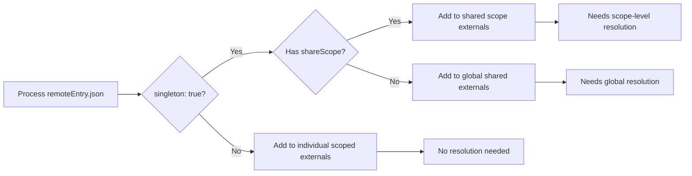
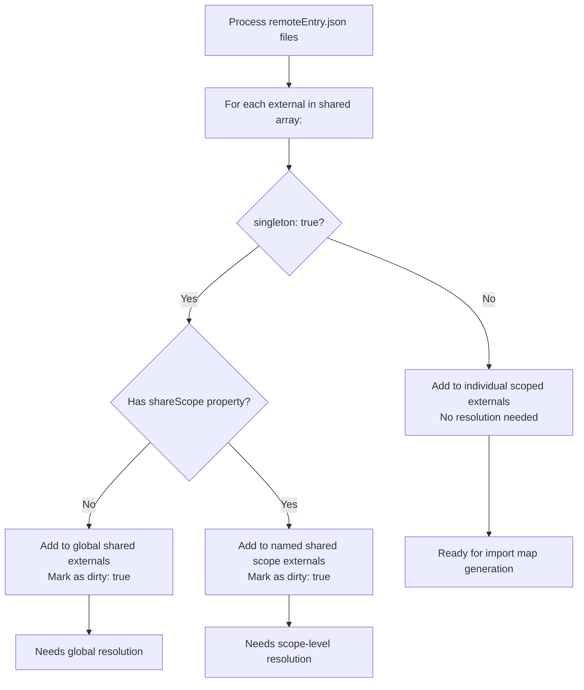
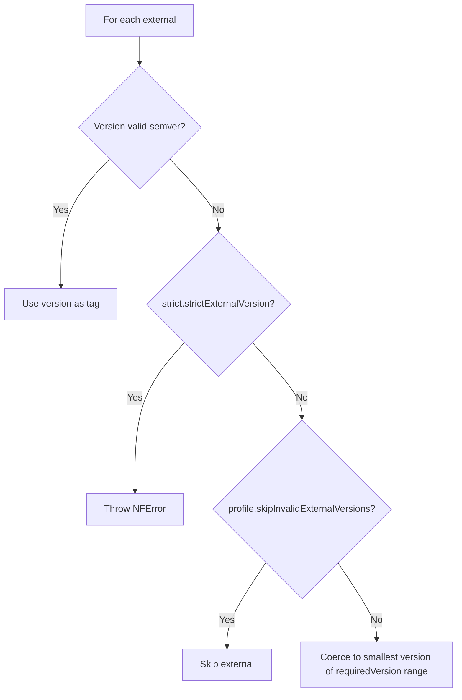
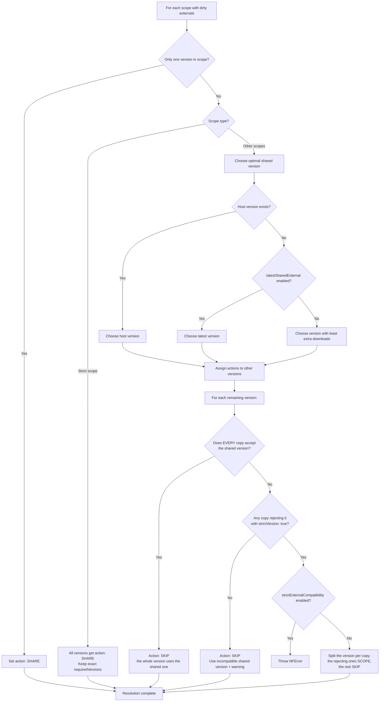
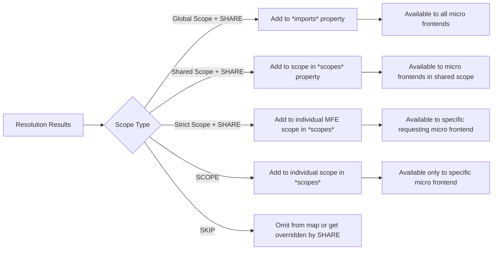
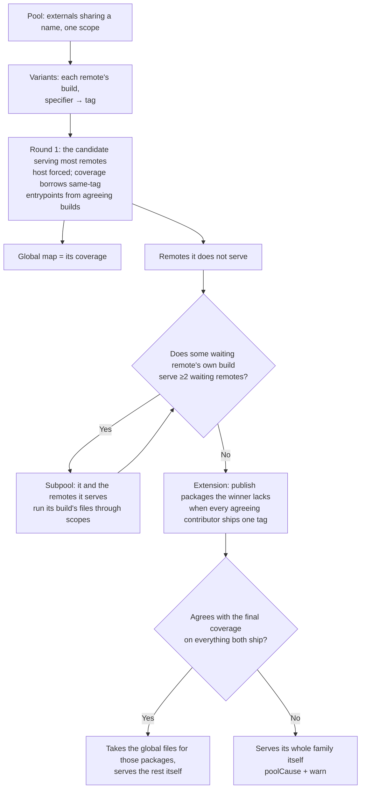
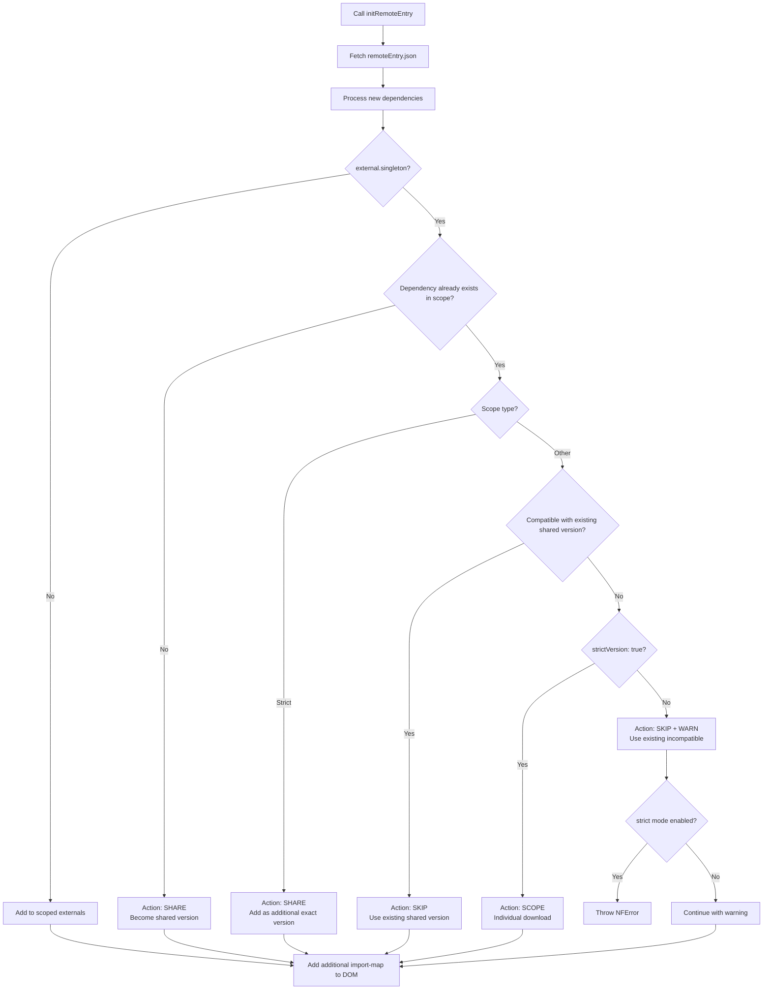
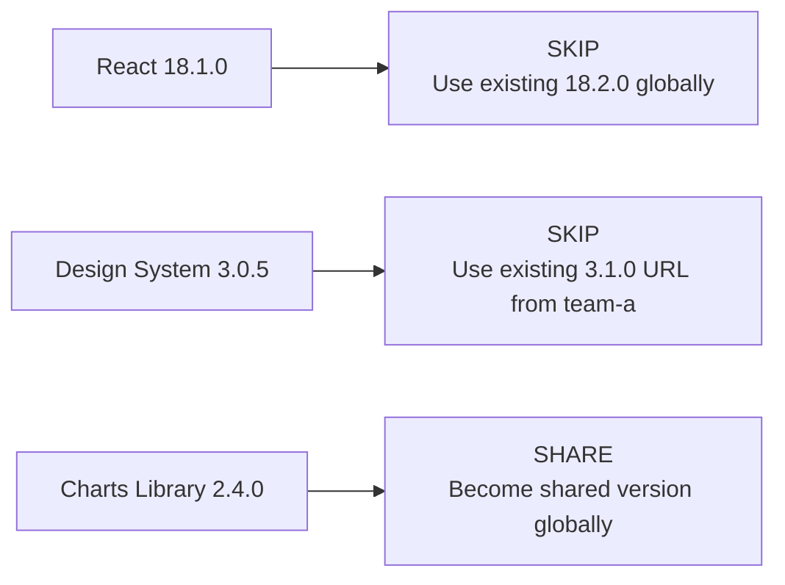
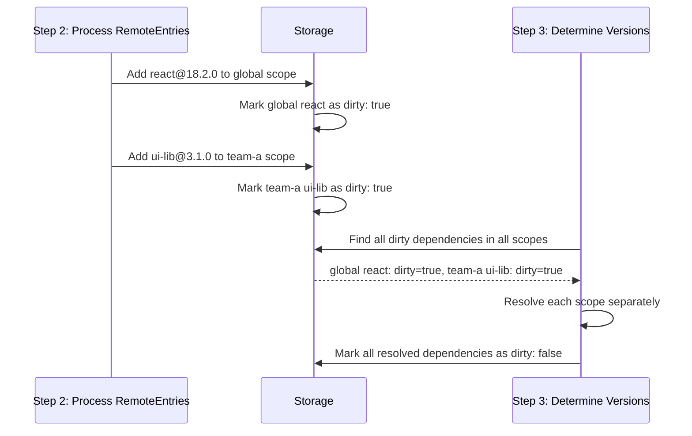
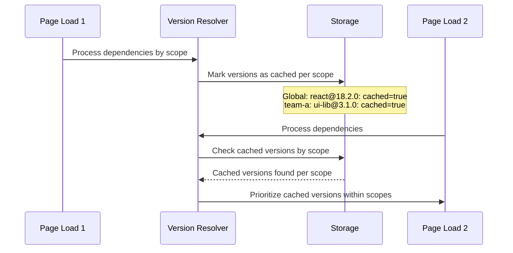

[< back](./../README.md)

# Version Resolver

The version resolver determines how to share externals (dependencies) across multiple remotes (micro frontends). It decides which external versions to share globally, share within specific scopes, or scope to individual remotes (micro frontends).

## How are the remotes bundled:

Native-federation provides a `federation.config.js` in its remotes. This configuration file allows the user to finetune which externals should be shared with other remotes and which should only be used by that specific remote. This process of choosing a specific (sub)set of remotes that can use a particular shared externals is called "scoping".

Whenever a remote is bundled, Native-federation includes a metadata file called the `remoteEntry.json`. When transpiled and bundled, a remote file structure looks like this:

```
📁 dist/
└── 📁 mfe1/
    ├── 📄 remoteEntry.json
    ├── 📄 button.js
    ├── 📄 dependency-a.js
    ├── 📄 dependency-b.js
    └── 📄 chunk-ABCD1234.js
```

The `remoteEntry.json` contains a translation of the `federation.config.js` and serves as metadata file to explain to the orchestrator which remotes can be shared and which have to be scoped:

```json
{
  "name": "team/mfe1",
  "exposes": [
    {
      "key": "./Button",
      "outFileName": "button.js"
    }
  ],
  "shared": [
    {
      "packageName": "dep-a",
      "outFileName": "dependency-a.js",
      "requiredVersion": "~2.1.0",
      "singleton": false,
      "strictVersion": true,
      "version": "2.1.1"
    },
    {
      "packageName": "dep-b",
      "outFileName": "dependency-b.js",
      "requiredVersion": "~2.1.0",
      "singleton": true,
      "strictVersion": true,
      "version": "2.1.2",
      "bundle": "browser-dep-b"
    }
  ],
  "chunks": {
    "browser-dep-b": ["chunk-ABCD1234.js"],
    "mapping-or-exposed": []
  }
}
```

These properties are very important for the orchestrator, here is what they mean:

- **requiredVersion:** The acceptable range of versions that this remote is compatible with.
- **singleton:** Should the orchestrator share this external with other remotes or use it only for this remote?
- **strictVersion:** Does the remote accept versions of this external that are outside of the accepted range (requiredVersion).
- **version:** The version of the external.
- **bundle:** (Optional) name of the internal chunk bundle this external belongs to, resolved via the `chunks` map on the same remoteEntry. See [Shared Chunks](./architecture.md#shared-chunks) for details.

## Understanding Import Maps

The orchestrator creates an import map from the provided remote metadata files (`remoteEntry.json`). Externals can be shared globally, shared within specific groups (shared scopes), or scoped to individual micro frontends.

### What is an Import Map?

An [import map](https://developer.mozilla.org/en-US/docs/Web/HTML/Reference/Elements/script/type/importmap) is a JSON structure that tells the browser where to find JavaScript ES module imports:

```javascript
{
  "imports": {
    "react": "https://cdn.example.com/react@18.2.0.js",
    "lodash": "https://cdn.example.com/lodash@4.17.21.js"
  },
  "scopes": {
    "https://legacy-mfe.example.com/": {
      "react": "https://legacy-mfe.example.com/react@17.0.2.js"
    }
  }
}
```

When your code does `import React from 'react'`, the browser uses this map to fetch the actual file.

### Only one shared version per scope

A major drawback of import-maps is that they can only specify **one version** of each dependency per scope:

```javascript
// ❌ This is NOT possible in import maps
{
  "imports": {
    "react": "https://cdn.example.com/react@18.2.0.js",
    "react": "https://cdn.example.com/react@17.0.2.js"  // Duplicate key!
  }
}
```

This limitation necessitates version resolution. When multiple micro frontends require different versions of the same dependency within a scope, only one can be shared "globally".

### The Solution: Multiple Scope Levels

Import maps provide **scopes** as solutions for dependency management:

```javascript
{
  "imports": {
    // Global scope - most micro frontends use this
    "react": "https://cdn.example.com/react@18.2.0.js",
    "ui-library": "https://cdn.example.com/ui-lib@2.1.0.js"
  },
  "scopes": {
    // Individual micro frontend scope
    "https://legacy-mfe.example.com/": {
      "react": "https://legacy-mfe.example.com/react@17.0.2.js"
    },

    // Linking multiple scopes to the same external can create a more fine-grained sharing of externals between a specific selection of remotes.
    "mfe1.example.com/": {
      "ui-library": "mfe1.example.com/ui-lib@3.0.0.js"
    },
    "mfe2.example.com/": {
      "ui-library": "mfe1.example.com/ui-lib@3.0.0.js"
    }
  }
}
```

**How it works**:

- **Global sharing**: Most micro frontends use React 18.2.0 and UI Library 2.1.0
- **Individual scoping**: Legacy MFE gets its own React 17.0.2
- **shareScope grouping**: Design system MFEs share UI Library 3.0.0.

**Specificity**:

The order of precedence is based on the specificity of the scope, with the global import having the lowest precedence.

> **Note:** With the "shareScope" grouping (3rd example), the import map is being tricked in loading the same file for 2 different scopes. This is handled by the orchestrator internally and provides a way to share an external over a select set of scopes. More on this later.

## Shared vs Scoped Dependencies

In the remote's metadata file (remoteEntry.json), dependencies are marked as "externals". Every external contains configuration that determines how it should be shared.

### Shared externals (singleton: true)

Dependencies marked as `singleton: true` are candidates for sharing:

```json
// In remoteEntry.json
{
  "shared": [
    {
      "packageName": "react",
      "singleton": true,
      "version": "18.2.0",
      "requiredVersion": "^18.0.0"
    }
  ]
}
```

**Result**: This dependency is a candidate to be placed in the imports object (in the importmap).

### Scoped externals (singleton: false)

Dependencies with `singleton: false` are always scoped to their individual remote:

```json
// In remoteEntry.json
{
  "shared": [
    {
      "packageName": "lodash-utils",
      "singleton": false,
      "version": "1.0.0"
    }
  ]
}
```

**Result**: This external is placed in the scope of its remote. And therefore only available to that specific remote.

### Secondary entrypoints (the `entries` map)

A package can expose more than one import specifier — a primary entrypoint (`@angular/core`) and one or
more secondary entrypoints (`@angular/core/testing`, `@angular/core/rxjs-interop`, …). Core v4.3.0 groups
these under a single `DenseSharedInfo`, replacing the flat `outFileName` with an `entries` map from each
specifier to its output file:

```json
// In remoteEntry.json
{
  "shared": [
    {
      "packageName": "@angular/core",
      "singleton": true,
      "version": "20.0.0",
      "requiredVersion": "^20.0.0",
      "entries": {
        "@angular/core": "core.js",
        "@angular/core/testing": "core-testing.js"
      }
    }
  ]
}
```

The resolver treats the whole `entries` map as one shared external: version negotiation happens once per
package, and every specifier in `entries` follows the winning version's placement — scoped, shareScope,
global, or the skip/override redirect. When a shared version wins, the union of its copies' `entries` is
the surface served to every consumer of that version, so each secondary entrypoint resolves to the same
version as its primary. (Older/flat remote builds emit one `SharedInfo` per specifier; set
[`feature.convertFlatSharedInfo`](./config.md#modeConfig) to group them at runtime.)

#### The basis of a version

Several remotes can report the same version of a package, and they all land in one `SharedVersion` as its
`remotes` list. They build the same tag, but each bundles only the entrypoints it actually imports, so the
lists can differ. `remotes[0]` is the version's **basis** — the copy that serves every specifier it
declares, and thus the primary — and the cache keeps it sorted on insert by this precedence:

1. **host** — the shell's build is already loaded in the browser and cannot be repointed.
2. **cached** — an already-served copy; repointing it would invalidate a committed import map and force a
   redundant download.
3. **widest coverage** — the copy declaring the most entrypoints, so fewest builds are needed.
4. **arrival order** — ties keep the incumbent, so generated import maps stay byte-stable.

Rule 3 is what makes a superset copy win: given `{table}`, `{table}` and `{sort, table}` of one version,
the third becomes the basis and serves both specifiers from a single build. Rules 1 and 2 deliberately
outrank it — stability beats optimality — so a host or already-served basis can leave gaps its siblings
fill (see below).

#### Merging within a version

Copies of one version build the same tag, so a specifier only some of them bundle is not a conflict: the
version **exposes the union of its copies' entries**, each specifier served by the first copy that declares
it in basis precedence. Given a cached basis `{table}` and a sibling `{table, sort}`, `table` resolves to
the basis's build and `sort` to the sibling's — every entrypoint any copy declares stays importable, and
no copy is pushed out of sharing because it bundles more than the basis. This is unconditional: the
coverage settings below never apply within a version.

Only copies that publish their own files join the union. A copy pooling has placed in a foreign build's
subpool (`servedBy`, see [How pooling resolves](#how-pooling-resolves)) runs that build's files, named in its
own scope per consumer — so what it bundles answers for itself alone, and counting it would advertise a
specifier no other consumer of the version can resolve. Pooling keeps a subpool copy out of the basis slot
for this reason, so a shared version always has its basis to serve from.

#### Entrypoint coverage and tearing

A version's merged entries are not guaranteed to list every specifier a consumer needs. A `skip` version
redirected to the winner can declare a secondary entrypoint no copy of the winner contains — for example
the shared version ships `@angular/core` while a compatible, deduped remote on another tag also imports
`@angular/core/testing`:

```
@angular/core  20.0.0  share  mfe-a  entries { @angular/core }
@angular/core  20.1.0  skip   mfe-b  entries { @angular/core, @angular/core/testing }
```

Serving those two specifiers from two **different versions** is a **tear**. It is harmless for most
libraries but can break packages whose secondary entrypoints share module-singleton state with the primary.
Three behaviours are available, in precedence order:

| Setting | Behaviour on an entrypoint uncovered by the shared version |
| --- | --- |
| [`strict.strictEntryPointCoverage`](./config.md#modeConfig) | **Throws.** Resolution refuses to share a package it cannot serve coherently. |
| [`profile.scopeUncoveredEntrypoints`](./config.md#modeConfig) | **Scopes.** The uncovered copy is split out into a `scope` version of its own tag and serves its whole `entries` bunch from its own build. Sharing continues for the copies the shared version does cover. |
| neither (default) | **Self-fills.** The specifier is served from the declaring remote's own build and a warning is logged. Nothing is dropped; the package tears. |

**Inside a pool the tear cannot happen at all**, whichever of the three is configured: pooling tests coverage
itself, **per specifier**, and a remote no build covers takes its whole family from its own build (see
[How pooling resolves](#how-pooling-resolves)). Per specifier is the load-bearing part — a build can be the
elected basis of every *member* of a pool and still not carry one secondary entrypoint, which the mapping then
serves from the declaring remote's own build at that remote's own tag. Every test pooling applies, including
the borrowing of same-tag entrypoints from other builds, is therefore keyed on specifiers. All three
settings are `false` in every shipped profile, so a pooled family relies on the pooling rule, and an unpooled
package still self-fills as described.

Both settings are strictly about tears between versions; copies of the shared version itself always merge,
whatever they are set to. A subpool copy is exempt in both directions — it cannot cover anyone else, and
the shared version cannot tear it, because it resolves through its subpool's build rather than through the
version. Scoping is per remote copy, not per version: given a shared surface
`{table, sort}`, a skipped `{table}` and a skipped `{table, paginator}`, only the third is split out — the
first two keep sharing. The import-map builders keep a last-resort net for stale storage: an uncovered
specifier reaching them is refused under `strictEntryPointCoverage` or
[`strict.strictImportMap`](./config.md#modeConfig), and warned about otherwise.

The additive dynamic-init path applies the same policy to a runtime remote whose tag differs from the shared
one, but measures it against a smaller surface: what the **committed** import map publishes for the version,
not the whole union. A copy that joined at runtime served its own extra entrypoints into its own scope alone
— the committed `imports` cannot be added to — so it is part of the version and covers nobody. Reading the
whole union there would report a specifier as covered that the joining remote has no way to resolve. A
shareScope skip is not restricted this way: it is handed a per-consumer override that names its provider
outright, so any copy can serve it.

To minimise tears (and scope promotions) the resolver also uses coverage as a **tiebreaker** when choosing
the shared version: among candidates that tie on the extra-downloads heuristic, it prefers the one whose
merged entries leave the fewest specifiers uncovered across the versions it would skip. A decisive
extra-downloads winner is never overridden, and an exact tie still keeps the highest version.

### Shared scopes

By default, externals with the `singleton: true` property are shared globally between all remotes. The `shareScope` property can be used for externals that should only be shared over a select group of remotes. The `shareScope` property creates a logical group for dependency resolution. Externals with the same shared scope are resolved together in isolation from other share scopes.

This can be useful e.g. if some legacy remotes are still dependent on a previous major of a framework:

> Internally, shared "scope groups" don't exist in import maps, therefore it is only possible through overriding the specific scopes with 'the same url'.

```json
// Team A micro frontends - share UI components v3.x
{
  "shared": [{
    "packageName": "ui-components",
    "singleton": true,
    "shareScope": "team-a",
    "version": "3.1.0",
    "requiredVersion": "^3.0.0"
  }]
}

// Team B micro frontends - share UI components v2.x
{
  "shared": [{
    "packageName": "ui-components",
    "singleton": true,
    "shareScope": "team-b",
    "version": "2.5.0",
    "requiredVersion": "^2.0.0"
  }]
}

// Global shared dependency
{
  "shared": [{
    "packageName": "react",
    "singleton": true,
    "version": "18.2.0",
    "requiredVersion": "^18.0.0"
  }]
}
```

**How shared scopes work:**

1. **Resolution**: Dependencies with the same `shareScope` are grouped and resolved together
2. **Sharing**: The version within a logical group that is deemed to be most optimal for sharing is shared among all micro frontends in that logical group
3. **Import Map**: Each micro frontend within the logical group gets the shared version added to its individual scope in the final import map

### The "strict" shareScope

The special `shareScope: "strict"` shareScope enables exact version matching instead of semantic version range compatibility. This is useful when you need precise version control and want to share multiple specific versions of the same dependency.

```json
// Strict sharing - only exact versions are matched
{
  "shared": [
    {
      "packageName": "ui-library",
      "singleton": true,
      "shareScope": "strict",
      "version": "2.1.1",
      "requiredVersion": "^2.1.0" // Will be replaced with exact version 2.1.1
    }
  ]
}
```

**Differences compared to regular "share scopes":**

While a regular shareScope (including "global") shares only the most compatible version and scopes the rest of the provided incompatible versions. The "strict" shareScope will share _all_ provided versions. The shared versions will be stripped of their requiredVersion range and exposed as exact versions. This way, remotes can still share dependencies while receiving their own exact provided version. This is good for externals that have many breaking updates or incompatibilities between (patch) versions.

**Example: Multiple exact versions sharing**

```json
// Team A - Framework 15.2.1
{
  "shared": [{
    "packageName": "@framework/core",
    "singleton": true,
    "shareScope": "strict",
    "version": "15.2.1",
    "requiredVersion": "15.2.1"  // Exact version required
  }]
}

// Team B - Framework 15.2.3
{
  "shared": [{
    "packageName": "@framework/core",
    "singleton": true,
    "shareScope": "strict",
    "version": "15.2.3",
    "requiredVersion": "15.2.3"  // Different patch, potential incompatibility
  }]
}

// Result: Both teams get their exact framework version
// No runtime compatibility issues from mismatched compiled code
```

This prevents the runtime errors that occur when framework's interdependent modules (e.g. @angular/common -> @angular/core) expects specific internal APIs that may have changed between patch versions.

**When to use strict shareScope:**

- **Compiled Frameworks**: `@framework/*` related packages, where patch versions can break compatibility due to ahead-of-time (AOT) compilation
- **Breaking Changes**: When minor/patch versions introduce breaking changes despite semantic versioning
- **API Contracts**: When exact version matching is required for API compatibility

**Limitations:**

- No automatic version resolution - each remote gets exactly what it specifies
- Potential for more downloads compared to compatible version ranges
- Requires careful coordination between teams, especially when using monorepo-style dependencies subdivided into multiple packages. This feature does not fix an incompatibility between remotes.

## Resolution Process

The resolver creates an import map based on the provided metadata (remoteEntry.json) files, processing dependencies at multiple scope levels.

### Step 1: Categorize Dependencies by Scope


```mermaid
flowchart LR
    A[Process remoteEntry.json] --> B{singleton: true?}
    B -->|Yes| C{Has shareScope?}
    B -->|No| D[Add to individual scoped externals]
    C -->|Yes| E[Add to shared scope externals]
    C -->|No| F[Add to global shared externals]
    E --> G[Needs scope-level resolution]
    F --> H[Needs global resolution]
    D --> I[No resolution needed]
```

### Step 2: Resolve Dependencies by Scope

Dependencies are resolved separately for each scope:

```
// Input: Multiple scopes with different versions

Global scope:
  react@18.2.0 (requires "^18.0.0", singleton: true)
  react@18.1.0 (requires "^18.0.0", singleton: true)

"team-a" scope:
  ui-lib@3.1.0 (requires "^3.0.0", singleton: true, shareScope: "team-a")
  ui-lib@3.0.5 (requires "^3.0.0", singleton: true, shareScope: "team-a")

"team-b" scope:
  ui-lib@2.5.0 (requires "^2.0.0", singleton: true, shareScope: "team-b")

"strict" scope:
  design-tokens@2.1.0 (requires "2.1.0", singleton: true, shareScope: "strict")
  design-tokens@2.2.0 (requires "2.2.0", singleton: true, shareScope: "strict")

Individual scopes:
  lodash@4.17.21 (singleton: false)
```

### Step 3: Resolution Algorithm

For each scope (global, shared scopes, strict, individual), the resolver determines one or more versions to share. The first step is to check wether the external should be shared or not:


```mermaid
flowchart TD
    A[Process remoteEntry.json files] --> B[For each external in shared array:]
    B --> C{singleton: true?}
    C -->|No| D[Add to individual scoped externals<br/>No resolution needed]
    C -->|Yes| E{Has shareScope property?}
    E -->|No| F[Add to global shared externals<br/>Mark as dirty: true]
    E -->|Yes| G[Add to named shared scope externals<br/>Mark as dirty: true]

    F --> H[Needs global resolution]
    G --> I[Needs scope-level resolution]
    D --> J[Ready for import map generation]
```

#### Version Validation

An external's `version` is optional and may be missing or non-semver. Before it is stored, an invalid version is handled in precedence order: throw, skip, or coerce (default). The result is always valid semver.


```mermaid
flowchart TD
    A[For each external] --> B{Version valid semver?}
    B -->|Yes| C[Use version as tag]
    B -->|No| D{strict.strictExternalVersion?}
    D -->|Yes| E[Throw NFError]
    D -->|No| F{profile.skipInvalidExternalVersions?}
    F -->|Yes| G[Skip external]
    F -->|No| H[Coerce to smallest version of requiredVersion range]
```

#### Determine Shared Versions

When the shared externals have been discovered, it is time for the resolver to determine which version to share of each shared external. This processs is partially based on the provided config of the user. There are multiple scopes, 1 global and 1 for each shareScope, the resolver loops through the scopes as follows:


```mermaid
flowchart TD
    A[For each scope with dirty externals] --> B{Only one version in scope?}
    B -->|Yes| C[Set action: SHARE]
    B -->|No| D{Scope type?}
    D -->|Strict scope| E[All versions get action: SHARE<br/>Keep exact requiredVersions]
    D -->|Other scopes| F[Choose optimal shared version]

    F --> F1{Host version exists?}
    F1 -->|Yes| F2[Choose host version]
    F1 -->|No| F3{latestSharedExternal enabled?}
    F3 -->|Yes| F4[Choose latest version]
    F3 -->|No| F5[Choose version with least extra downloads]

    F2 --> G[Assign actions to other versions]
    F4 --> G
    F5 --> G

    G --> G1[For each remaining version:]
    G1 --> G2{Does EVERY copy accept<br/>the shared version?}
    G2 -->|Yes| G3[Action: SKIP<br/>the whole version uses the shared one]
    G2 -->|No| G4{Any copy rejecting it<br/>with strictVersion: true?}
    G4 -->|No| G6[Action: SKIP<br/>Use incompatible shared version + warning]
    G4 -->|Yes| G5{strictExternalCompatibility enabled?}
    G5 -->|Yes| G7[Throw NFError]
    G5 -->|No| G8[Split the version per copy:<br/>the rejecting ones SCOPE,<br/>the rest SKIP]

    C --> H[Resolution complete]
    E --> H
    G3 --> H
    G6 --> H
    G8 --> H
```

> Externals in a [pool](#dependency-pooling) skip this flow: the pool elects its members together, and
> `determine` only reports them as re-elected.

> The "least extra downloads" choice (F5) is tie-broken by entrypoint coverage, and with
> [`profile.scopeUncoveredEntrypoints`](./config.md#modeConfig) a `SKIP` copy whose specifiers the
> winner cannot cover is promoted to `SCOPE` — copies of the winner's own tag merge instead. See
> [Entrypoint coverage and tearing](#entrypoint-coverage-and-tearing).

#### A verdict belongs to the copy, not the version

Note where the two questions are asked, because they are asked at different granularities. **Whether a
version may be redirected** (G2) is asked of the version as a whole: it is one file served from one basis,
so redirecting it has to satisfy every remote it would redirect — see `versionDemands`. **Whose build must
change** (G8) is per copy: `requiredVersion` and `strictVersion` are per-build settings, so two remotes
that happen to ship the same tag can disagree about the winner, and only the ones that reject it keep their
own build.

So a version that fails G2 is **split**: the rejecting copies become a `scope` version at that tag, the
rest stay `skip` and dedup. A tag can therefore hold two versions in the record, one `skip` and one
`scope` — at most one of each, and both sorted where that tag belongs. Three consequences worth knowing:

- **A copy always accepts its own version.** A copy runs the build it ships whatever its range says, so a
  range that excludes its own version (one drifted from the lockfile, `~19.1.0` shipping 19.2.15) never
  rejects it — in determine, in pooling and on the dynamic path alike. Versions compare by semver, so
  `v19.2.15` is `19.2.15`. The drift is logged as a warning when the remote is stored.
- **Prereleases follow semver.** A range admits a prerelease only on its own `major.minor.patch`
  (`^20.0.0-rc.1` takes `20.0.0-rc.2`; `>=19.2.0` takes no `20.0.0-rc.x`), so a remote on a release range is
  incompatible with a prerelease build, and pooling islands it — unless that prerelease is its own version.
- **The winner is never split.** Its copies all accept its tag, as above, and host precedence makes the
  host's version the winner, so a host copy never lands in a `scope` version.
- **A copy declaring `strictVersion: false` dedups** even where its own range rejects the shared version —
  that is what the flag asks for — rather than being carried into a strict sibling's `scope`.
- **The objective prices the split**, not the version: see
  [Optimal Version Strategy](#3-optimal-version-strategy-default).


### Step 4: Generate Import Map

The resolver creates different import map sections based on scope and actions:


```mermaid
flowchart LR
    A[Resolution Results] --> B{Scope Type}
    B -->|Global Scope + SHARE| C[Add to *imports* property]
    B -->|Shared Scope + SHARE| D[Add to scope in *scopes* property]
    B -->|Strict Scope + SHARE| E[Add to individual MFE scope in *scopes*]
    B -->|SCOPE| F[Add to individual scope in *scopes*]
    B -->|SKIP| G[Omit from map or get overridden by SHARE]

    C --> H[Available to all micro frontends]
    D --> I[Available to micro frontends in shared scope]
    E --> J[Available to specific requesting micro frontend]
    F --> K[Available only to specific micro frontend]
```

## Dependency Pooling

The resolver above resolves every shared external **independently**: each one picks its own shared
version, sourced from whichever remote contributed that winning tag. Packages that must move together
can therefore split — `@framework/core` and `@framework/common` resolved against different versions,
or served from different remotes, even when one coherent version exists.

The sharper hazard is **transitive coupling** through a shared intermediary. Suppose a design system
`@design-system/ui` is built against `@framework/core`, shared from mfe-A (framework 15), and mfe-B
(framework 16) consumes that shared design system. mfe-B now loads two framework runtimes — its own
`core@16` plus the `core@15` the design system drags in — and breaks (e.g. two DI containers that
cannot see each other). The coupled group must resolve to one mutually-compatible version _together_,
and that has to hold transitively through intermediaries like the design system.

**Pooling** groups such externals and elects them **as one family**: every remote takes the whole group
from one build that shipped it together — the elected one, another remote's, or its own. Pooled externals
are elected by pooling alone; the per-external resolver leaves them untouched (see
[Determine Shared Versions](#determine-shared-versions)).

### Enabling pooling

Pooling is opt-in and inert by default. An external joins a pool through a `pool` tag on its shared
external in `remoteEntry.json` (mirrors `shareScope`), set per external in the federation config at build
time:

```json
// In remoteEntry.json
{ "packageName": "@framework/core", "version": "22.0.5", "requiredVersion": "^22.0.0", "pool": "framework" }
```

**A pool is a name.** Every external tagged `framework`, by any remote, is in the `framework` pool. Formally a
pool is the **connected component** of a graph with a node per external and a node per tag name, and an edge
from each external to every name some remote tagged it with. Two consequences:

- Remotes do not need to tag the same members: mfe-A tagging `core` + `common` and mfe-B tagging `router` +
  `forms` with `framework` make one four-member pool.
- **Names that share an external merge.** mfe-A calling a family `angular` and mfe-B calling it `ng-core` still
  pool together once both tag one common external. A per-remote single name would not remove this need — the
  conflicts are cross-remote by nature (an explicit `ng-core` on one side, a build's npm-scope default
  `angular` on the other).

Tagging every package of an npm scope with that scope (`@framework/core`, `@framework/common` → `framework`)
is the usual way to pool a framework family. To pull a cross-scope sibling in, tag it with the family's name:
`@design-system/ui` tagged `framework` joins the framework pool.

One edge needs no tag: a secondary entrypoint is always joined to its package (`@framework/core/testing` →
`@framework/core`), whoever declares either. A package and its entrypoints are one artefact, so they must not
be separable — they genuinely tear when they are, with one remote's `@framework/forms` served beside another's
`@framework/forms/signals`. The edge is not itself a reason to pool: with no tag, a package and its entrypoints
form no pool. A member carrying a tag that pools with nothing is almost always a typo or a missing sibling, so
it is logged.

**A pool is named after the tag most of its copies declare** (ties break alphabetically), so a family tagged
`framework` logs and stores as `framework` whatever else some remote called it. A name belongs to exactly one
pool, so no suffixing is ever needed. A coupling no remote declares — two externals no tag connects — cannot be
expressed; this is by design.

### How pooling resolves

**The promise: within a pool, every specifier a remote resolves — and every specifier the files it resolves
import in turn — comes from a build that shipped them together.** Builds are internally consistent by
construction: those files were compiled and tested together, so a remote running one build's family is safe
whatever the version metadata says. Nothing reads tag *distance*: the election reads coverage and
`versionCheck.isCompatible(tag, requiredVersion)`, and compares tags only for **identity**. Version arithmetic
cannot carry the promise, since a minor line is a convention each vendor picks.

Pooling runs per share scope, per pool; the `strict` scope is never pooled. Everything it compares is keyed
by **specifier**, never by external name: a flat build declares `@framework/core/testing` as an external of
its own where a dense one lists it as an entry of `@framework/core`, so names cannot be compared.

**1. Variants.** Each remote's build is one candidate: a map *specifier → tag* of everything it ships in the
pool. Two notions are read off it for every other remote R:

- the variant **serves** R when every specifier R imports is in it, at a tag R's `requiredVersion` accepts
  (whether or not R set `strictVersion`);
- R **agrees** with it when every specifier both ship is at the same tag — a specifier the variant does not
  ship is compared through its package's tag, since `core/testing@22.0.6` beside a variant's `core@22.0.8` is
  two cores whoever lists the entrypoint. A package's tag is its root's, else that of any entrypoint the
  variant ships: `material/sort@17.0.2` beside `material/table@17.0.0` is two Materials too.

**2. Round 1 elects the global map.** Every build is a candidate — only the host's when a host ships the pool,
since the host cannot be repointed. A candidate's coverage is its own specifiers plus the **same-tag**
entrypoints of the builds that agree with it: at one tag, `core/testing@22.0.8` from another remote is the
same published artefact (see [Merging within a version](#merging-within-a-version)). Candidates rank by, in
order:

1. the newer variant first, under [`profile.latestSharedExternal`](./config.md#modeConfig);
2. **most remotes served**;
3. most remotes that agree without being served — what separates a build its peers share from an outlier when
   no build serves more than itself;
4. the build the stored record already elected (so a re-election on equal terms does not flip the family);
5. the newer variant, then arrival order, then name.

One variant is **newer** than another when the first member both ship, in the pool's member order (by name),
whose tags differ is newer in it — two unrelated version lines, such as `rxjs` and `@angular/core`, are never
compared.

A borrowed entrypoint is only as good as a copy that publishes it. A remote lending one that no round-1 remote
ships itself is therefore kept on a route whose files resolve globally — it is never placed below in the
subpool of a build that disagrees with the winner.

**3. Later rounds form subpools.** Among the remotes round 1 does not serve, each one's **own** build is a
candidate (no same-tag borrowing), and the one serving the most waiting remotes — itself included — forms a
**subpool**: those remotes run that one build, and the subpool is named after its remote. A tie goes to the
newer variant, then to the name that sorts first (code-unit order), never to arrival: no stored winner keeps
a subpool, and the record pooling rewrites reorders arrival, so a re-election would flip between equal
builds. Rounds repeat while some build serves at least two; earlier rounds never change. A subpool runs its
build's files through scopes (`servedBy`).

**4. Extension.** A package the winner does not ship at all is published globally when every remote outside
round 1 that agrees with the coverage, and whose files would resolve globally, ships it at one tag. A build's
files resolve globally when it runs every member it ships from the global map: a file's own imports resolve
in its owner's scope, so a file of a build that serves any member itself binds that build's copy for
whoever takes it. Every remote the extended coverage now serves moves onto the global map, in a subpool or
not — but a subpool's build only once no other member needs it, so a subpool moves as a whole or keeps its
build. A subpool left with its build alone dissolves: that remote moves onto the global map when served, else
serves itself. It runs after the rounds so the rounds can place what it does not settle. Then the coverage
keeps only what a build whose files resolve globally ships at its tag, a borrowed entrypoint included, and a
remote it no longer serves leaves the global map: it joins the first subpool whose build serves it, else
another round of subpools, until nothing changes.
Served is not enough to move: **one build must have shipped the combination the remote would resolve**,
counting a build's package at its tag for that package's other entrypoints. The winner's `core@18.0.1` next
to another build's `common@18.0.1` is a pair no build shipped, so a remote importing both stays where the
rounds put it (or serves itself, `uncovered`) rather than resolving that pair.

**5. Agreement takes the global files, all or nothing.** A remote running its own build — a subpool's build or
a remote left alone — that agrees with the final coverage on *everything* both ship takes the global files for
those packages and serves only the rest itself. A remote that disagrees on anything takes nothing global,
**not even a file at its own version**: that file's own imports bind the global peers, so it would run the
global `core` under its own `router` one hop in. A remote that serves any member itself publishes no global
file; it takes a copy global only where a build whose files resolve globally lists every entrypoint of that
copy in its own copy of the same member, at the same tag, since the import map maps a specifier from whichever
member reaches it first.

**6. Everyone left serves themselves**, with the reason recorded (`poolCause`, see
[What pooling stores](#what-pooling-stores)).


```mermaid
flowchart TD
    A[Pool: externals sharing a name, one scope] --> B[Variants: each remote's build,<br/>specifier → tag]
    B --> R1[Round 1: the candidate serving most remotes<br/>host forced; coverage borrows same-tag<br/>entrypoints from agreeing builds]
    R1 --> G[Global map = its coverage]
    R1 --> P[Remotes it does not serve]
    P --> R2{Does some waiting remote's own build<br/>serve ≥2 waiting remotes?}
    R2 -->|Yes| AN[Subpool: it and the remotes it serves<br/>run its build's files through scopes]
    AN --> R2
    R2 -->|No| EX[Extension: publish packages the winner lacks<br/>when every agreeing contributor ships one tag]
    EX --> AG{Agrees with the final coverage<br/>on everything both ship?}
    AG -->|Yes| T[Takes the global files for those packages,<br/>serves the rest itself]
    AG -->|No| S[Serves its whole family itself<br/>poolCause + warn]
```

**Host precedence is absolute.** The host's build is round 1 whenever it ships any member, whatever it serves:
the host's files are loaded regardless and cannot be repointed. A remote whose range rejects the host's tag
islands; the host never gives way.

**Strict compatibility.** Under [`strict.strictExternalCompatibility`](./config.md#modeConfig) init throws when
a `strictVersion` range rejects a tag of the elected build — the same incompatibility the per-external resolver
refuses. A tag the copy ships itself is never a rejection
([A verdict belongs to the copy](#a-verdict-belongs-to-the-copy-not-the-version)). A remote that misses round 1
only for **coverage** never throws: nothing about its versions is wrong,
so a gap in what other builds ship must not fail a strict portfolio.

**Coverage is keyed by specifier.** `generate-import-map` fills an entrypoint the shared version lacks from the
consumer's own build — a second build — so package-granularity coverage would break the promise silently (see
[Entrypoint coverage and tearing](#entrypoint-coverage-and-tearing)). Every test above is per specifier, which
is also why a pooled remote is never torn whichever entrypoint-coverage setting is configured.

> **Pooling chooses coherence first, then downloads.** Electing the family as a whole can move the global
> version of a pooled family — an **older** build wins when it serves more remotes — and a remote that would
> mix builds always pays for its own family. Because the election maximises the remotes one build serves and
> then places the rest in subpools, it also *saves* downloads where per-member election split a family: on the
> recorded eleven-remote portfolio the `@angular/*` files the map can fetch drop from 75 to 54, the
> seven-remote capture is unchanged at 37, and no measured portfolio rose. A warm init pays nothing: with no
> member re-elected, pooling does no work and writes nothing. The escape hatch is to not pool the family (no
> `pool` tag), not a per-portfolio knob. `e2e/pooling/capture.e2e.spec.ts` and
> `src/lib/core/2.app/steps/pooling/capture.integration.spec.ts` reproduce the figures.

#### How the verdicts land in the record and the map

Mechanics, for reading the code rather than for configuring the feature. The record format is the resolver's:
pooling rewrites each member's versions and `generate-import-map` reads them as it reads any other external.

Each member is rebuilt with one version per `(tag, action)`, newest tag first and, within a tag, `share`,
`skip`, `scope`:

- **`share`** — the tag round 1 publishes the member at. Its first copy (`remotes[0]`, the basis) is the
  winner's; every copy resolving globally at that tag joins it. The tag is read from any of the member's
  entrypoints, because a package can be shipped entrypoint-only (`material/table` without `material`).
- **`skip`** — copies resolving globally at another tag their range accepts; a subpool's copies with
  `servedBy: <its build>`, the build's own copies naming itself. A subpool whose build agrees with the global
  map (rule 5) resolves globally instead.
- **`scope`** — copies of a remote serving itself, with their `poolCause`.

**Every subpool's build maps its own family onto itself.** A consumer's scope governs only the consumer's
*own* imports; the build's files resolve their peers in the **build's** scope and fall through to `imports`.
Without a scope entry for every member, a consumer gets the build's `router` bound to the global `core` one
hop in — coherent at the top and torn one hop deeper. That is what `servedBy: <itself>` is for. A scope entry
that merely repeats the global mapping is not emitted, and each URL keeps the hash of the remote that owns
the file.

`generate-import-map` publishes every `share` version first, then fills the specifiers no winner covered from
the `skip` copies, so flat and dense builds of one specifier cannot race on external order. A copy carrying a
`servedBy` never fills the global map: it runs another build.

A pool is re-elected as a **unit**, and every member of a re-elected pool is written back:
`mark-pools-for-reelection` marks every member dirty as soon as one is, so pooling never reads back half of
its own previous verdict.

#### Declare the coupling you actually have

Pooling compensates for information the remote entry does not carry: a monorepo's members are coupled far
more tightly than their published ranges admit (Angular emits `^22.0.0` while `router@22.1.0` truly needs
`core@22.1.0`). Where your real coupling is tighter than your declared range, **say so** — `~22.0.6` rather
than `^22.0.0`.

Note what that buys, because the election enforces coupling at **every** granularity, patch included: a remote
that disagrees with the global map never takes a file from it, declared range or not. Declaring the range
changes which verdict the portfolio owner sees: a range that rejects the elected build is reported as an
island (`incompatible`) and, under `strictExternalCompatibility`, refused — a version problem with a name —
while a coverage miss is a statement about what nobody built.

**Tag the whole family.** A member left untagged pools only if some *other* remote tags it, or as an entrypoint
of a tagged package, and the failure is quiet: the member is still shared, just no longer coordinated with the
family. A build that emits flat entries makes this easy to get wrong — `@framework/core` and
`@framework/core/primitives/di` are two externals, and tagging only the first leaves the second relying on the
package edge rather than on your tag.

#### Unscoped lockstep families (react/react-dom)

A lockstep pair with no npm scope — `react` + `react-dom`, `vue` + `vue-router` — cannot be grouped by scope,
and the coupling cannot be inferred: a remote entry carries no `peerDependencies`. Declare it with a tag:

```json
// In remoteEntry.json
{
  "shared": [
    {
      "packageName": "react",
      "singleton": true,
      "version": "18.3.1",
      "requiredVersion": "^18.0.0",
      "pool": "react"
    },
    {
      "packageName": "react-dom",
      "singleton": true,
      "version": "18.3.1",
      "requiredVersion": "^18.0.0",
      "pool": "react"
    }
  ]
}
```

**One remote declaring this is enough for the whole portfolio.** The tag decides which externals form the
pool; the pool then operates on the whole `SharedExternal` for each member: every version, every remote. So
remotes that never declared a `pool` tag are still subject to the family's coherence rules for those two
packages. That is deliberate (one remote can fix a portfolio it does not own), but worth knowing before adding
a tag.

This holds on both paths, because both read membership out of the **committed record** rather than out of the
entry in front of them: a remote loaded by `initRemoteEntry` is subject to a pool some other remote's tag
formed. Without that, an untagged remote loaded later is exactly the consumer that bridges two builds the
portfolio had deliberately pooled apart.

#### What pooling logs

Every line is prefixed `[<scope>][pool:<name>]`, with `<name>` the pool's name as stored. Every remote not on
the elected build gets a `warn`, subpool members included, ending in one of four clauses that say where its
copies come from:

- `All N members it imports are scoped for it.` — it serves its whole family itself;
- `It runs in subpool '<build>': all N members it imports come from that build.` — it runs another remote's
  build;
- `Its build runs subpool '<self>' for its N members and K other remote(s).` — its build runs the subpool;
- `It takes the elected files where its versions match and serves the rest of its N members itself.` — it
  agrees with the global map (rule 5).

| level | line | what to do |
| --- | --- | --- |
| `warn` | `'<remote>' is islanded: its range rejects '<member>@<tag>' of the elected build '<winner>'. <where>` | A range rejects a tag of the elected build. Align that remote's version or range, or accept the cost. N counts what that remote imports, not the pool. |
| `warn` | `'<remote>' serves its own family: no elected build offers every entrypoint it imports at a version it accepts — '<gap>' is the gap, closest is '<winner>'. <where>` | Coverage: `<gap>` is the first specifier the elected build does not serve. Shipping it in the elected build, or dropping it from this remote, recovers the dedup. |
| `warn` | `'<remote>' is islanded: its range rejects '<specifier>@<tag>' of the committed map. All N members it imports are scoped for it.` | Dynamic init only — a range rejects a tag the committed map serves (see [Scope and dynamic init](#scope-and-dynamic-init)). |
| `warn` | `'<remote>' serves its own family: no committed build offers every entrypoint it imports at a version it accepts — '<gap>' is the gap. All N members it imports are scoped for it.` | Dynamic init only — the coverage finding read off the committed record. |
| `warn` | `'<build>' keeps subpool '<build>': the elected build would serve it, but K other remote(s) in it need its build.` | A subpool's build the global map would serve, kept for the members that need it. Nothing to fix on that remote; aligning the other members moves the whole subpool onto the global map. |
| `error` | `version-incompatible remotes cannot be pooled: {…}.` | Logged before the `strictExternalCompatibility` throw, naming every remote whose `strictVersion` range rejects the elected build. |
| `debug` | `round 1: '<winner>' serves N; subpool '<build>' serves M; …; alone: {…}` | The election, for confirming who serves whom. |

#### What pooling stores

Pooling's results live in the shared-externals record next to the verdicts they explain, so a tool reading
the storage (see [`globalThis.__NF_ORCHESTRATOR__`](./config.md#discovering-the-storage-from-tools)) does not
have to re-derive them. Every field is omitted when it does not apply.

| where | field | meaning |
| --- | --- | --- |
| `SharedExternal` | `poolName` | the pool this external resolves in: the most-declared name of the merged pool |
| `SharedExternal` | `poolWinner` | the round-1 winner of the pool's last election; a rename keeps it, the failure fallback stores none |
| `SharedVersionMeta` | `pool` | the `pool` tag this remote declared — pooling's input, never rewritten |
| `SharedVersionMeta` | `servedBy` | the build of the subpool this copy runs in — the remote itself on its own build's copies |
| `SharedVersionMeta` | `poolCause` | why pooling made this copy serve itself: `incompatible` (a range rejects a tag of the elected build) or `uncovered` (the elected build does not serve every specifier it imports) |

Only pooling writes these, so an external in no pool any more has nothing left to explain: when a pool dissolves
— the remote whose tag formed it redeployed without it, say — `mark-pools-for-reelection` drops `poolName`,
`poolWinner`, `servedBy` and `poolCause` from its former members before `determine` runs, and re-elects them. A leftover
`servedBy` would otherwise keep mapping that copy onto a build nothing chose any more.

`poolCause` is the one thing the `scope` action cannot say on its own: a copy scoped for a range violation and
one scoped because no build covers it look identical otherwise. The detail behind it — the gap, the closest
build — is in the matching `warn` line only. Membership is kept apart from the tags on purpose: pooling
recomputes pools from the copies' `pool` tags every time it runs, so writing its own result back into its
input would keep a pool alive after the remote that formed it had left.

The stored election is also an input: `poolWinner` keeps an otherwise exact tie (rank 4 above), unless two
members store different ones or it ships no member any more; a member that joined since stores none yet. It is
stored rather than inferred from the `share` rows: every package the winner does not ship itself is published
from another build, so counting bases can name the wrong one.

The dynamic path writes the same fields, for the loaded remote's copies only: a copy it scopes moves into a
`scope` version at its own tag with its `poolCause` (a `share` version only that copy held leaves with it), and
a copy it redirects keeps its place with a `servedBy`. Without that, the record would keep `update-cache`'s
verdicts, and a reload — which rebuilds the map from the record without re-electing anything — would publish
the combination the delta had refused.

### Scope and dynamic init

Pooling applies to the **global scope and named shareScopes**; the `strict` scope is never pooled. It runs in
both the initial pipeline and dynamic init (`initRemoteEntry`), and is gated on the resolver having re-elected
something — a warm init that adds no remotes does no pooling work at all.

Because the import map is immutable once committed, the dynamic pass holds no new election: it judges only the
newly loaded remote against the **committed** record, never retro-corrects committed remotes, and coordinates
each shareScope independently. Membership comes from the committed record, so the loaded remote is subject to
every pool the portfolio has — including one formed by another remote's `pool` tag — and only the members it
declares itself can have their verdict rewritten. The committed view excludes the loaded remote's own copies,
which `update-cache` has already stored but the committed map holds none of. In order:

1. **Already scoped.** If the resolver scoped any member for this remote, it serves its whole family itself;
   no committed build is trusted with it. The cause is `incompatible` when a range rejects a tag the map serves,
   else `uncovered` (`scopeUncoveredEntrypoints` scoped a copy whose entrypoint the map lacks).
2. **The global map.** It resolves through the committed `imports` when no range rejects a tag the map serves
   and either it **agrees** with the map on everything both ship — then the packages it adds are its own to
   publish — or the map serves every specifier it imports and some committed build shipped that exact
   combination. The second check matters for records written before variant election, whose global map can
   mix builds per member. A range rejecting a global tag moves it on with cause `incompatible`.
3. **A committed subpool.** Otherwise it may join the subpool of one committed build that covers every
   entrypoint it imports at versions it accepts and **already runs its own whole family**: every copy it
   holds is a member's global basis, `scope`, or `servedBy` itself. Anything in between resolved part of its
   family through the global winner — its modules are already bound there, and a consumer running it
   inherits that tear one hop in.
   Candidates are tried cheapest first: a build the committed `imports` already serves this pool from, then
   the host, then by name so the choice is reload-stable. All of the remote's actions become `skip` with a
   per-consumer override naming that build's files.
4. **Otherwise it serves its own family.** Every self-serving remote is warned, in the same sentences as init.

This gate is not redundant even though init enforced its own. Init guarantees no _remote_ runs a combination
nothing shipped, but a remote loaded later is exactly the consumer that could bridge two builds the committed
map keeps apart.

**Known limitation.** A load whose `pool` tag turns a lone tagged external into a pool can expose an
entrypoint [self-fill](#entrypoint-coverage-and-tearing) the committed map already holds for that external.
The committed map is immutable, so this cannot be repaired at runtime; the next init re-elects the pool
coherently.

## Dynamic Init

> **Important!:** This feature currently only works with the `use-import-shim` import-map type.

Dynamic init is a runtime feature that allows loading additional micro frontends after the initial federation setup is complete. This is useful for lazy-loading micro frontends on demand or adding micro frontends based on user interactions or application state.

### Key Characteristics/limitations

**Additive Only**: Dynamic init can only **add** new dependencies to existing scopes - it cannot replace, modify, or remove dependencies that were resolved during the initial setup.

**Non-Disruptive**: The dynamic init process preserves all existing dependency resolutions and import map entries. Cached dependencies from the initial setup remain unchanged.

**Scope Aware**: Dynamic init respects the same scoping rules as the initial resolution process, adding new dependencies to their appropriate global, shared, or individual scopes.

This is in line with the ideology behind import maps. [source](https://github.com/WICG/import-maps/blob/abc4c6b24e0cc9a764091be916c5057e83c30c23/README.md) | [Shopify article](https://shopify.engineering/resilient-import-maps#)

### How Dynamic Init Works

When you call `initRemoteEntry()` to dynamically load a micro frontend, the system follows these steps:


```mermaid
flowchart TD
    A[Call initRemoteEntry] --> B[Fetch remoteEntry.json]
    B --> C[Process new dependencies]
    C --> D{external.singleton?}
    D -->|No| E[Add to scoped externals]
    D -->|Yes| F{Dependency already exists in scope?}
    F -->|No| G[Action: SHARE<br/>Become shared version]
    F -->|Yes| H{Scope type?}
    H -->|Strict| I[Action: SHARE<br/>Add as additional exact version]
    H -->|Other| J{Compatible with existing shared version?}
    J -->|Yes| K[Action: SKIP<br/>Use existing shared version]
    J -->|No| L{strictVersion: true?}
    L -->|Yes| M[Action: SCOPE<br/>Individual download]
    L -->|No| N[Action: SKIP + WARN<br/>Use existing incompatible]

    N --> O{strict mode enabled?}
    O -->|Yes| P[Throw NFError]
    O -->|No| Q[Continue with warning]

    E --> R[Add additional import-map to DOM]
    G --> R
    I --> R
    K --> R
    M --> R
    Q --> R
```

### Dynamic Init Actions

Each new dependency gets one of these actions during dynamic init:

| Action    | Description                                                                                                                                                                                          |
| --------- | ---------------------------------------------------------------------------------------------------------------------------------------------------------------------------------------------------- |
| **SKIP**  | Version already exists or use existing shared version. In a shareScope context this action is used for overriding by skipping the provided external and loading a compatible cached version instead. |
| **SHARE** | No compatible version exists (yet), become the shared version for this scope                                                                                                                         |
| **SCOPE** | A copy whose own range rejects the shared version while `strictVersion: true` (never when the shared version is the copy's own), or (under `scopeUncoveredEntrypoints`) one **on another tag** whose entrypoints the shared winner cannot cover — served coherently from its own build. Per copy, not per version: co-tagged copies that accept the shared version keep deduping, and a copy of the shared tag merges its extra entrypoints in, serving them from its own build. |

### Example: Dynamic Loading Scenario

```javascript
// Initial setup
const { initRemoteEntry } = await initFederation({
  'team/header': 'http://localhost:3000/remoteEntry.json',
  'team/sidebar': 'http://localhost:4000/remoteEntry.json',
});

// Later, dynamically load a new micro frontend
await initRemoteEntry('http://localhost:5000/remoteEntry.json', 'team/dashboard');

// The dashboard MFE becomes available
const DashboardComponent = await loadRemoteModule('team/dashboard', './Dashboard');
```

### Initial Setup Dependencies

```json
// team/header - React 18.2.0 (global scope)
{
  "shared": [{
    "packageName": "react",
    "version": "18.2.0",
    "singleton": true
  }]
}

// team/sidebar - Design System 3.1.0 (team-a scope)
{
  "shared": [{
    "packageName": "design-system",
    "version": "3.1.0",
    "singleton": true,
    "shareScope": "team-a"
  }]
}
```

### Dynamic Init - New Dashboard MFE

```json
// team/dashboard - added dynamically
{
  "shared": [
    {
      "packageName": "react",
      "version": "18.1.0",
      "requiredVersion": "^18.0.0",
      "singleton": true
    },
    {
      "packageName": "design-system",
      "version": "3.0.5",
      "requiredVersion": "^3.0.0",
      "singleton": true,
      "shareScope": "team-a"
    },
    {
      "packageName": "charts-library",
      "version": "2.4.0",
      "singleton": true
    }
  ]
}
```

### Resolution Results


```mermaid
flowchart LR
    A[React 18.1.0] --> B[SKIP<br/>Use existing 18.2.0 globally]
    C[Design System 3.0.5] --> D[SKIP<br/>Use existing 3.1.0 URL from team-a]
    E[Charts Library 2.4.0] --> F[SHARE<br/>Become shared version globally]
```

### Resulting Import Map Changes

**Before Dynamic Init:**

```javascript
{
  "imports": {
    "react": "http://localhost:3000/react@18.2.0.js"
  },
  "scopes": {
    "http://localhost:4000/": {
      "design-system": "http://localhost:4000/design-system@3.1.0.js"
    }
  }
}
```

**ImportMap that will be appended to the DOM:**

```javascript

{
  "imports": {
    "charts-library": "http://localhost:5000/charts-library@2.4.0.js"
  },
  "scopes": {
    "http://localhost:5000/": {
      "design-system": "http://localhost:4000/design-system@3.1.0.js"
    }
  }
}
```

### Dynamic Init Constraints

#### Cannot Replace Existing Dependencies

If a dependency is already shared globally during the initial setup, dynamic init cannot replace it with a different version. For example, if React 18.2.0 is shared globally, dynamically loading React 17.0.0 with `strictVersion: false` will still use React 18.2.0 and show a warning. If `strictVersion: true` is used, the micro frontend will get its own scoped copy of React 17.0.0.

#### Cannot Modify Scope Assignments

Dynamic init cannot change the scope of a shared dependency. If a dependency like design-system@3.1.0 is shared in the "team-a" scope, it cannot be moved to the global scope or another shared scope during dynamic loading.

#### Dirty Flag Always False

Dynamic init sets `dirty: false` for all dependencies because it never modifies existing resolutions:

```typescript
// Dynamic init behavior
ports.sharedExternalsRepo.addOrUpdate(packageName, {
  dirty: false, // Always false - no re-resolution needed
  versions: [...existingVersions, newVersion],
});
```

### Best Practices for Dynamic Init

#### 1. Design for Additive Loading

Structure your application so dynamic MFEs complement rather than conflict with initial setup:

```javascript
// ✅ Good: Progressive enhancement
Initial: Core navigation + basic React
Dynamic: Dashboard with charts, analytics widgets

// ❌ Problematic: Conflicting versions
Initial: React 18.x + Modern UI library
Dynamic: Legacy MFE requiring React 17.x + Old UI library
```

#### 2. Use Shared Scopes Strategically

Group related MFEs in shared scopes to maximize reuse during dynamic loading:

```javascript
// ✅ Good: Team-based scopes
"team-dashboard": { "ui-components": "3.x" }
"team-reports": { "ui-components": "3.x" }

// Later dynamic loading within same team reuses components
```

#### 3. Handle Loading Failures Gracefully

```javascript
try {
  await initRemoteEntry('http://dashboard-team.com/remoteEntry.json', 'dashboard');
  // Dashboard is now available
} catch (error) {
  console.warn('Dashboard MFE failed to load:', error);
  // Application continues without dashboard features
}
```

#### 4. Monitor Compatibility Warnings

Dynamic init may produce warnings for version mismatches:

```javascript
// Enable logging to catch compatibility issues
await initFederation(manifest, {
  logLevel: 'warn',
  logger: consoleLogger,
});

// Watch for warnings like:
// "WARN: dashboard.react@18.1.0 using existing shared version 18.2.0"
```

### Use Cases for Dynamic Init

#### Route-Based Loading

```javascript
// Load MFEs based on navigation
router.on('/dashboard', async () => {
  await initRemoteEntry('http://dashboard.com/remoteEntry.json', 'dashboard');
  const Dashboard = await loadRemoteModule('dashboard', './Dashboard');
});
```

#### Feature Flags

```javascript
// Load additional features based on user permissions
if (user.hasFeature('advanced-analytics')) {
  await initRemoteEntry('http://analytics.com/remoteEntry.json', 'analytics');
}
```

#### A/B Testing

```javascript
// Load different versions for testing
const variant = getABTestVariant();
await initRemoteEntry(`http://variant-${variant}.com/remoteEntry.json`, 'test-mfe');
```

## Understanding Scope Levels

### Global Scope (`__GLOBAL__`)

- **Purpose**: Dependencies shared across all micro frontends
- **Use case**: Core libraries like React, common utilities
- **Configuration**: `singleton: true` without `shareScope`
- **Import map**: Added to the `imports` property

### Shared Scopes (custom names)

- **Purpose**: Logical groupings for dependency resolution among specific micro frontends
- **Use case**: Team-specific libraries, design systems, domain-specific tools
- **Configuration**: `singleton: true` with `shareScope: "scope-name"`
- **Import map**: Resolved version URL is added to each MFE's individual scope

### Strict Scope (`"strict"`)

- **Purpose**: Exact version matching without semantic version compatibility checking
- **Use case**: Multiple exact versions of the same dependency, legacy support, breaking changes
- **Configuration**: `singleton: true` with `shareScope: "strict"`
- **Import map**: Each exact version URL is added to requesting MFE's individual scope
- **Unique behavior**: Multiple versions can have the "share" action simultaneously

### Individual Scopes (per micro frontend)

- **Purpose**: Dependencies used only by one micro frontend
- **Use case**: Incompatible versions, micro frontend-specific libraries
- **Configuration**: `singleton: false` or incompatible shared dependencies
- **Import map**: Added to the specific MFE's scope with its own URL

## Understanding "dirty" Flag

When processing remoteEntry.json files, shared dependencies are marked as "dirty" when new versions are added or their version list changes. This signals that the dependency needs resolution within its scope.


```mermaid
sequenceDiagram
    participant Step2 as Step 2: Process RemoteEntries
    participant Storage as Storage
    participant Step3 as Step 3: Determine Versions

    Step2->>Storage: Add react@18.2.0 to global scope
    Storage->>Storage: Mark global react as dirty: true
    Step2->>Storage: Add ui-lib@3.1.0 to team-a scope
    Storage->>Storage: Mark team-a ui-lib as dirty: true
    Step3->>Storage: Find all dirty dependencies in all scopes
    Storage-->>Step3: global react: dirty=true, team-a ui-lib: dirty=true
    Step3->>Step3: Resolve each scope separately
    Step3->>Storage: Mark all resolved dependencies as dirty: false
```

**Why this matters**: The dirty flag prevents unnecessary re-resolution of dependencies that haven't changed within their scope, improving performance when the same micro frontends are loaded repeatedly.

Pooling runs before step 3. It skips any scope with no dirty external, re-elects every pool with a dirty
member and writes those members clean; step 3 then elects whatever is still dirty. A warm init — every remote
already cached, nothing dirty — therefore costs neither resolution nor pooling.

## Understanding "strictVersion"

The `strictVersion` flag applies to shared dependencies (`singleton: true`) and determines how incompatible versions are handled within each scope:

### strictVersion: false (default)

The user will be notified about the incompatible version, but the resolver will skip this version since another version was already shared in the scope.

```json
// MFE needs ui-lib ~4.16.0, but team-a scope shares 4.17.0
{
  "packageName": "ui-lib",
  "version": "4.16.5",
  "requiredVersion": "~4.16.0",
  "singleton": true,
  "shareScope": "team-a",
  "strictVersion": false
}

// Result: SKIP + WARNING
// The MFE will use the shared 4.17.0 version URL from team-a scope
// May cause runtime compatibility issues
```

### strictVersion: true

```json
// MFE needs ui-lib ~4.16.0, but team-a scope shares 4.17.0
{
  "packageName": "ui-lib",
  "version": "4.16.5",
  "requiredVersion": "~4.16.0",
  "singleton": true,
  "shareScope": "team-a",
  "strictVersion": true
}

// Result: SCOPE (individual)
// The MFE gets its own ui-lib@4.16.5 download
// Guaranteed compatibility, but extra download
```

**Note**: `strictVersion` is ignored for scoped dependencies (`singleton: false`) since they always get their own copy.

## Priority Rules Explained

### 1. Host Version Override

Host remoteEntry.json has the highest precedence within each scope. When an external version exists in the host remoteEntry.json for a specific scope, it is guaranteed chosen as the shared version for that scope.

```javascript
await initFederation(manifest, {
  hostRemoteEntry: { url: './host-remoteEntry.json' },
});

// If host specifies react@18.0.5 globally, it wins over:
// - MFE1's react@18.2.0 (global)
// - MFE2's react@18.1.0 (global)

// If host specifies ui-lib@3.0.0 for team-a scope, it wins over:
// - Team A MFE1's ui-lib@3.1.0 (team-a scope)
// - Team A MFE2's ui-lib@3.0.5 (team-a scope)
```

### 2. Latest Version Strategy

Can be activated with the `profile.latestSharedExternal` hyperparameter. This changes the strategy within each scope from "most optimal" to "latest available" version.

```javascript
await initFederation(manifest, {
  profile: { latestSharedExternal: true },
});

// Available versions in global scope: [18.1.0, 18.2.0, 18.0.5]
// Chosen: 18.2.0 (latest in global scope)

// Available versions in team-a scope: [3.0.5, 3.1.0, 3.0.8]
// Chosen: 3.1.0 (latest in team-a scope)
```

### 3. Optimal Version Strategy (default)

**Why this is default**: Minimizes bundle size and download time by choosing the version that requires the fewest additional scoped downloads within each scope.

The resolver calculates which version minimizes extra downloads per scope by examining which versions would need to be individually scoped due to incompatibility, and how many copies each of those scopes costs.

The unit of cost is a **copy that has to keep its own build**: a rejected version is split, so what a
candidate really costs is the copies that themselves reject it while `strictVersion` is set and that are not
already cached. Not one per version, and not the whole version either — a copy whose own range accepts the
candidate dedups, and so does one declaring `strictVersion: false`:

```
// The resolver calculates which version minimizes extra downloads per scope:

Global scope - if 18.2.0 is chosen:
  18.1.0 (2 remotes, both accept 18.2.0):     compatible (SKIP)  → 0 extra downloads
  17.0.2 (3 remotes, 1 of them pinning ~17):  splits             → 1 extra download
                                              (the pinner SCOPEs, its two
                                               co-tagged neighbours SKIP)
  Total cost: 1 extra download

Team-a scope - if 3.1.0 is chosen:
  3.0.5 (1 remote): compatible (SKIP) → 0 extra downloads
  Total cost: 0 extra downloads

Result: Choose 18.2.0 globally, 3.1.0 for team-a scope
```

Because the shared version itself is one download whichever candidate wins, minimizing this sum is exactly
minimizing total downloads for the external — provided the sum counts what will really be downloaded, which
is why it prices copies rather than versions. Pricing the whole version would charge the two neighbours that
dedup for a download they never make, and can prefer a candidate that is dearer once resolved.

> **Consequence.** A large group of remotes sitting on an older tag can win over a smaller group on a newer
> one — that is what "fewest extra downloads" asks for. Ties break toward the newest tag, and they are common,
> since a version costs only its objectors and prices are therefore small. Host precedence (`remoteEntry` of
> the host) and `profile.latestSharedExternal` are decided before this objective runs and are unaffected.
>
> Two approximations, both deliberate. A cached copy is priced at zero, so the same portfolio can elect
> different equal-cost winners assembled cold and assembled incrementally. And the sum leaves the *winner's*
> own download out, so two candidates differing only in whether their copies are already cached score the
> same; adding that term would start deciding ties that currently go to the newest tag.

> **Pooled externals are not priced per external.** Members of one pool whose majorities sit on different
> version lines would elect opposite winners here; pooling elects them as one family instead (see
> [How pooling resolves](#how-pooling-resolves)).

### 4. Caching Strategy

The resolver optimizes for applications with page reloads. When storage like sessionStorage is chosen, shared dependencies are cached across page loads within their respective scopes:


```mermaid
sequenceDiagram
    participant Page1 as Page Load 1
    participant Resolver as Version Resolver
    participant Storage as Storage
    participant Page2 as Page Load 2

    Page1->>Resolver: Process dependencies by scope
    Resolver->>Storage: Mark versions as cached per scope
    Note over Storage: Global: react@18.2.0: cached=true<br/>team-a: ui-lib@3.1.0: cached=true

    Page2->>Resolver: Process dependencies
    Resolver->>Storage: Check cached versions by scope
    Storage-->>Resolver: Cached versions found per scope
    Resolver->>Page2: Prioritize cached versions within scopes
```

## Remote Cache Override Behavior

When a remote is already present in the cache, the orchestrator will skip the requested remote or override the existing cached remote based on the provided `profile` options.

### Override Flag Detection

The orchestrator checks when a remote should be overridden or skipped by comparing the provided remoteName with the cached remoteName. If they match, the requested `remoteEntry.json` URL will be compared with the cached `remoteEntry.json` URL. By default, on initialization, the remote will be skipped if the URLs match and overridden if the URLs differ. Except for the dynamic init which will always skip by default.

### Skip Cached Remotes Configuration

The `overrideCachedRemotes` setting controls whether to fetch remotes that already exist in cache. The default setting is "init-only" since it is generally not recommended to update the existing import-map after initialization:

```javascript
await initFederation(manifest, {
  profile: {
    overrideCachedRemotes: 'never', // Do not override cached remotes
    overrideCachedRemotes: 'init-only', // Override only during the first initialization (default)
    overrideCachedRemotes: 'always', // Override all cached remotes
  },
});
```

### URL Matching Behavior

The `overrideCachedRemotesIfURLMatches` setting provides additional control. Normally, it makes sense to only override the cached remote if the URL changed, like from `https://my.cdn/mfe1/0.0.1/remoteEntry.json` to `https://my.cdn/mfe1/0.0.2/remoteEntry.json`. However, it might be necessary to always override, even if the URL matches the previously cached url:

```javascript
await initFederation(manifest, {
  profile: {
    overrideCachedRemotes: 'always',
    overrideCachedRemotesIfURLMatches: true,
  },
});
```

> **Note:** the `overrideCachedRemotes` is generally meant as "override only if urls differ".

### Override Processing Steps

When a remote is marked for override by the orchestrator (`override: true`), the system performs complete cache cleanup by purging all cached meta data like exposed modules and externals:

```mermaid
flowchart TD
    A[Remote marked as override] --> B[Remove from RemoteInfo cache]
    B --> B2[Remove from SharedChunks cache]
    B2 --> C[Remove from ScopedExternals cache]
    C --> D[Remove from SharedExternals cache (all scopes)]
    D --> E[Add new RemoteInfo to cache]
    E --> F[Process new externals normally]

    F --> G{External Type}
    G -->|singleton: true| H[Add to SharedExternals]
    G -->|singleton: false| I[Add to ScopedExternals]
```

Each of those is a whole-remote removal, never a merge with what the replacement declares — a build that
stops chunking a bundle omits the key rather than sending an empty list, so a per-bundle replace would
leave the old chunk files mapped.

Removing the host's copy also clears `SharedVersion.host`. On a flagged version `remotes[0]` is the host's
copy, which is both what the import map publishes and what gives the version precedence; leaving the flag
behind would let a tag the host has moved off outrank the one it now declares.

## Configuration

### Host Remote Entry

Specify a host `remoteEntry.json` to control critical dependencies across all scopes:

```javascript
await initFederation(manifest, {
  hostRemoteEntry: {
    url: './host-remoteEntry.json',
  },
});
```

Host dependencies can specify `shareScope` to control specific logical shared scopes, or omit it to control global sharing. Host versions always take precedence within their respective scope.

### Resolution Strategy

Hyperparameters to tweak the behavior of the version resolver across all scopes:

```javascript
await initFederation(manifest, {
  // Use latest available versions in each scope
  profile: {
    latestSharedExternal: true,
  },

  // Skip cached remotes for performance
  profile: {
    overrideCachedRemotes: 'never',
  },

  // Drop externals with a missing/invalid version instead of coercing them
  profile: {
    skipInvalidExternalVersions: true,
  },

  // Fail on version conflicts in any scope
  strict: true,
});
```

### Storage Options

Choosing different storage allows the library to reuse cached externals across page loads, maintaining scope-specific optimizations:

```javascript
// In-memory only (default) - fastest, lost on page reload
storage: globalThisStorageEntry,

// Single session only - survives page reloads, cleared when browser closes
storage: sessionStorageEntry,

// Persist across browser sessions - survives browser restarts
storage: localStorageEntry
```

**When to use each**:

- **globalThis**: Development or single-page visits where speed matters most
- **sessionStorage**: Multi-page applications where users navigate between pages
- **localStorage**: Frequently visited applications where long-term caching provides value

**Scope impact**: All storage options maintain the logical shared scope groupings and resolved version URLs for optimal performance.

## Troubleshooting

### Version Conflicts

```
// Error in strict mode for global scope
NFError: [team/mfe1] dep-a@1.2.3 is not compatible with existing dep-a@2.0.0 requiredRange '^1.0.0'

// Error in strict mode for shared scope
NFError: [custom-scope.dep-a] ShareScope external has multiple shared versions.

// Solutions:
// 1. Loosen the version constraints in the remoteEntry.json
// 2. Use host override for the dependency in the specific scope
// 3. Disable strict mode
// 4. Move conflicting dependencies to different shared scopes
// 5. Use strict shareScope for exact version control
```

### Shared Scope Issues

```
// Warning for shared scope with no shared versions
Warning: [team-a][dep-a] shareScope has no override version.

// All versions in the shared scope will be individually scoped
// Consider reviewing version compatibility or shared scope assignments
```

**Common causes**:

- All versions in the logical shared scope are incompatible with each other and have `strictVersion: true`
- Misconfigured shared scope names leading to single-version groups
- Version ranges that don't overlap within the logical group

### Strict Scope Considerations

```
// Multiple exact versions in strict scope
Info: Strict scope external design-tokens has multiple shared versions: 2.1.0, 2.2.0

// This is expected behavior - each exact version gets its own download
// Consider if version consolidation is possible to reduce bundle size
```

**Best practices for strict scopes**:

- Use sparingly to avoid version sprawl
- Consider if regular shareScopes with looser version ranges could work
- Document exact version requirements clearly for your team
- Monitor bundle size impact of multiple exact versions

**Common scenarios requiring strict scopes**:

- **Angular applications**: Patch versions can break compatibility due to AOT compilation
- **Compiled frameworks**: Any framework with compilation steps that create version-specific artifacts
- **Binary dependencies**: Native modules or WebAssembly that require exact version matching
- **Legacy migrations**: Gradually migrating from old to new versions without compatibility risks

## Semver Compatibility

The resolver uses [standard semantic versioning rules](https://www.npmjs.com/package/semver) within each scope:

| Range     | Matches               | Examples                  |
| --------- | --------------------- | ------------------------- |
| `^1.2.3`  | Compatible changes    | `1.2.4`, `1.3.0`, `1.9.9` |
| `~1.2.3`  | Patch-level changes   | `1.2.4`, `1.2.9`          |
| `>=1.2.3` | Greater than or equal | `1.2.3`, `2.0.0`          |
| `1.2.3`   | Exact version         | `1.2.3` only              |

Pre-release versions are only compatible with the same pre-release range within the same scope.
